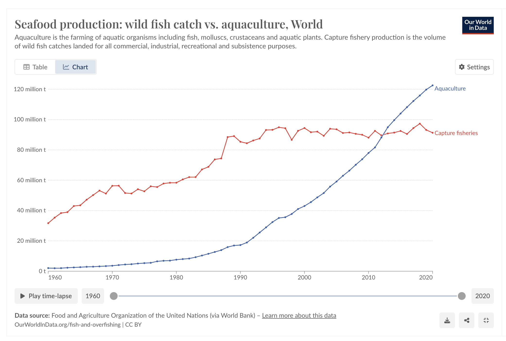
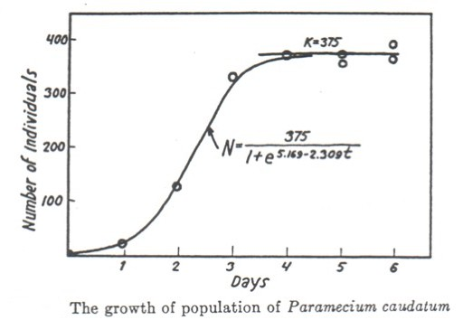

---
format:
  revealjs:
    slide-number: true
    # code-link: true
    highlight-style: a11y
    chalkboard: true
    theme:
      - ../../ucsb-media.scss
    include-in-header:
      text: |
        <script>
        (function loadCancelExtension(){
          if (window.MathJax && window.MathJax.Hub) {
            MathJax.Hub.Config({ TeX: { extensions: ["cancel.js"] } });
          } else {
            setTimeout(loadCancelExtension, 20);
          }
        })();
        </script>
editor_options:
  chunk_output_type: console
---


---

## {#exponential-function-title data-menu-title="The exponential function" background-color="#003660"}


<div class="page-center">
<div class="custom-subtitle">The exponential function</div>
</div>

--- 

## {#number-e-1 data-menu-title="The number $e$"}

<!-- 
A very nice slide deck Carmen made to explain what e is to my 34A summer 2020 students.
https://docs.google.com/presentation/d/1uztsfd9fwG49lxsDgxhyQZVsbFQDkmszsSkQdDivz2Q/edit?usp=sharing
-->

[The number $e$]{.slide-title}

<hr>

The **number $e$ is a constant** in mathematics, it is approximately $e\approx 2.72$, but really its decimals continue infinitely without any pattern:

:::{.center-text .teal-text}
$e = 2.71828182845904523536...$
:::

. . .

It's exact value can be described as 
$$
e = 1 + 1 + \frac{1}{1*2} + \frac{1}{1*2*3} + \frac{1}{1*2*3*4} + \frac{1}{1*2*3*4*5} + ... 
$$

. . .

Like any other number, $e$ follows normal power properties:

$$
\begin{align}
e^x\cdot e^y &=& ?\\
\frac{1}{e^x} &=& ?\\
\frac{e^x}{e^y} &=& ?\\
(e^x)^r &=& ?
\end{align}
$$

✏️ [Take a moment to write these with a single exponent.]{style="color:green;"}

--- 

## {#number-e-2 data-menu-title="The number $e$"}

<!-- 
A very nice slide deck Carmen made to explain what e is to my 34A summer 2020 students.
https://docs.google.com/presentation/d/1uztsfd9fwG49lxsDgxhyQZVsbFQDkmszsSkQdDivz2Q/edit?usp=sharing
-->

[The number $e$]{.slide-title}

<hr>

The **number $e$ is a constant** in mathematics, it is approximately $e\approx 2.72$, but really its decimals continue infinitely without any pattern:

:::{.center-text .teal-text}
$e = 2.71828182845904523536...$
:::

It's exact value can be described as 
$$
e = 1 + 1 + \frac{1}{1*2} + \frac{1}{1*2*3} + \frac{1}{1*2*3*4} + \frac{1}{1*2*3*4*5} + ... 
$$


Like any other number, $e$ follows normal power properties:

$$
\begin{align}
e^{x+y}&=&e^x\cdot e^y \\
e^{-x}&=&\frac{1}{e^x}\\
e^{x-y}&=&\frac{e^x}{e^y}\\
e^{rx}&=&(e^x)^r 
\end{align}
$$

<!---------------------------------------------------------------------->

---

## {#exponential-function data-menu-title="The exponential function $e^x$"}

[The exponential funciton]{.slide-title}

<hr>

The **exponential function $e^x$** is the number $e$ raised to the $x$ power. 

In function notation you may sometimes see it as

$$ f(x) = e^x \ \ \text{ or } \ \ \text{exp}(x).$$


```{r,fig.align='center',out.width="75%"}
library(tidyverse)
x=seq(-3,3,by=0.01)
y=exp(x)

ggplot()+
  geom_line(aes(x=x,y=y),color="black",linewidth=3)+
  theme_classic()+
  labs(x="x",y="y",title=bquote(e^x))+
  theme(text=element_text(size=28))
```

---

## {#e-common data-menu-title="e common"} 

[Why is the exponential function so common?]{.slide-title}

<hr>

<br>

::: {.body-text-l}
- **One reason:** Exponential trends show up a LOT in environmental science (the proportional change is the same over each time span)

- **Math reason:** Turns out it's a very useful value for calculus
:::

---

## {#aquaculture data-menu-title="Aquaculture example"} 

[A real-world example:]{.slide-title}

<hr>

```{r}
#| eval: true
#| echo: false
#| out-width: "100%"
#| fig-align: "center"

```

::: {.footer}
Source: [Our World in Data](https://ourworldindata.org/grapher/capture-fisheries-vs-aquaculture)
:::

---

## {#cant-grow-forever data-menu-title="Can't grow forever"} 

[But populations can't grow exponentially forever]{.slide-title2}

<hr>

```{r}
#| eval: true
#| echo: false
#| out-width: "90%"
#| fig-align: "center"

```

::: {.center-text .body-text-s .gray-text}
Gause, G. F. 1934. The Struggle for Existence. Baltimore: Williams and Wilkins.
:::

---

## {#logistic-growth data-menu-title="Logistic growth"} 

[Logistic growth]{.slide-title}

<hr>

[$$N_t=\frac{K}{1+[\frac{K-N_0}{N_0}]e^{-rt}}$$]{.body-text-l}

<br>

[Where $N_t$ is the population size at time $t$, $K$ is the carrying capacity, $N_0$ is the initial population size, and $r$ is a growth rate.]{.body-text-m}

<br>

. . .

✏️ [What should be the value of the formula when $t=0$? Confirm your answer by substituting.]{style="color:green;" }

. . .

::: {.center-text .body-text-m .teal-text}
We should always *understand the components of formulas and equations* - both conceptually and mathematically.
:::

---

## {#logistic-growth-example data-menu-title="Logistic growth: Example"}

[Logistic growth: Example]{.slide-title}

<hr>

What is [$$N_t=\frac{K}{1+[\frac{K-N_0}{N_0}]e^{-rt}}$$]{.body-text-m} when t = 0?


---

## {#logistic-growth-solution data-menu-title="Logistic growth: Solution"}

[Solution]{.slide-title}

<hr>

$$
\begin{aligned}
N_0 &= \frac{K}{1+[\frac{K-N_0}{N_0}]e^{-r(0)}} &\text{Substitute } t=0 \\
&= \frac{K}{1+[\frac{K-N_0}{N_0}](1)} &e^{0}=1 \\
&= \frac{K}{\frac{N_0 + (K-N_0)}{N_0}} &\text{Combine terms in the denominator} \\
&= \frac{K}{\frac{K}{N_0}} &N_0 + (K-N_0) = K \\
&= N_0
\end{aligned}
$$

---

## {#logistic-growth-Qs data-menu-title="Logistic growth (Qs)"}

[Logistic growth]{.slide-title}

<hr>

<br>

[$$N_t=\frac{K}{1+[\frac{K-N_0}{N_0}]e^{-rt}}$$]{.body-text-l}

<br>

::: {.body-text-m}
1. Why might we expect logistic growth for many populations? 

2. What variables *besides* time would influence the actual population?

<!-- 3. Why, mathematically, does the logistic growth expression take the shape it does? What happens as the population becomes very close to the carrying capacity? -->
:::

<!-- [A brief explanation of the math with derivatives.](https://sites.math.duke.edu/education/ccp/materials/diffeq/logistic/logi1.html) -->

::: {.notes}
1. Pops grow slowly at the start when there are few individuals. Grow more quickly (exponentially) when enough individuals are in a pop and resources are abundant. Plateau when resources become depleted.

2. The number of individuals and the amount of resources
:::

---

## {#logarithms-title data-menu-title="Logarithms" background-color="#003660"}


<div class="page-center">
<div class="custom-subtitle">Logarithms</div>
</div>

---

## {#logarithms data-menu-title="Logarithms"} 

[Logarithms]{.slide-title}

<hr>

<br>

[$\log_a(b)$ is the exponent you need to raise $a$ to get a value of $b$]{.body-text-m} 


<br>

[**For example:**]{.body-text-l} 

- $\log_2(8)=x$ asks "to what power do I have to raise 2, to get a value of 8?"
- $\log_{105}(1)=x$ asks "to what power do I have to raise 105, to get a value of 1?"


<!----------------------------------------------------->
## {#ln-blank-1 data-menu-title="Natural Logs"}

[Natural logarithms]{.slide-title}

<hr>

<div style="position: absolute; bottom: 550px; right: 1000px; font-size: 1em;">                                                                               
  ✏️                    
</div>  

<!----------------------------------------------------->
## {#ln-blank-2 data-menu-title="Natural Logs"}

[Natural logarithms]{.slide-title}

<hr>

If $y>0$, then **$\ln(x)$ is the exponent you need to raise $e$ to in order to get $y$.**

This means:

$$
\begin{align}
\ln(e^x) &= x \\
e^{\ln(y)} &= y
\end{align}
$$

In other words, $\ln(x)$ is the inverse of the exponential function $e^x$. 

<br>

**✏️ Examples**

- $\ln(e^3)$

- $\ln(\frac{1}{e})$

- $\ln(1)$

- $\ln(0)$ 

- $\ln(-7)$ 


<!----------------------------------------------------->
## {#ln data-menu-title="Natural Logs"}

[Natural logarithms]{.slide-title}

<hr>

If $y>0$, then **$\ln(x)$ is the exponent you need to raise $e$ to in order to get $y$.**

This means:

$$
\begin{align}
\ln(e^x) &= x \\
e^{\ln(y)} &= y
\end{align}
$$

In other words, $\ln(x)$ is the inverse of the exponential function $e^x$. 

<br>

**Examples**

- $\ln(e^3) = 3$ because 3 is the power of $e$ needed to get $e^3$.

- $\ln(\frac{1}{e}) = \ln(e^{-1}) = -1$

- $\ln(1) = 0$ because 0 is the exponent we need to raise $e$ to to get 1

- $\ln(0)$ does not exist, because there's no number we can raise $e$ to to get 0

- $\ln(-7)$ does not exist, because $e$ to any number always be positive

<!----------------------------------------------------->
## {#ln-blank data-menu-title="Properties of natural logarithm"}

[Natural log properties]{.slide-title}

<hr>

::::{.columns}
:::{.column width="50%"}

```{r,fig.dim=c(5,5.5), out.width="100%"}

# Define x values
x_exp <- seq(-2, 4, length.out = 500)          # for e^x
x_log <- seq(0.001, 4, length.out = 500)       # for ln(x) (x>0 only)

# Compute y values
y_exp <- exp(x_exp)
y_log <- log(x_log)

# Base plot: no axes, no box, no margin labels
plot(x_exp, y_exp, type = "l", col = "blue", lwd = 2,
     xlab = "", ylab = "",
     xlim = c(-2, 4), ylim = c(-2, 6),         
     main = "",
     axes = FALSE, frame.plot = FALSE)

# Draw custom axes at x=0 and y=0
axis(1, pos = 0)  # x-axis at y=0
axis(2, pos = 0)  # y-axis at x=0

# Add ln(x)
lines(x_log, y_log, col = "red", lwd = 2)

# Add the line y = x (dotted)
abline(0, 1, lty = 2, col = "darkgreen")

# Add legend (no box)
legend("topleft", legend = c("e^x", "ln(x)", "y=x"),
       col = c("blue", "red", "darkgreen"), lwd = c(2,2,1),
       lty = c(1,1,2), bty = "n")

# Add manual axis labels at the ends
text(x = 4, y = -0.2, labels = "x", cex = 1.2)
text(x = 0.2, y = 6, labels = "y", cex = 1.2) 
```

:::

:::{.column width="50%"}
✏️ 
:::

::::

<!----------------------------------------------------->
## {#ln-properties data-menu-title="Properties of natural logarithm"}

[Natural log properties]{.slide-title}

<hr>

::::{.columns}
:::{.column width="50%"}

```{r,fig.dim=c(5,5.5), out.width="100%"}

# Define x values
x_exp <- seq(-2, 4, length.out = 500)          # for e^x
x_log <- seq(0.001, 4, length.out = 500)       # for ln(x) (x>0 only)

# Compute y values
y_exp <- exp(x_exp)
y_log <- log(x_log)

# Base plot: no axes, no box, no margin labels
plot(x_exp, y_exp, type = "l", col = "blue", lwd = 2,
     xlab = "", ylab = "",
     xlim = c(-2, 4), ylim = c(-2, 6),         
     main = "",
     axes = FALSE, frame.plot = FALSE)

# Draw custom axes at x=0 and y=0
axis(1, pos = 0)  # x-axis at y=0
axis(2, pos = 0)  # y-axis at x=0

# Add ln(x)
lines(x_log, y_log, col = "red", lwd = 2)

# Add the line y = x (dotted)
abline(0, 1, lty = 2, col = "darkgreen")

# Add legend (no box)
legend("topleft", legend = c("e^x", "ln(x)", "y=x"),
       col = c("blue", "red", "darkgreen"), lwd = c(2,2,1),
       lty = c(1,1,2), bty = "n")

# Add manual axis labels at the ends
text(x = 4, y = -0.2, labels = "x", cex = 1.2)
text(x = 0.2, y = 6, labels = "y", cex = 1.2) 
```

:::

:::{.column width="50%"}

:::{.center-text}
**Properties**
:::


$\ln (e^x)=x$

$\ln(xy)=\ln x+\ln y$

$\ln(\frac{x}{y})=\ln x-\ln y$

$\ln(x^y)=y \ln x$
:::

::::

<!----------------------------------------------------->
## {#ln-ex-blank data-menu-title="Natural Logs"}

[Using logarithms to solve equations]{.slide-title}

<hr>
✏️ [Solve for $t$ in the equation $Pe^{rt} = A$. ]{style="color:green;"}

::::{.columns}
:::{.column width="70%"}
:::

:::{.column width="30%"}
:::{.center-text}
**Properties**
:::

$\ln (e^x)=x$

$\ln(xy)=\ln x+\ln y$

$\ln(\frac{x}{y})=\ln x-\ln y$

$\ln(x^y)=y \ln x$
:::

::::

<!----------------------------------------------------->
## {#ln-ex data-menu-title="Natural Logs"}

[Using logarithms to solve equations]{.slide-title}

<hr>
✏️ [Solve for $t$ in the equation $Pe^{rt} = A$. ]{style="color:green;"}

$$
\begin{align}
Pe^{rt} &= A \\
e^{rt} & = \frac{A}{P} \\
rt &= \ln\left(\frac{A}{P}\right) \\
t &= \frac{\ln(A)-\ln(P)}{r}
\end{align}
$$
