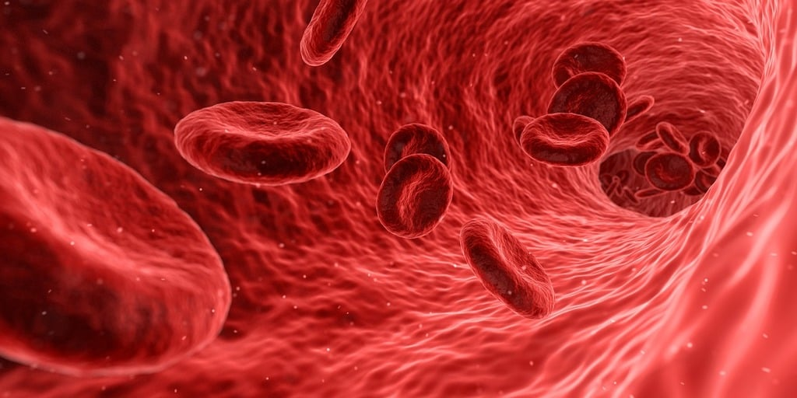
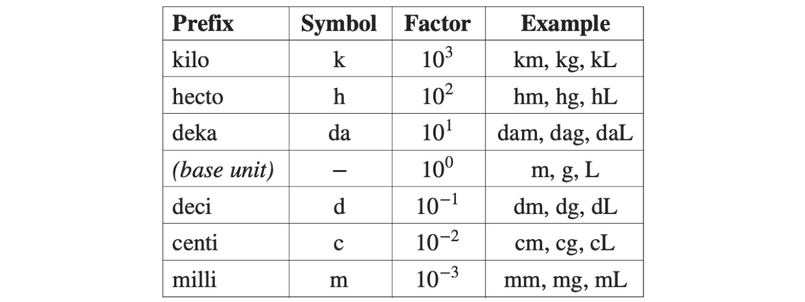
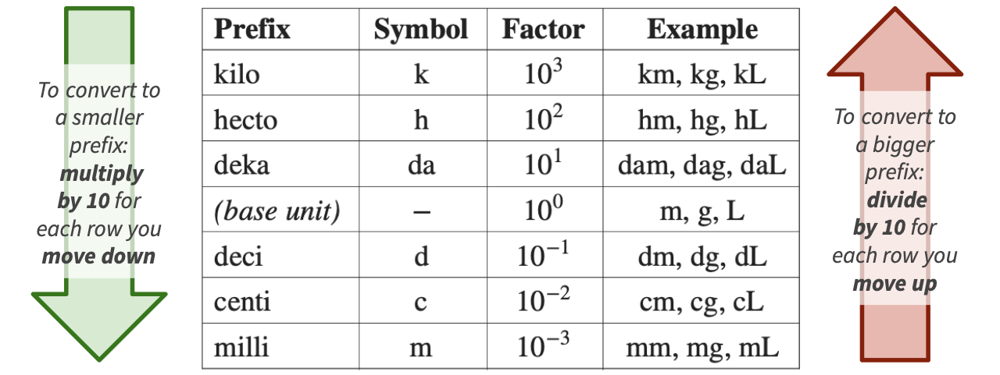

---
format:
  revealjs:
    chalkboard: true
    slide-number: true
    show-slide-number: all
    theme:
     - ../../ucsb-media.scss
    include-in-header:
      text: |
        

---

## {#title-slide data-menu-title="Title Slide" background="#053660"}

[Algebra Refresher and Units]{.custom-title}

[Bren Math Workshop]{.custom-subtitle .gold}

[Carmen Galaz García, Ph.D.]{.body-text-l .center-text .baby-blue-text}

[Bren School of Environmental Science & Management]{.center-text .body-text-m .baby-blue-text}

 

[*Materials have been adapted from Nathaniel Grimes work for the Bren Math Workshop.*]{.baby-blue-text .body-text-s}

---

## {#basics-title data-menu-title="EDS 212 basics" background-color="#003660"}

MESM Math Workshop basics

---

## {#welcome data-menu-title="Welcome to MESM Math Workshop!"} 

[Welcome to the MESM Math Workshop]{.slide-title}

 

- **Instructor:** Carmen Galaz García
- **Course hours:** Daily 12:00pm - 2:00pm PST (except for Day 5, which is 12:30pm - 2:30pm PST)
- **Location:** Bren Hall 1414
- **Website:** [https://bit.ly/mesm-math-workshop](https://bit.ly/mesm-math-workshop)

{fig-align="center" width="60%"}

---

## {#about-instructor data-menu-title="About your instructor"}

[About your instructor]{.slide-title .smaller}

::: {.columns}

::: {.column width="60%"}

[Carmen Galaz García (she/her)]{.body-text-m .blue-text}

- Assistant Teaching Professor @ Bren

Before:

- Data Scienist @ NCEAS
- Ph.D. in Mathematics @ UCSB

**Teaching & Research**

- Python courses and Capstone Projects for Masters in Environmental Data Science (MEDS)
- Supporting math and data science across Bren!
- NCEAS/TNC collaboration for invasive iceplant mapping analyzing remotely sensed images

:::

::: {.column width="40%"}
{fig-align="center" width="60%"}

{fig-align="center" width="40%"}
:::
:::

---

## {#about-you data-menu-title="About you"} 

[About you!]{.slide-title}

---

## {#topics data-menu-title="Topics"} 

[Topics overview]{.slide-title}

::: {.body-text-l}
- **Day 1:** Algebra refresher; Units I
- **Day 2:** Units II; Functions; Graphing; Linear functions
- **Day 3:** Exponential functions and logarithms; Limits
- **Day 4:**  Derivatives 
- **Day 5:**  Integration & ODEs
:::

---

## {#objectives data-menu-title="Workshop Objectives"}

[Workshop Objectives]{.slide-title}

::: {.body-text-l}
1.  🧹 Shake off the math dust

2.  💪 Exercise core math skills needed to succeed in your Bren courses

3.  🌎 Explore how valuable math is to environmental data science

4.  🤝 Build a collaborative environment and get to know your cohort
:::

---

## {#expectations-1 data-menu-title="Student Expectations"}

[Student expectations]{.slide-title}

::: {.body-text-m}
We expect all students will:

- 🤗 Support and encourage all classmates

- 🌱 Be open to learning from each other

- 🙌 Bring a collaborative attitude and communicate respectfully

- 💡 See opportunities to share kownledge as a chance to deepen understanding

- ✅ Complete all in-class exercises
:::

---

## {#expectations-2 data-menu-title="Team Expectations"}

[Student expectations]{.slide-title}

::: {.body-text-m}
We expect all students will:

- 🤗 Support and encourage all classmates

- 🌱 Be open to learning from each other

- 🙌 Bring a collaborative attitude and communicate respectfully

- 💡 See opportunities to share kownledge as a chance to deepen understanding

- ✅ Complete all in-class exercises

:::

**Logistics**

- No food in BH 1414
- If you are feeling sick: stay home and take care of yourself! Please mask up if you are not feeling 100%.

---

## {#survey data-menu-title="Please fill out this survery"}

[Please fill out this survey]{.slide-title}

{fig-align="center"}

::: {.center-text .body-text-l}
[Or you can click on this link.](https://forms.gle/rmhQpyu6ze33fGaK6)
:::

---

## {#math-envs data-menu-title="Math in Environmental Science" background-color="#003660"}

Math in Environmental Science

---

## {#why-math data-menu-title="Why math?"} 

[Why am I taking a math class?]{.slide-title}

 
 
 

::: {.center-text .body-text-xl}
or, 

 

*Why do I have to know math when a computer will do it for me?*
:::

---

## {#warm-up data-menu-title="Brain warm-up"} 

[A quantitative brain warm-up]{.slide-title}

 

::: {.center-text .body-text-l .teal-text}
MESM students have diverse work & academic histories
:::

**This course (re)introduces math concepts and tools that:** 

- Focus on applications to environmental data science
- Are specifically relevant for MEDS projects, coursework
- Provide an entryway into building computational skills
- Refresh quantitative thinking skills generally
- Refresh essentials like units, conversions, notation, **language**

--- 

## {#des data-menu-title="describe"}

[Share with the person next to you:]{.slide-title}

[What has been your life or professional experience with math? Best friend ever, mortal enemy, or something in between?]{.slide-title}

 

[How do you see math being relevant to solving environmental problems?]{.slide-title}

---

## {#math-lang data-menu-title="Math is a Language"}

[Math is an important tool in environmental science]{.slide-title}

**Math helps us investigate the world and communicate our findings**

- Used by scientists to find evidence

- Can be used to quantify relations, trends, and changes

- Mathematical models can help us understand complex systems

- Must be used responsibly and with awareness of potential biases and limitations

- Helps us support arguments that can transform policy and actions

 

[We need to understand the math to responsibly make decisions on it!]{.center-text .body-text-m .blue-text}

---

## {#math-bren data-menu-title="Math at Bren"}

[Math at Bren]{.slide-title}

::: columns
::: {.column width="50%"}
:::{.center-text}
**In classes:**
:::

- ESM 201: Ecology of Managed Ecosystems

Lotka-Volterra Models 
$$
\begin{align}
\frac{dN_1}{dt}&=r_1N_1\left(\frac{K_1-N_1-\alpha N_2}{K_1}\right)\\
\frac{dN_2}{dt}&=r_2N_2\left(\frac{K_2-N_2-\beta N_1}{K_2}\right)
\end{align}
$$

<!--
 Predator-prey dynamics.
 A pair of first-order nonlinear differential equations, frequently used to describe the dynamics of biological systems in which two species interact, one as a predator and the other as prey. The populations change through time according to the pair of equations.
-->

- ESM 222: Pollution Risk Management

 Groundwater transport of absorbed contaminant
$$
\frac{\partial C}{\partial t}=\left(\frac{D}{R}\frac{\partial^2t}{\partial x^2}\right)-\left(\frac{v}{R}\frac{\partial C}{\partial x}\right)-\frac{k}{R}C
$$
:::

<!--
Contaminants moving and breaking down in groundwater.

Widely used in hydrogeology and environmental engineering to model how contaminants move and break down in groundwater.
-->

::: {.column width="40%"}
:::{.center-text}
**In Research**

:::

- Ecology, modeling, economics, and more!

- [Applying Portfolio Theory (A mix of calculus and stochastic linear algebra) to salmon stocks (MESM GP)](https://bren.ucsb.edu/projects/applying-portfolio-theory-improve-spatial-recovery-planning-pacific-salmon)

- [Quantifying Greenhouse Gas (GHG) Emissions Associated with Global Seafood Production (MEDS Capstone)](https://bren.ucsb.edu/projects/quantifying-greenhouse-gas-ghg-emissions-associated-global-seafood-production)

:::
:::

---

## {#warm-up-overview data-menu-title="Warm-up overview"} 

[Today: Math brain warm up]{.slide-title}

::: {.body-text-m}
- Algebra review
- Rules of exponents
- Units
:::

---

## {#algebra-review data-menu-title="Algebra review" background-color="#003660"}

Algebra review

---

## {#rules-of-algebra data-menu-title="Rules of algebra"} 

[Rules of algebra]{.slide-title}

[**You can get far with a few rules:**]{.body-text-l}

::: {.body-text-m}
1.  Follow order of operations (a.k.a. PEDMAS)

2. Never change an equation. Instead, rewrite them into more useful forms

3. Manipulate BOTH sides of an equation with the SAME PROCEDURE.

Always add/substract/multiply/divide by the same number on both sides. More generally, always apply the same function to both sides of the equation. 

:::

---

## {#PEMDAS data-menu-title="PEMDAS"} 

[Order of operations (P-E-DM-AS)]{.slide-title}

 

[**P** - Parentheses]{.body-text-l}

 

[**E** - Exponents]{.body-text-l}

 

[**D/M** - Division / multiplication]{.body-text-l}

 

[**A/S** - Addition / subtraction]{.body-text-l}

---

## {#PEMDAS-practice data-menu-title="PEMDAS practice"} 

[Order of operations practice problems]{.slide-title}

✏️ [Take a minute to solve these individually.]{style="color:green;"  .body-text-m}

 

* Simplify $\frac{4-6}{2}(3+1)-\frac{1+2*4}{3}$

 

* Simplify $3x+4(8x-6x) -(2y-5)+\frac{2x(1-3)}{2}$

 

* If we are given the values of $x=-3$ and $y=2$, what would be the value of $z$?
$$
z = 4*(y-4)+(x+1)^2
$$

---

## {#PEMDAS-practice-solution-1 data-menu-title="PEMDAS practice: solution 1"} 

[Order of operations practice problems]{.slide-title}

💡 [Let's see a solution!]{style="color:green;" .body-text-m}

 

:::: {.columns}

::: {.column width="40%"}
[$\frac{4-6}{2}(3+1)-\frac{1+2*4}{3}$]{.body-text-m}
:::

::: {.column width="60%"}
[$3x+4(8x-6x) -(2y-5)+\frac{2x(1-3)}{2}$]{.body-text-m}
:::

::::

---

## {#PEMDAS-practice-solution-2 data-menu-title="PEMDAS practice: solution 2"}

[Order of operations practice problems]{.slide-title}

💡 [Let's see a solution!]{style="color:green;" .body-text-m}

[If we are given the values of $x=-3$ and $y=2$, what would be the value of $z$?
$$
z = 4*(y-4)+(x+1)^2
$$]{.body-text-m}

---

## {#PEMDAS-practice-solution-1-answer data-menu-title="Practice solutions"}

[Practice solutions]{.slide-title}

$$
\small
\begin{aligned}
\frac{4-6}{2}(3+1)-\frac{1+2*4}{3} &= \frac{-2}{2}(4)-\frac{9}{3} \\
&= -1(4)-3 \\
&= -4-3 \\
&= -7
\end{aligned}
$$

$$
\small
\begin{aligned}
3x+4(8x-6x) -(2y-5)+\frac{2x(1-3)}{2} &= 3x+4(2x)-2y+5+\frac{2x-6x}{2} \\
&= 3x+8x-2y+5+\frac{-4x}{2} \\
&= 3x+8x-2y+5-2x \\
&= 9x-2y+5
\end{aligned}
$$

$$
\small
\begin{aligned}
z = 4(y-4)+(x+1)^2 &= 4(2-4)+(-3+1)^2 \\
&= 4(-2)+(-2)^2 \\
&= -8+4 \\
z&=-4
\end{aligned}
$$

--- 

## {#equations-solved-1 data-menu-title="Equations solved"} 

[Solving equations]{.slide-title}

Equations help us find unknown values that satisfy certain conditions. 

Remember the rules:

2. Never change an equation. Instead, we rewrite them into more useful forms

3. Manipulate BOTH sides of an equation with the SAME PROCEDURE.

Always add/substract/multiply/divide by the same number on both sides. More generally, always apply the same function to both sides of the equation. 

--- 

## {#equations-solved-2 data-menu-title="Equations solved"} 

[Solving equations]{.slide-title}

Equations help us find unknown values that satisfy certain conditions. 

Remember the rules:

2. Never change an equation. Instead, we rewrite them into more useful forms

3. Manipulate BOTH sides of an equation with the SAME PROCEDURE.

Always add/substract/multiply/divide by the same number on both sides. More generally, always apply the same function to both sides of the equation. 

---

## {#solving-equations-2 data-menu-title="Solving equations"}

[Solving equations: example]{.slide-title}

✏️ Isolate $y$ in terms of $x$:

$$
\begin{aligned}
x&=\frac{(400-y)}{80} \\
\end{aligned}
$$

---

## {#solving-equations-3 data-menu-title="Solving equations"}

[Solving equations: example]{.slide-title}

💡 [Let's see a solution!]{style="color:green;"}

:::{.center-text}
**Isolate $y$ in terms of $x$:**
:::

$$
\begin{aligned}
x&=\frac{(400-y)}{80} \\
80x&=\frac{(400-y)\cancel{80}}{\cancel{80}}  &\text{ Multiply both sides by 80} \\
80x-400&=\cancel{400}-\cancel{400} -y &\text{ Subtract both sides by 400} \\
-1(80x-400)&=-y(-1) &\text{Multiply both sides by -1} \\
400-80x&=y  &\text{Flip terms for simplicity}
\end{aligned}
$$

---

## {#practice-alge-1 data-menu-title="Easy to make mistakes"}

[Solving equations: Practice set 1]{.slide-title}

::::::{.teal-text}
It can be easy to make mistakes while doing algebra. Practice is key!
:::

✏️ [Solve all in terms of $x$:]{style="color:green;"}

(A)  $3x+2=10x-12$

 

(B) $4-3(2x+1)=8-\frac{3x}{2}$

 

(C) $3(x+7a)-5=b+2(c-4x)$

---

## {#practice-alge-2 data-menu-title="Easy to make mistakes"}

[Solving equations: Practice set 1]{.slide-title}

✏️ [Let's see a solution!]{style="color:green;"}

Solve all in terms of $x$

:::: {.columns}

::: {.column width="50%"}
:::{.center-text}
(A)  $3x+2=10x-12$
:::
:::

::: {.column width="50%"}
:::{.center-text}
(B) $4-3(2x+1)=8-\frac{3x}{2}$
:::
:::

::::

---

## {#practice-alge-3 data-menu-title="Easy to make mistakes"}

[Solving equations: Practice set 1]{.slide-title}

✏️ [Let's see a solution!]{style="color:green;"}

Solve all in terms of $x$

(C) $3(x+7a)-5=b+2(c-4x)$

---

## {#practice-alge-4 data-menu-title="Solutions"}

[Practice set 1 solutions]{.slide-title}

:::: {.columns}

:::{.column width=50%}

$$
\small
\begin{aligned}
3x+2&=10x-12 \\
3x+2+12&=10x-12(+12) \\
3x-3x+14&=10x-3x \\
14&=7x \\
x&=2
\end{aligned}
$$

:::

:::{.column width=50%}

$$
\small
\begin{aligned}
4-3(2x+1)&=8-\frac{3x}{2}\\
4-3-6x&=8-\frac{3x}{2} \\
1-6x&=8-\frac{3x}{2} \\
2-12x&=16-3x \\
-9x&=14 \\
x&=\frac{-14}{9}\\
\end{aligned}
$$

:::
:::

---

## {#practice-alge-5 data-menu-title="Solutions"}

[Practice set 1 solutions]{.slide-title}

$$
\small
\begin{aligned}
3(x+7a)-5&=b+2(c-4x)\\
3x+21a-5&=b+2c-8x \\
11x+21a-5&=b+2c \\
11x&=5+b+2c-21a\\
x&=\frac{5+b+2c-21a}{11}
\end{aligned}
$$

---

## {#algebra-practice-four data-menu-title="Solving equations: practice"}

<!-- Sources: ESM 201 Exercise Bank Ex. 3; ESM 202 Exercise Bank Ex. 6; ESM 203 Exercise Bank Ex. 9; price/quantity example moved from #equations-solved-2 -->

[Solving equations: Practice set 2]{.slide-title}

✏️ [Solve these individually.]{style="color:green;"}

::: {.body-text-s}
1) Prices are important in economics, but not always available for environmental goods. If we know quantity $Q=\dfrac{(400-P)}{80}$, isolate $P$ in terms of $Q$.

 

2) The logistic per-capita growth rate is $r\left(1-\dfrac{N}{K}\right)$, where $N$ is population size, $K$ is carrying capacity, and $r$ is the intrinsic growth rate. If this rate equals $0.02$ when $N=750$ and $K=1000$, solve for $r$.

 

3) A steady-state concentration balance for a pollutant $C$ (mg/L) in a mixed system is $3(C-5)+2C=40$. Solve for $C$.

 

4) A watershed's water balance is: change in storage per unit time = precipitation ($P$) − actual ET − river outflows ($Q$). At steady state (storage isn't changing), with actual evapotranspiration (ET) being 60% of precipitation and $Q=320$ mm/y, solve for $P$.
:::

---

## {#algebra-practice-space-1 data-menu-title="Practice 1: space to solve"}

[Solving equations: Practice set 2]{.slide-title}

💡 [Let's see a solution!]{style="color:green;" .body-text-m}

**1)** Prices are important in economics, but not always available for environmental goods. If we know quantity $Q=\dfrac{(400-P)}{80}$, isolate $P$ in terms of $Q$.

---

## {#algebra-practice-space-2 data-menu-title="Practice 2: space to solve"}

[Solving equations: Practice set 2]{.slide-title}

💡 [Let's see a solution!]{style="color:green;" .body-text-m}

**2)** The logistic per-capita growth rate is $r\left(1-\dfrac{N}{K}\right)$, where $N$ is population size, $K$ is carrying capacity, and $r$ is the intrinsic growth rate. If this rate equals $0.02$ when $N=750$ and $K=1000$, solve for $r$.

---

## {#algebra-practice-space-3 data-menu-title="Practice 3: space to solve"}

[Solving equations: Practice set 2]{.slide-title}

💡 [Let's see a solution!]{style="color:green;" .body-text-m}

**3)** A steady-state concentration balance for a pollutant $C$ (mg/L) in a mixed system is $3(C-5)+2C=40$. Solve for $C$.

---

## {#algebra-practice-space-4 data-menu-title="Practice 4: space to solve"}

[Solving equations: Practice set 2]{.slide-title}

💡 [Let's see a solution!]{style="color:green;" .body-text-m}

**4)** A watershed's water balance is: change in storage per unit time = precipitation ($P$) − actual ET − river outflows ($Q$). At steady state (storage isn't changing), with actual evapotranspiration (ET) being 60% of precipitation and $Q=320$ mm/y, solve for $P$.

---

## {#algebra-practice-answer data-menu-title="Practice solutions"}

[Practice set 2 solutions]{.slide-title}

:::: {.columns}

::: {.column width="50%"}
**1)**

$$
\small
\begin{aligned}
Q&=\frac{(400-P)}{80} \\
80Q&=400-P \\
80Q-400&=-P \\
P&=400-80Q
\end{aligned}
$$
:::

::: {.column width="50%"}
**2)**

$$
\small
\begin{aligned}
1-\frac{750}{1000} &= 0.25 \\
0.25r &= 0.02 \\
r &= 0.08 \text{ per year}
\end{aligned}
$$
:::

::::

:::: {.columns}

::: {.column width="50%"}
**3)**

$$
\small
\begin{aligned}
3C-15+2C&=40\\
5C&=55\\
C&=11 \text{ mg/L}
\end{aligned}
$$
:::

::: {.column width="50%"}
**4)**

$$
\small
\begin{aligned}
\text{storage} &= P - AET - Q \\
0 &= P - 0.6P - Q \\
0.4P &= 320 \\
P &= 800 \text{ mm/y}
\end{aligned}
$$
:::

::::

---

## {#break data-menu-title="5 minute break"}

[Let's take a 5 minute break]{.slide-title}

---

## {#rules-of-exponents data-menu-title="Rules of exponents" background-color="#003660"}

Rules of exponents

---

## {#exponents data-menu-title="Exponents"}

[Exponents make algebra more interesting!]{.slide-title}

**Example**

The expression $x^3$ means $x$ multiplied by itself 3 times:
$$x^3=x * x * x$$

. . .

More generally, 
$$x^n = x \text{ to the power of } n.$$

. . .

Intuitively, the **exponent** $n$ tells us how many times to multiply the **basis** $x$ by itself:

$$x^n = \underbrace{x \times x \times \ldots \times x}_{n \text{ times}}$$

But the exponent can be any (real) number, not only integers!

---

## {#exponents-applications-1 data-menu-title="What are exponents good for?"}

[What are exponents good for?]{.slide-title}

:::: {.columns}

::: {.column width="50%" style="text-align: center;"}
They can describe really big numbers

Diameter of the Milky Way = 
1,000,000,000,000,000,000,000 meters =
$$10^{21} \text{ m}$$
:::

::: {.column width="50%" style="text-align: center;"}
And also really small numbers

Diameter of a human red blood cell = 
0.0000000001 meters = 
$$10^{-10} \text{ m}$$
:::

::::

This way, we can use exponents to describe exponential growth and decay. Many environmental variables behave in this way. 

---

## {#exponents-rules-blank-1 data-menu-title="Exponents Rules (1)"}
[Rules and properties of exponents (1)]{.slide-title}

                                                                               
  ✏️                    

  

(1) Product rule:

 

(2) Quotient rule:

 

(3) Any non-negative $x$ to the power of 0 equals 1:

 

(4) Negative exponent means divide:

 

(5) Fractional exponent means take the $n$-th root:

---

## {#exponents-rules-blank-2 data-menu-title="Exponents Rules (2)"}
[Rules and properties of exponents (2)]{.slide-title}

                                                                               
  ✏️                    

  

(6) Power of a power means multiply the exponents: 

 

(7) Exponents get distributed over products:

 

(8) And exponents get distributed over divisions: 

 

(9) If $a$ is the $n$-th root of $x$, then $a$ to the $n$ equals $x$:

---

## {#exponents-rules-1 data-menu-title="Exponents Rules (1)"}
[Rules and properties of exponents (1)]{.slide-title}

(1) Product rule: $x^a * x^b = x^{a+b}$

 

(2) Quotient rule: $\frac{x^a}{x^b} = x^{a-b}, \ \ \text{for } x \neq 0$

 

(3) Any non-negative $x$ to the power of 0 equals 1: $x^0 = 1, \ \ \text{for } x \neq 0$

 

(4) Negative exponent means divide: $x^{-a} = \frac{1}{x^a}, \ \ \text{for } x \neq 0$

 

(5) Fractional exponent means take the $n$-th root: $x^{\frac{1}{n}} = \sqrt[n]{x}$

---

## {#exponents-rules-2 data-menu-title="Exponents Rules (2)"}
[Rules and properties of exponents (2)]{.slide-title}

(6) Power of a power means multiply the exponents: $(x^a)^b = x^{ab}$

 

(7) Exponents get distributed over products: $(xy)^a = x^a y^a$

 

(8) And exponents get distributed over divisions: $\left( \frac{x}{y} \right)^a = \frac{x^a}{y^a}$

 

(9) If $a$ is the $n$-th root of $x$, then $a$ to the $n$ equals $x$:

$$
a = \sqrt[n]{x} \Rightarrow a^n = x
$$

---

## {#exponents-table data-menu-title="Rules of exponents"}

[Rules and properties of exponents]{.slide-title}

$$
\begin{array}{|l|l|}
\hline
\textbf{Rule} & \textbf{Expression} \\
\hline
\text{Product Rule} & x^{a} \cdot x^{b} = x^{a+b} \\
\hline
\text{Quotient Rule} & \frac{x^{a}}{x^{b}} = x^{a-b}, \quad x \neq 0 \\
\hline
\text{Zero Exponent} & x^{0} = 1, \quad x \neq 0 \\
\hline
\text{Negative Exponent} & x^{-a} = \frac{1}{x^{a}}, \quad x \neq 0 \\
\hline
\text{Fractional Exponent} & x^{\frac{1}{n}} = \sqrt[n]{x} \\
\hline
\text{Power of a Power} & (x^{a})^{b} = x^{ab} \\
\hline
\text{Power of a Product} & (xy)^{a} = x^{a}y^{a} \\
\hline
\text{Power of a Quotient} & \left(\frac{x}{y}\right)^{a} = \frac{x^{a}}{y^{a}} \\
\hline
\text{$n$-th Root Definition} & a = \sqrt[n]{x} \quad \Rightarrow \quad a^{n} = x \\
\hline
\end{array}
$$

---

## {#exponents-practice-set-up data-menu-title="Exponents practice"}
[Exponents practice]{.slide-title}

:::: {.columns}

::: {.column width="40%"}
✏️ [Simplify the following.]{style="color:green;"}

(A) $\frac{6^5}{6^3}$

 

(B) $(x^2y)^4$

 

(C) $\frac{x^5y^6}{xy^2}$

(D) $\frac{24x^6}{12x^{-8}}$

:::

::: {.column width="60%"}
$$
\begin{array}{|l|l|}
\hline
\textbf{Rule} & \textbf{Expression} \\
\hline
\text{Product Rule} & x^{a} \cdot x^{b} = x^{a+b} \\
\hline
\text{Quotient Rule} & \frac{x^{a}}{x^{b}} = x^{a-b}, \quad x \neq 0 \\
\hline
\text{Zero Exponent} & x^{0} = 1, \quad x \neq 0 \\
\hline
\text{Negative Exponent} & x^{-a} = \frac{1}{x^{a}}, \quad x \neq 0 \\
\hline
\text{Fractional Exponent} & x^{\frac{1}{n}} = \sqrt[n]{x} \\
\hline
\text{Power of a Power} & (x^{a})^{b} = x^{ab} \\
\hline
\text{Power of a Product} & (xy)^{a} = x^{a}y^{a} \\
\hline
\text{Power of a Quotient} & \left(\frac{x}{y}\right)^{a} = \frac{x^{a}}{y^{a}} \\
\hline
\text{$n$-th Root Definition} & a = \sqrt[n]{x} \quad \Rightarrow \quad a^{n} = x \\
\hline
\end{array}
$$
:::

::::

<!--------------------------------------------------------------------------->
## {#exponents-practice data-menu-title="Exponents practice"}
[Exponents practice]{.slide-title}

✏️ [Let's see a solution.]{style="color:green;"}

(A) $\frac{6^5}{6^3} = 6^{5-3} = 6^2$

 

(B) $(x^2y)^4 = (x^2)^4*y^4 = x^8y^4$

 
 

(C) $\frac{x^5y^6}{xy^2} = \frac{x^5}{x}*\frac{y^6}{y^2} = x^{5-1}*y^{6-2} = x^4y^4 = (xy)^4$

 
 

(D) $\frac{24x^6}{12x^{-8}} = 2x^6x^{(-(-8))}=2x^6x^8 = 2x^{6+8} = 2x^{14}$

---

## {#FOIL data-menu-title="FOIL"} 

[Multiplying expressions (FOIL)]{.slide-title}

[**F**irst, **O**utside, **I**nside, **L**ast]{.body-text-l}

 

[**Example:**]{.body-text-m}

[$$(2x+5)(x-3)$$]{.body-text-m}
✏️ [Expand this expression.]{style="color:green;"}

---

## {#FOIL-solution data-menu-title="FOIL"} 

[Multiplying expressions (FOIL)]{.slide-title}

[**F**irst, **O**utside, **I**nside, **L**ast]{.body-text-l}

 

[**Example:**]{.body-text-m}

[$$(2x+5)(x-3)$$]{.body-text-m}
✏️ [Let's see a solution.]{style="color:green;"}

[$$= (2x \times x) (2x \times -3) (5 \times x) (5 \times -3)$$]{.body-text-m}

[$$= 2x^2 - 6x + 5x - 15$$]{.body-text-m}

[$$=2x^2-x-15$$]{.body-text-m}

---

## {#polynomials-1 data-menu-title="Polynomials"}

[Polynomials describe more complex relationships through exponents]{.slide-title}

A polynomial is a function of the form:
$$
\large
\begin{align}
a_nx^n+a_{n-1}x^{n-1}+...+a_1x+a_0
\end{align}
$$

- $x$ is the **variable** 
- $a_i$ are **constants** (fixed numbers) that are called the **coefficients** of the polynomial
- each $a_ix^i$ is called a **term** of the polynomial,
- $n$ is called the **degree** of the polynomial, this is the largest exponent in the polynomial.

---

## {#polynomials-2 data-menu-title="Polynomials"}

[Polynomials describe more complex relationships through exponents]{.slide-title}

A polynomial is a function of the form:
$$
\large
\begin{align}
a_nx^n+a_{n-1}x^{n-1}+...+a_1x+a_0
\end{align}
$$

- $x$ is the **variable** 
- $a_i$ are **constants** (fixed numbers) that are called the **coefficients** of the polynomial
- each $a_ix^i$ is called a **term** of the polynomial,
- $n$ is called the **degree** of the polynomial, this is the largest exponent in the polynomial.

*Example:*

- $x^5 + x^2 - 1$ is a polynomial of degree five with three terms.

- Linear functions like $mx + c$ where $m$ and $c$ are constants are polynomials of degree 1!

Polynomials often represent real world data better than a linear function.

---

## {#units-title data-menu-title="Units" background-color="#003660"}

Units

---

## {#units-1 data-menu-title="Units"} 

[UNITS. UNITS. UNITS.]{.slide-title}

 

::: {.body-text-m}
Think about these statements, which all contain the same *value* of 4:

 

- There are four in the refrigerator.

- There are four **burritos** in the refrigerator.

- There are four **roaches** in the refrigerator.

- There are four **million dollars** in the refrigerator.
:::

---

## {#units-2 data-menu-title="Units"} 

[UNITS. UNITS. UNITS.]{.slide-title}

::: {.body-text-m}
Think about this sign at New Cuyama. Anything odd here?
:::

:::{.center-text}
{width="50%"}
:::

---

## {#units-critical data-menu-title="Units are critical"} 

[Units are critical in environmental science]{.slide-title2}

 
 

::: {.center-text .body-text-l}
We cannot responsibly work with data without knowing the units of **each variable we're working with**.

 

That means we need to always **familiarize ourselves with variables**, carefully **check units and any unit conversions**, and understand **how units combine into the units of a dependent variable**.
:::

---

## {#metric-prefixes data-menu-title="Metric prefixes"}

[Metric prefixes]{.slide-title}

Metric units are built from a **base unit** (like meters, grams, or liters) plus a **prefix** that scales it by a power of 10.

:::{.center-text}
{width=80%}
:::

::: {.body-text-s}
The **factor** indicates how many times to multiply the base unit by 10. For example, 1 km = $10^3$ m = 1000 m, and 1 cm = $10^{-2}$ m = 0.01 m.
:::

---

## {#metric-prefixes-conversion data-menu-title="Metric prefixes"}

[Metric prefixes]{.slide-title}

Metric units are built from a **base unit** (like meters, grams, or liters) plus a **prefix** that scales it by a power of 10.

:::{.center-text}
{width=80%}
:::

::: {.body-text-s}
The **factor** indicates how many times to multiply the base unit by 10. For example, 1 km = $10^3$ m = 1000 m, and 1 cm = $10^{-2}$ m = 0.01 m.
:::

---

## {#metric-prefixes-example-2 data-menu-title="Metric prefixes: example 2"}

[Metric prefixes]{.slide-title}

**Example.** Convert 750 mL into L.

✏️  [Let's solve this together.]{style="color:green;"}

:::: {.columns}

::: {.column width="40%"}

:::

::: {.column width="60%"}
{width=80%}
:::

:::

---

## {#metric-prefixes-example-2-solution data-menu-title="Metric prefixes: example 2"}

[Metric prefixes]{.slide-title}

**Example.** Convert 750 mL into L.

:::: {.columns}

::: {.column width="40%"}
Starting at **milli** and ending at **base**, we move **3 rows up** the table:

milli &rarr; centi &rarr; deci &rarr; base

So we divide by $10^3$:

\begin{align*}
750 \text{ mL} &= \frac{750}{10^3} \text{ L} \\
&= 0.75 \text{ L}
\end{align*}

:::

::: {.column width="60%"}
{width=80%}
:::

:::

---

## {#metric-prefixes-example data-menu-title="Metric prefixes: example"}

[Metric prefixes]{.slide-title}

**Exercise.** Convert 4.7 km into cm.

✏️  [Take a moment to compute it.]{style="color:green;"}

:::: {.columns}

::: {.column width="40%"}

:::

::: {.column width="60%"}
:::{.center-text}

:::
:::

:::

---

## {#metric-prefixes-example-solution data-menu-title="Metric prefixes: example"}

[Metric prefixes]{.slide-title}

**Exercise.** Convert 4.7 km into cm.

:::: {.columns}

::: {.column width="40%"}
Starting at **kilo** and ending at **centi**, we move **5 rows down** the table:

kilo &rarr; hecto &rarr; deka &rarr; base &rarr; deci &rarr; centi

So we multiply by $10^5$:

\begin{align*}
4.7 \text{ km} &= 4.7 \times 10^5 \text{ cm} \\
&= 470{,}000 \text{ cm}
\end{align*}

:::

::: {.column width="60%"}
{width=80%}
:::

:::

---

## {#area-volume-conversions data-menu-title="Area & volume conversions"}

[Converting areas and volumes]{.slide-title}

::: {.body-text-m}
So far we've converted **linear** units (length). What about **area** (squared units) and **volume** (cubed units)?
:::

::: {.body-text-m}
To convert area units, **square** the linear conversion factor. To convert volume units, **cube** the linear conversion factor.
:::

 

Since $1 \text{ m} = 100 \text{ cm}$:

\begin{align*}
1 \text{ m}^2 &= (100 \text{ cm})^2 = 100^2 \text{ cm}^2 = 10{,}000 \text{ cm}^2 \\
1 \text{ m}^3 &= (100 \text{ cm})^3 = 100^3 \text{ cm}^3 = 1{,}000{,}000 \text{ cm}^3
\end{align*}

---

## {#area-conversion-example data-menu-title="Area conversion: example"}

[Converting areas and volumes]{.slide-title}

**Example.** Convert $3.5 \text{ m}^2$ into $\text{cm}^2$.

✏️  [Let's solve this together.]{style="color:green;"}

---

## {#area-conversion-example-solution data-menu-title="Area conversion: example"}

[Converting areas and volumes]{.slide-title}

**Example.** Convert $3.5 \text{ m}^2$ into $\text{cm}^2$.

::: {.body-text-m}
The linear factor from meters to centimeters is $10^2$ (2 rows down the metric prefix table). For area, we **square** this factor:
:::

\begin{align*}
3.5 \text{ m}^2 &= 3.5 \times (10^2)^2 \text{ cm}^2 \\
&= 3.5 \times 10^4 \text{ cm}^2 \\
&= 35{,}000 \text{ cm}^2
\end{align*}

---

## {#volume-conversion-example data-menu-title="Volume conversion: example"}

[Converting areas and volumes]{.slide-title}

**Example.** Convert $2 \text{ m}^3$ into $\text{cm}^3$.

✏️  [Let's solve this together.]{style="color:green;"}

---

## {#volume-conversion-example-solution data-menu-title="Volume conversion: example"}

[Converting areas and volumes]{.slide-title}

**Example.** Convert $2 \text{ m}^3$ into $\text{cm}^3$.

::: {.body-text-m}
The linear factor from meters to centimeters is $10^2$ (2 rows down the metric prefix table). For volume, we **cube** this factor:
:::

\begin{align*}
2 \text{ m}^3 &= 2 \times (10^2)^3 \text{ cm}^3 \\
&= 2 \times 10^6 \text{ cm}^3 \\
&= 2{,}000{,}000 \text{ cm}^3
\end{align*}

---

## {#unit-conv data-menu-title="Unit conversions"}

[Dimensional analysis (unit conversions)]{.slide-title}

In dimensional analysis, we multiply initial units by a sequence of **unit conversion factors** to arrive at the final desired units.

**Example:** How many centimiters are there in 6 inches?

✏️  [Let's solve this together.]{style="color:green;"}

---

## {#unit-conv-solution-1 data-menu-title="Unit conversions"} 

[Dimensional analysis (unit conversions)]{.slide-title}

In dimensional analysis, we multiply initial units by a sequence of **unit conversion factors** to arrive at the final desired units.

**Example:** How many centimiters are there in 6 inches?

We know: 1 inch = 2.54 cm. This gives us two unit conversion factors:

$$ \frac{2.54 \text{ cm}}{1 \text{ in}} \text{ and } \frac{1 \text{ in}}{2.54 \text{ cm}}.$$
Important: the fraction the numerator and denominator represent the same quantity. 

Then we multiply by the *appropriate* conversion factor and simplify:

\begin{align*}

6 \text{ in} &= 6 \text{ in} \cdot  \frac{2.54 \text{ cm}}{1 \text{ in}}\\
&= 6  \frac{2.54}{1} \cdot  \text{ in}\frac{\text{ cm}}{\text{ in}} \\
&= 15.24 \cancel{\text{ in}}\frac{\text{ cm}}{\cancel{\text{ in}}} \\
&= 15.24 \text{ cm}
\end{align*}

---

## {#unit-conv-2 data-menu-title="Unit conversions"} 

[Dimensional analysis (unit conversions)]{.slide-title}

**Example.** Convert $100 \frac{g}{cm^3}$ into units of $\frac{kg}{in^3}$, given that 1 cm^3^ = 0.061 in^3^.

✏️  [Let's solve this together.]{style="color:green;"}

---

## {#unit-conv-2-solution data-menu-title="Unit conversions"} 

[Dimensional analysis (unit conversions)]{.slide-title}

**Example.** Convert $100 \frac{g}{cm^3}$ into units of $\frac{kg}{in^3}$, given that 1 cm^3^ = 0.061 in^3^.

We need one unit conversion factor for $g$: 
$\frac{1 \text{ kg}}{1000 \text{ g}}$.

And another one for $\text{cm}^3$:
$\frac{1 \text{ cm}^3}{0.061 \text{in}^3}$.

Then we multiply by the conversion factors and simplify

\begin{align*}

100 \frac{\text{ g}}{\text{cm}^3} &= 100 \frac{\text{ g}}{\text{cm}^3} \cdot \frac{1 \text{ cm}^3}{0.061 \text{ in}^3} \cdot \frac{1 \text{ kg}}{1000 \text{ g}}\\
&= 100 \frac{1}{0.061} \frac{1}{1000}\cdot \frac{\text{ g}}{\text{cm}^3} \frac{\text{ cm}^3}{ \text{ in}^3} \frac{ \text{ kg}}{\text{ g}}\\
&= \frac{1}{0.61} \cdot \frac{\cancel{\text{ g}}}{\cancel{\text{cm}^3}} \frac{\cancel{\text{ cm}^3}}{ \text{ in}^3} \frac{ \text{ kg}}{\cancel{\text{ g}}}\\
&=1.639\frac{kg}{in^3}
\end{align*}

---

## {#unit-conv-practice data-menu-title="Unit conversions practice"} 

[Unit conversion practice]{.slide-title}

:::{style="color:green;"}
1. Convert $8.1\frac{km}{s}$ to miles per hour, given that 1 km = 0.621 miles.

 

2. You are combining information from multiple sources to estimate the total annual oil spilled in a watershed, reported by different companies. The following are reported for the year:

-   **Company A:** 14.6 barrels spilled (with 9.3 barrels recovered)
-   **Company B:** 692 liters spilled (94% recovered)
-   **Company C:** 18.1 gallons spilled (0% recovered)

What is the total *unrecovered* amount of oil spilled into the watershed that year, in barrels. Use the conversion 1 barrel = 42 gallons = 159 liters and a calculator when needed.
:::

---

## {#unit-conv-solutions-1 data-menu-title="Unit conversions practice"} 

[Unit conversion practice: solutions]{.slide-title}

1. Convert $8.1\frac{km}{s}$ to miles per hour, given that 1 km = 0.621 miles.

✏️  [Let's see a solution!]{style="color:green;" .body-text-m}

---

## {#unit-conv-solutions-2 data-menu-title="Unit conversions practice" .smaller} 

[Unit conversion practice: solutions]{.slide-title}

2. You are combining information from multiple sources to estimate the total annual oil spilled in a watershed, reported by different companies. The following are reported for the year:

-   **Company A:** 14.6 barrels spilled (with 9.3 barrels recovered)
-   **Company B:** 692 liters spilled (94% recovered)
-   **Company C:** 18.1 gallons spilled (0% recovered)

What is the total *unrecovered* amount of oil spilled into the watershed that year, in barrels. Use the conversion 1 barrel = 42 gallons = 159 liters and a calculator when needed.

✏️  [Let's see a solution!]{style="color:green;" .body-text-m}

---

## {#unit-conv-solutions-3 data-menu-title="Unit conversions practice" .smaller} 

[Unit conversion practice: solutions]{.slide-title}

1. 

[$8.1\frac{km}{s} \times 60\frac{s}{min} \times 60\frac{min}{hr} \times 0.621\frac{mi}{km} = 18108.36 \frac{mi}{hr}$]{.body-text-m}

2. You are combining information from multiple sources to estimate the total annual oil spilled in a watershed, reported by different companies. The following are reported for the year:

-   **Company A:** 14.6 barrels spilled (with 9.3 barrels recovered)
-   **Company B:** 692 liters spilled (94% recovered)
-   **Company C:** 18.1 gallons spilled (0% recovered)

What is the total *unrecovered* amount of oil spilled into the watershed that year, in barrels. Use the conversion 1 barrel = 42 gallons = 159 liters and a calculator when needed.

[**Company A:** $14.6\text{ barrels} - 9.3\text{ barrels} = 5.3\text{ barrels unrecovered}$]{.body-text-m}

[**Company B:** $692\text{ liters} \times (1-0.94) = 41.52\text{ liters unrecovered} \rightarrow 41.52\text{ L} \times \frac{1\text{ barrel}}{159\text{ L}} = 0.26\text{ barrels}$]{.body-text-m}

[**Company C:** $18.1\text{ gallons} \times \frac{1\text{ barrel}}{42\text{ gal}} = 0.43\text{ barrels unrecovered}$]{.body-text-m}

[**Total:** $5.3\text{ barrels} + 0.26\text{ barrels} + 0.43\text{ barrels} = 5.99\text{ barrels unrecovered}$]{.body-text-m}

---

## {#wrapping-up data-menu-title="Integration" background-color="#003660"}

Wrapping up...

---

## {#what-we-covered data-menu-title="What we covered today" }

[What we covered today]{.slide-title}

- <b>🔢 Algebra review</b>  
- <b>🗺️ Solving equations</b>
- <b>✖️ Exponents</b>  
- <b>📐 Polynomials</b>  
- <b>🌡  Units</b>  
