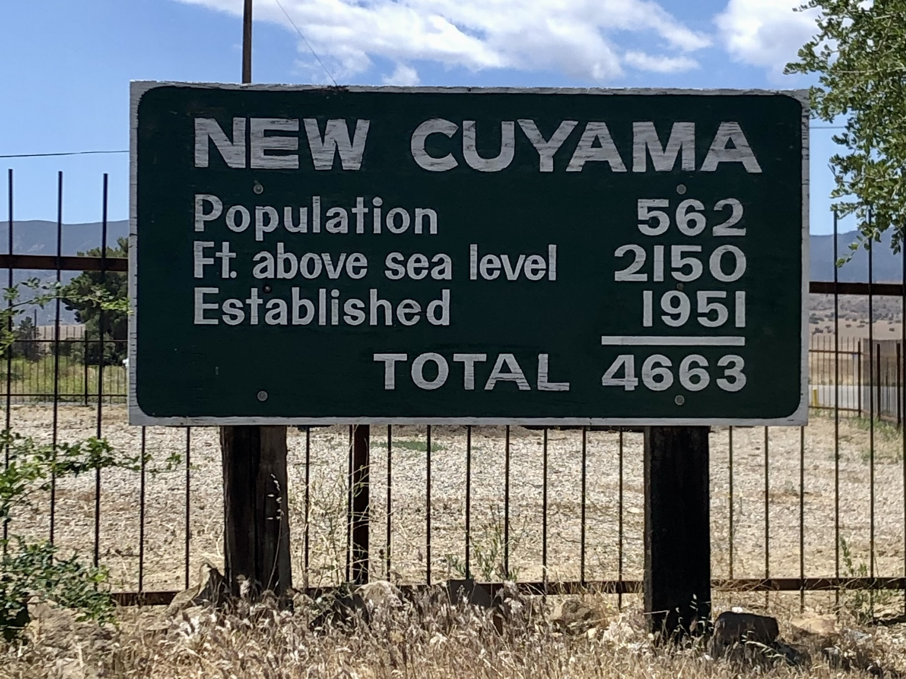
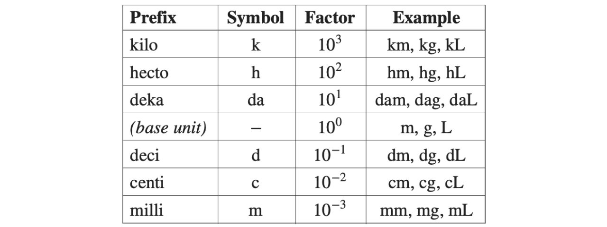
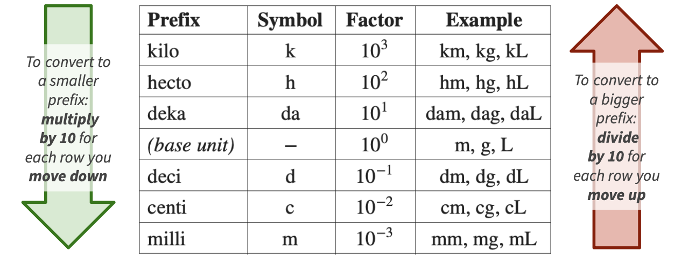
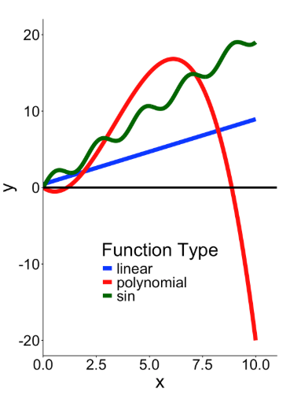
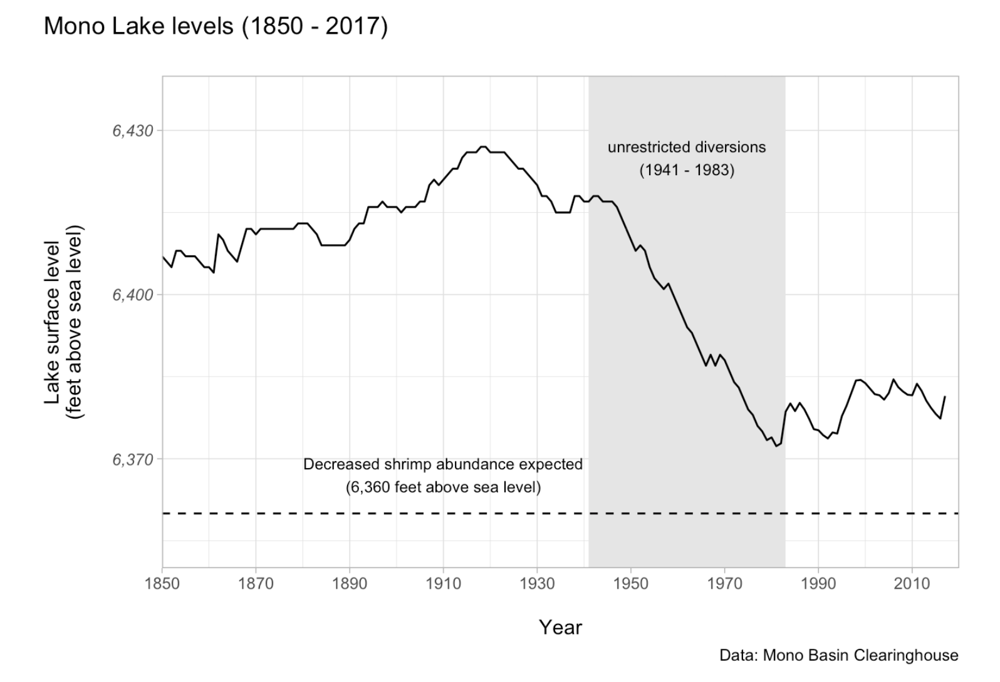

---
format:
  revealjs:
    slide-number: true
    # code-link: true
    highlight-style: a11y
    chalkboard: true
    theme:
      - ../../ucsb-media.scss
    include-in-header:
      text: |
        <script>
        (function loadCancelExtension(){
          if (window.MathJax && window.MathJax.Hub) {
            MathJax.Hub.Config({ TeX: { extensions: ["cancel.js"] } });
          } else {
            setTimeout(loadCancelExtension, 20);
          }
        })();
        </script>
editor_options:
  chunk_output_type: console
---

## {#title-slide data-menu-title="Title Slide" background="#053660"}

[Functions, Graphs, $e^x$ and Logarithms]{.custom-title}

[Bren Math Workshop]{.custom-subtitle .gold}

<hr class="hr-teal">

[Carmen Galaz García, Ph.D.]{.body-text-l .center-text .baby-blue-text}

[Bren School of Environmental Science & Management]{.center-text .body-text-m .baby-blue-text}

<br>

[*Some materials have been adapted from Nathaniel Grimes work for the Bren Math Workshop.*]{.baby-blue-text .body-text-s}

---

## {#units-title data-menu-title="Units" background-color="#003660"}


<div class="page-center">
<div class="custom-subtitle">Units</div>
</div>


---

## {#units-1 data-menu-title="Units"} 

[UNITS. UNITS. UNITS.]{.slide-title}

<hr>

<br>

::: {.body-text-m}
Think about these statements, which all contain the same *value* of 4:

<br>

- There are four in the refrigerator.

- There are four **burritos** in the refrigerator.

- There are four **roaches** in the refrigerator.

- There are four **million dollars** in the refrigerator.
:::

---

## {#units-2 data-menu-title="Units"} 

[UNITS. UNITS. UNITS.]{.slide-title}

<hr>

::: {.body-text-m}
Think about this sign at New Cuyama. Anything odd here?
:::

:::{.center-text}
{width="50%"}
:::

---

## {#units-critical data-menu-title="Units are critical"} 

[Units are critical in environmental science]{.slide-title2}

<hr>

<br>
<br>

::: {.center-text .body-text-l}
We cannot responsibly work with data without knowing the units of **each variable we're working with**.

<br>

That means we need to always **familiarize ourselves with variables**, carefully **check units and any unit conversions**, and understand **how units combine into the units of a dependent variable**.
:::


---

## {#metric-prefixes data-menu-title="Metric prefixes"}

[Metric prefixes]{.slide-title}

<hr>

Metric units are built from a **base unit** (like meters, grams, or liters) plus a **prefix** that scales it by a power of 10.

:::{.center-text}
{width=80%}
:::

::: {.body-text-s}
The **factor** indicates how many times to multiply the base unit by 10. For example, 1 km = $10^3$ m = 1000 m, and 1 cm = $10^{-2}$ m = 0.01 m.
:::

---

## {#metric-prefixes-conversion data-menu-title="Metric prefixes"}

[Metric prefixes]{.slide-title}

<hr>

Metric units are built from a **base unit** (like meters, grams, or liters) plus a **prefix** that scales it by a power of 10.

:::{.center-text}
{width=80%}
:::

::: {.body-text-s}
The **factor** indicates how many times to multiply the base unit by 10. For example, 1 km = $10^3$ m = 1000 m, and 1 cm = $10^{-2}$ m = 0.01 m.
:::


---

## {#metric-prefixes-example-2 data-menu-title="Metric prefixes: example 2"}

[Metric prefixes]{.slide-title}

<hr>

**Example.** Convert 750 mL into L.

✏️  [Let's solve this together.]{style="color:green;"}


:::: {.columns}

::: {.column width="40%"}

:::


::: {.column width="60%"}
{width=80%}
:::

:::

---

## {#metric-prefixes-example-2-solution data-menu-title="Metric prefixes: example 2"}

[Metric prefixes]{.slide-title}

<hr>

**Example.** Convert 750 mL into L.

:::: {.columns}

::: {.column width="40%"}
Starting at **milli** and ending at **base**, we move **3 rows up** the table:

milli &rarr; centi &rarr; deci &rarr; base

So we divide by $10^3$:

\begin{align*}
750 \text{ mL} &= \frac{750}{10^3} \text{ L} \\
&= 0.75 \text{ L}
\end{align*}

:::


::: {.column width="60%"}
{width=80%}
:::

:::


---

## {#metric-prefixes-example data-menu-title="Metric prefixes: example"}

[Metric prefixes]{.slide-title}

<hr>

**Exercise.** Convert 4.7 km into cm.

✏️  [Take a moment to compute it.]{style="color:green;"}


:::: {.columns}

::: {.column width="40%"}

:::


::: {.column width="60%"}
:::{.center-text}

:::
:::

:::

---

## {#metric-prefixes-example-solution data-menu-title="Metric prefixes: example"}

[Metric prefixes]{.slide-title}

<hr>

**Exercise.** Convert 4.7 km into cm.

:::: {.columns}

::: {.column width="40%"}
Starting at **kilo** and ending at **centi**, we move **5 rows down** the table:

kilo &rarr; hecto &rarr; deka &rarr; base &rarr; deci &rarr; centi

So we multiply by $10^5$:

\begin{align*}
4.7 \text{ km} &= 4.7 \times 10^5 \text{ cm} \\
&= 470{,}000 \text{ cm}
\end{align*}

:::


::: {.column width="60%"}
{width=80%}
:::

:::

---

## {#area-volume-conversions data-menu-title="Area & volume conversions"}

[Converting areas and volumes]{.slide-title}

<hr>

So far we've converted **linear** units (length). What about **area** (squared units) and **volume** (cubed units)?

<br>

::: {.body-text-m .teal-text .center-text}
To convert area units, **square** the linear conversion factor. 

To convert volume units, **cube** the linear conversion factor.
:::


Since $1 \text{ m} = 100 \text{ cm}$:

\begin{align*}
1 \text{ m}^2 &= (100 \text{ cm})^2 = 100^2 \text{ cm}^2 = 10{,}000 \text{ cm}^2 \\
1 \text{ m}^3 &= (100 \text{ cm})^3 = 100^3 \text{ cm}^3 = 1{,}000{,}000 \text{ cm}^3
\end{align*}

---

## {#area-conversion-example data-menu-title="Area conversion: example"}

[Converting areas and volumes]{.slide-title}

<hr>

**Example.** Convert $3.5 \text{ m}^2$ into $\text{cm}^2$.

✏️  [Let's solve this together.]{style="color:green;"}

---

## {#area-conversion-example-solution data-menu-title="Area conversion: example"}

[Converting areas and volumes]{.slide-title}

<hr>

**Example.** Convert $3.5 \text{ m}^2$ into $\text{cm}^2$.

::: {.body-text-m}
The linear factor from meters to centimeters is $10^2$ (2 rows down the metric prefix table). For area, we **square** this factor:
:::

\begin{align*}
3.5 \text{ m}^2 &= 3.5 \times (10^2)^2 \text{ cm}^2 \\
&= 3.5 \times 10^4 \text{ cm}^2 \\
&= 35{,}000 \text{ cm}^2
\end{align*}

---

## {#volume-conversion-example data-menu-title="Volume conversion: example"}

[Converting areas and volumes]{.slide-title}

<hr>

**Exercise.** Convert $2 \text{ m}^3$ into $\text{cm}^3$.

✏️  [Take a moment to solve this.]{style="color:green;"}

---

## {#volume-conversion-example-solution data-menu-title="Volume conversion: example"}

[Converting areas and volumes]{.slide-title}

<hr>

**Exercise.** Convert $2 \text{ m}^3$ into $\text{cm}^3$.

::: {.body-text-m}
The linear factor from meters to centimeters is $10^2$ (2 rows down the metric prefix table). For volume, we **cube** this factor:
:::

\begin{align*}
2 \text{ m}^3 &= 2 \times (10^2)^3 \text{ cm}^3 \\
&= 2 \times 10^6 \text{ cm}^3 \\
&= 2{,}000{,}000 \text{ cm}^3
\end{align*}

---

## {#unit-conv data-menu-title="Unit conversions"}

[Dimensional analysis (unit conversions)]{.slide-title}

<hr>

In dimensional analysis, we multiply initial units by a sequence of **unit conversion factors** to arrive at the final desired units.

**Example:** How many centimiters are there in 6 inches?

✏️  [Let's solve this together.]{style="color:green;"}


---

## {#unit-conv-solution-1 data-menu-title="Unit conversions"} 

[Dimensional analysis (unit conversions)]{.slide-title}

<hr>

In dimensional analysis, we multiply initial units by a sequence of **unit conversion factors** to arrive at the final desired units.

**Example:** How many centimiters are there in 6 inches?

We know: 1 inch = 2.54 cm. This gives us two unit conversion factors:


$$ \frac{2.54 \text{ cm}}{1 \text{ in}} \text{ and } \frac{1 \text{ in}}{2.54 \text{ cm}}.$$
Important: the fraction the numerator and denominator represent the same quantity. 

Then we multiply by the *appropriate* conversion factor and simplify:

\begin{align*}

6 \text{ in} &= 6 \text{ in} \cdot  \frac{2.54 \text{ cm}}{1 \text{ in}}\\
&= 6  \frac{2.54}{1} \cdot  \text{ in}\frac{\text{ cm}}{\text{ in}} \\
&= 15.24 \cancel{\text{ in}}\frac{\text{ cm}}{\cancel{\text{ in}}} \\
&= 15.24 \text{ cm}
\end{align*}

---

## {#unit-conv-2 data-menu-title="Unit conversions"}

[Dimensional analysis (unit conversions)]{.slide-title}

<hr>

**Example.** Convert $100 \frac{g}{cm^3}$ into units of $\frac{kg}{in^3}$, given that 1 cm^3^ = 0.061 in^3^.

✏️  [Let's solve this together.]{style="color:green;"}

---

## {#unit-conv-2-solution data-menu-title="Unit conversions"} 

[Dimensional analysis (unit conversions)]{.slide-title}

<hr>

**Example.** Convert $100 \frac{g}{cm^3}$ into units of $\frac{kg}{in^3}$, given that 1 cm^3^ = 0.061 in^3^.

We need one unit conversion factor for $g$: 
$\frac{1 \text{ kg}}{1000 \text{ g}}$.

And another one for $\text{cm}^3$:
$\frac{1 \text{ cm}^3}{0.061 \text{in}^3}$.

Then we multiply by the conversion factors and simplify

\begin{align*}

100 \frac{\text{ g}}{\text{cm}^3} &= 100 \frac{\text{ g}}{\text{cm}^3} \cdot \frac{1 \text{ cm}^3}{0.061 \text{ in}^3} \cdot \frac{1 \text{ kg}}{1000 \text{ g}}\\
&= 100 \frac{1}{0.061} \frac{1}{1000}\cdot \frac{\text{ g}}{\text{cm}^3} \frac{\text{ cm}^3}{ \text{ in}^3} \frac{ \text{ kg}}{\text{ g}}\\
&= \frac{1}{0.61} \cdot \frac{\cancel{\text{ g}}}{\cancel{\text{cm}^3}} \frac{\cancel{\text{ cm}^3}}{ \text{ in}^3} \frac{ \text{ kg}}{\cancel{\text{ g}}}\\
&=1.639\frac{kg}{in^3}
\end{align*}


---

## {#ppm data-menu-title="Parts per million (ppm)"}

[Parts per million (ppm)]{.slide-title}

<hr>

::: {.body-text-m}
**Parts per million (ppm)** is another way of writing a fraction — just like percent — but suited to very small concentrations (e.g. a contaminant in water or soil).
:::

<br>

$$
1\% = \frac{1}{100} \qquad \qquad 1 \text{ ppm} = \frac{1}{1{,}000{,}000}
$$

From these fractions we see we need 10,000 ppm to get 1%, so **1% = 10,000 ppm**. 

<span style="color: red;">To convert **percent &rarr; ppm**, multiply by 10,000. </span>

<span style="color: red;">To convert **ppm &rarr; percent**, divide by 10,000.</span>

---

## {#ppm-example data-menu-title="ppm example"}

[Parts per million (ppm)]{.slide-title}

<hr>

**Example.** Convert 0.008% to ppm.

✏️  [Let's solve this together.]{style="color:green;"}

---

## {#ppm-example-solution data-menu-title="ppm example"}

[Parts per million (ppm)]{.slide-title}

<hr>

**Example.** Convert 0.008% to ppm.

::: {.body-text-m}
We are converting **percent &rarr; ppm**, so we multiply by 10,000:
:::

\begin{align*}
0.008\% &= 0.008 \times 10{,}000 \text{ ppm} \\
&= 80 \text{ ppm}
\end{align*}

---

## {#unit-conv-practice data-menu-title="Unit conversions practice"}

[Unit conversion practice]{.slide-title}

<hr>

:::{style="color:green;" .body-text-s}

1. Convert 120 ppm to a percentage.

<br>

2. Convert 3,400 mm to meters.

<br>

3. Convert an area of $3.2 \text{ km}^2$ to $\text{m}^2$.

<br>


4. A stock solution is 4 g/L. Express this in mg/mL.

<br>

5. Convert $8.1\frac{km}{s}$ to miles per hour, given that 1 km = 0.621 miles.

<br>

6. A lake has average depth 800 cm and surface area $2.5 \text{ km}^2$. Using Volume = depth × area, find the volume in $\text{m}^3$.

:::

---

## {#unit-conv-solutions-6 data-menu-title="Unit conversions practice"}

[Unit conversion practice]{.slide-title}

<hr>

✏️  [Let's see a solution!]{style="color:green;" .body-text-m}

1. Convert 120 ppm to a percentage.

<br>
<br>
<br>

2. Convert 3,400 mm to meters.

<br>
<br>
<br>

3. Convert an area of $3.2 \text{ km}^2$ to $\text{m}^2$.


---

## {#unit-conv-solutions-3 data-menu-title="Unit conversions practice"}

[Unit conversion practice]{.slide-title}

<hr>

4. A stock solution is 4 g/L. Express this in mg/mL.

✏️  [Let's see a solution!]{style="color:green;" .body-text-m}

---

## {#unit-conv-solutions-4 data-menu-title="Unit conversions practice"}

[Unit conversion practice]{.slide-title}

<hr>

5. Convert $8.1\frac{km}{s}$ to miles per hour, given that 1 km = 0.621 miles.

✏️  [Let's see a solution!]{style="color:green;" .body-text-m}

---

## {#unit-conv-solutions-5 data-menu-title="Unit conversions practice"}

[Unit conversion practice]{.slide-title}

<hr>

6. A lake has average depth 800 cm and surface area $2.5 \text{ km}^2$. Using Volume = depth × area, find the volume in $\text{m}^3$.

✏️  [Let's see a solution!]{style="color:green;" .body-text-m}

---

## {#unit-conv-solutions-answers data-menu-title="Unit conversions practice" .smaller}

[Unit conversion practice: solutions]{.slide-title}

<hr>

[**1.** $120 \text{ ppm} = 120 / 10{,}000 = 0.012\%$]{.body-text-m}

[**2.** $3{,}400 \text{ mm} = 3{,}400 / 10^3 = 3.4$ m]{.body-text-m}

<br>

[**3.** $3.2 \text{ km}^2 \times (1000\text{ m/km})^2 = 3.2\times10^{6}$ m²]{.body-text-m}

<br>

[**4.** $4 \text{ g/L} = 4000 \text{ mg} / 1000 \text{ mL} = 4$ mg/mL]{.body-text-m}

<br>

[**5.** $8.1\frac{km}{s} \times 3600\frac{s}{hr} \times 0.621\frac{mi}{km} = 18108.36 \frac{mi}{hr}$]{.body-text-m}

<br>

[**6.** Area $= 2.5\times10^{6}$ m². Volume $= 8 \times 2.5\times10^{6} = 2\times10^{7}$ m³]{.body-text-m}

---

## {#break data-menu-title="5 minute break"} 

[Let's take a 10 minute break]{.slide-title}

<hr>


---

## {#eds212-basics data-menu-title="EDS 212 basics" background-color="#003660"}


<div class="page-center">
<div class="custom-subtitle">Functions</div>
</div>

---

## {#functions-1 data-menu-title="Functions"} 

[Functions]{.slide-title}

<hr>

[Functions are mathematical expressions that tell us how input values are related to output values.]{.body-text-m}

---

## {#functions-2 data-menu-title="Functions"} 

[Functions]{.slide-title}

<hr>

[Functions are mathematical expressions that tell us how input values are related to output values.]{.body-text-m}

<br>

For example, $y = 3x-5$ is a function that tells us the **value of y** at **any value of x**. In this scenario, we would probably say **y is a function of x**. 

---

## {#functions-3 data-menu-title="Functions"} 

[Functions]{.slide-title}

<hr>

[Functions are mathematical expressions that tell us how input values are related to output values.]{.body-text-m}


<br>

For example, $y = 3x-5$ is a function that tells us the **value of y** at **any value of x**. In this scenario, we would probably say **y is a function of x**. 

Could you also rewrite it and say **x is a function of y**? 

Here, with no knowledge of what's an input and what's an output, sure - but usually in environmental science we specify the input variable(s), and the output variable(s) carefully. 

What follows is the expression in the format of: 

:::{.center-text}
"**[output variable(s)] is/are a function of [input variable(s)]**".
:::

<br>

Also: output variable = **dependent variable** and input variable = **independent variable**.

---

## {#inputs-outputs data-menu-title="Inputs & outputs"} 

[Thinking about inputs and outputs]{.slide-title}

<hr>

<br>

For the following combinations of related variables, which do you expect would be the **input** and the **output** in a function describing how they are related? E.g. "Evapotranspiration is a function of air temperature."

<br>

✏️ [Write your answer individually as **a sentence**.]{style="color:green;"}

::: {.body-text-m}
1. fuel (biomass) / slope / wildfire severity / windspeed / air temperature

2. wind speed / power generated by wind turbine

3. soil C:N ratio / bacterial biomass / soil water content / leaf litter decomposition rate
:::

::: {.notes}
1. wildfire severity is a function of fuel and slope and windspeed and air temperature
2. power generated by wind turbine is a function of wind speed
3. leaf litter decomposition rate is a function of soil C:N ratio and bacterial biomass and soil water content
:::


---

## {#fxn-notation-blank data-menu-title="Function notation"} 

[Function notation]{.slide-title}

<hr>

✏️ 

---

## {#fxn-notation data-menu-title="Function notation"} 

[Function notation]{.slide-title}

<hr>

<br>

[Single variable (univariate) function:]{.body-text-l} 

$f(x) = [expression\space containing \space x]$

<br>


[Multivariate function:]{.body-text-l} 

$g(a,T,z)=[expression\space containing \space a, T, \space and \space z]$

---

## {#eval-fxns-blank data-menu-title="Evalutating functions"} 

[Evaluating functions]{.slide-title}

<hr>

<br>

::: {.body-text-m}
We evaluate functions by plugging in values of the input variables. 

<br>

✏️ [Example:]{style="color:green;"}

<br>

Evaluate $g(x,t)=2.4x+0.5t^2$ at $x = 3$ and $t = 10$

:::

---

## {#eval-fxns data-menu-title="Evalutating functions"} 

[Evaluating functions]{.slide-title}

<hr>

<br>

::: {.body-text-m}
We evaluate functions by plugging in values of the input variables. 

<br>

✏️ [Example:]{style="color:green;"}

<br>

Evaluate $g(x,t)=2.4x+0.5t^2$ at $x = 3$ and $t = 10$

<br>

$g(3, 10) = 2.4(3) + 0.5(10^2)= 57.2$
:::


---

## {#graphs-title data-menu-title="Graphs title" background-color="#003660"}


<div class="page-center">
<div class="custom-subtitle">Graphs</div>
</div>

---

## {#graphs data-menu-title="Graphs"} 

[Why graphs?]{.slide-title}

<hr>

Graphs are a way for us to more easily process trends or patterns that may be more challenging to understand in a table or list.

:::{.center-text}
**Which could be easier to understand?**
:::

:::: {.columns}
::: {.column width="50%"}
```{r,out.width="70%"}
library(DT)
library(tidyverse)

car<-mtcars %>%
  select(mpg,cyl,disp,hp) %>%
  head(6)
DT::datatable(car,
              fillContainer = FALSE, options = list(pageLength = 10))
```

:::

:::{.column width="50%"}
```{r,echo=FALSE, fig.width=6, fig.height=6,out.width="70%",fig.align='right'}
ggplot(mtcars, aes(x=as.factor(cyl), y=mpg)) + 
    geom_boxplot(fill="slateblue", alpha=0.2) + 
    xlab("Number of Cylinders")+
  theme_classic()+
  theme(text = element_text(size = 28)) 
```
:::
::::

---

## {#xy-coordinates data-menu-title="xy coordinates"}

[The $xy$ coordinate system]{.slide-title}

<hr>

::::{.columns}
:::{.column width="50%"}

Graphs generally move in a 2-dimensional plane with a coordinate system using two axes:

- $x$-axis (horizontal axis)

- $y$-axis (vertical axis)


<br>

Axes units must be defined depending on the application.

:::{.incremental}

We use pairs of numbers to place data:

- A point on the $xy$ plane with **coordinates** $(a,b)$ means the point is located at $a$ on the $x$-axis and at $b$ on the $y$-axis.

- Where would (2,-1) go on the graph?

:::
:::
:::{.column width="50%"}

```{r echo=FALSE}
knitr::include_graphics("images/cart.png")
```
:::
::::

---

## {#graph-series data-menu-title="Graphs series of points to make lines"}

[We can join series of points to make graphs]{.slide-title}

<hr>

::::{.columns}
:::{.column width="50%"}
```{r echo=FALSE}
set.seed(1)
x=seq(0,10)
y=x+1.5*rnorm(10)
pdf<-data.frame(x=x,y=y)

DT::datatable(round(pdf,2),
              fillContainer = FALSE, options = list(pageLength = 6))
```

:::
:::{.column width="50%"}

```{r, echo=FALSE,fig.height=5.5,fig.width=5,out.width="90%"}
ggplot(pdf,aes(x=x,y=y))+
  geom_point(size=4)+
  geom_path(linewidth=2)+
  theme_classic()+
  theme(text = element_text(size = 28)) 
```

:::
::::

--- 

## {#graph-fcn data-menu-title="Most functions can be shown on graphs"}

[Functions on a single variable and a single output can be graphed]{.slide-title}

<hr>

::::{.columns}
:::{.column width="50%"}

- $\color{green}{y=sin(3x)+2x}$

<br>

- $\color{red}{y=0.5x^3+x^2-5x}$

<br>

- $\color{blue}{y=0.85x+0.44}$

:::

:::{.column width="50%"}

:::

::::

---

## {#graph-ingredients-1 data-menu-title="Two key ingredients to graphs"}

[Two key ingredients to graphs]{.slide-title}

<hr>

::::{.columns}
:::{.column width="50%"}


Intercepts

- $x$-intercept

  - Where does the graph intersect the $x$-axis? 
  - In other words, for what values of $x$ do we have $(x,0)$ be part of the graph?
    
    

:::

:::{.column width="50%"}
:::{.center-text}
What are the intercepts of the polynomial function in red?
:::
{width=60%}
:::
::::

---

## {#graph-ingredients-2 data-menu-title="Two key ingredients to graphs"}

[Two key ingredients to graphs]{.slide-title}

<hr>

::::{.columns}
:::{.column width="50%"}


Intercepts

- $x$-intercept

  - Where does the graph intersect the $x$-axis? 
  - In other words, for what values of $x$ do we have $(x,0)$ be part of the graph?
    
- $y$-intercept

    - Where does  the graph intersect the $y$-axis? 
    - In other words, for what value of $y$ do we have $(0,y)$ be part of the graph?
    

:::

:::{.column width="50%"}
:::{.center-text}
What are the intercepts of the polynomial function in red?
:::

{width=60%}

:::
::::


---

## {#intercepts-practice-1 data-menu-title="Intercepts practice"}
<!-- Source: ESM 204 Exercise Bank, Exercise 52 -->

[Intercepts practice]{.slide-title}

<hr>

✏️ [Take a minute to solve this individually.]{style="color:green;"}

A supply-and-demand graph shows the demand curve hitting the $y$-axis at $P=\$60$ and the supply curve hitting it at $P=\$5$. What does each $y$-intercept represent?

---

## {#intercepts-practice-1-solve data-menu-title="Intercepts practice"}

[Intercepts practice]{.slide-title}

<hr>

A supply-and-demand graph shows the demand curve hitting the $y$-axis at $P=\$60$ and the supply curve hitting it at $P=\$5$. What does each $y$-intercept represent?

✏️ [Let's see a solution!]{style="color:green;"}

---

## {#intercepts-practice-2 data-menu-title="Intercepts practice"}

[Intercepts practice]{.slide-title}

<hr>

::::{.columns}
:::{.column width="50%"}

✏️ [Take a minute to solve this individually.]{style="color:green;"}

A graph shows a population's per-capita growth rate, $\frac{1}{N}\frac{dN}{dt}$, as a function of its population size $N$.

What does the $y$-intercept represent? What does the $x$-intercept represent?

:::

:::{.column width="50%"}

```{r echo=FALSE,fig.align='center',out.width="90%"}
x_min <- 0
x_max <- 120
y_min <- -0.1
y_max <- 0.5

r <- 0.4
K <- 100

x <- seq(x_min, x_max, length.out = 100)
y <- r - (r / K) * x

plot(x, y, type = "l", lwd = 4, col = "seagreen",
     xlim = c(x_min, x_max), ylim = c(y_min, y_max),
     xlab = "Population size, N",
     ylab = "Per-capita growth rate, (1/N)(dN/dt)",
     xaxt = "n", yaxt = "n")

abline(h = seq(y_min, y_max, by = 0.1), col = "lightgray", lty = "dotted")
abline(v = seq(x_min, x_max, by = 20), col = "lightgray", lty = "dotted")

abline(h = 0, v = 0, col = "gray50")

lines(x, y, lwd = 2)

axis(1, at = seq(x_min, x_max, by = 20))
axis(2, at = seq(y_min, y_max, by = 0.1))
```

:::
::::

---

## {#intercepts-practice-2-solve data-menu-title="Intercepts practice"}

[Intercepts practice]{.slide-title}

<hr>

::::{.columns}
:::{.column width="50%"}

A graph shows a population's per-capita growth rate, $\frac{1}{N}\frac{dN}{dt}$, as a function of its population size $N$.

What does the $y$-intercept represent? What does the $x$-intercept represent?

✏️ [Let's see a solution!]{style="color:green;"}

:::

:::{.column width="50%"}

```{r echo=FALSE,fig.align='center',out.width="90%"}
x_min <- 0
x_max <- 120
y_min <- -0.1
y_max <- 0.5

r <- 0.4
K <- 100

x <- seq(x_min, x_max, length.out = 100)
y <- r - (r / K) * x

plot(x, y, type = "l", lwd = 4, col = "seagreen",
     xlim = c(x_min, x_max), ylim = c(y_min, y_max),
     xlab = "Population size, N",
     ylab = "Per-capita growth rate, (1/N)(dN/dt)",
     xaxt = "n", yaxt = "n")

abline(h = seq(y_min, y_max, by = 0.1), col = "lightgray", lty = "dotted")
abline(v = seq(x_min, x_max, by = 20), col = "lightgray", lty = "dotted")

abline(h = 0, v = 0, col = "gray50")

lines(x, y, lwd = 2)

axis(1, at = seq(x_min, x_max, by = 20))
axis(2, at = seq(y_min, y_max, by = 0.1))
```

:::
::::

---

## {#intercepts-practice-3 data-menu-title="Intercepts practice"}

[Intercepts practice]{.slide-title}

<hr>

::::{.columns}
:::{.column width="50%"}

✏️ [Take a minute to solve this individually.]{style="color:green;"}

A reservoir is being drained for irrigation. The graph below shows its storage volume $V$ (in millions of cubic meters) as a function of time $t$ (in years).

What does the $y$-intercept represent? What does the $x$-intercept represent?

:::

:::{.column width="50%"}

```{r echo=FALSE,fig.align='center',out.width="90%"}
x_min <- 0
x_max <- 14
y_min <- -20
y_max <- 60

V0 <- 50
rate <- 5

x <- seq(x_min, x_max, length.out = 100)
y <- V0 - rate * x

plot(x, y, type = "l", lwd = 4, col = "steelblue",
     xlim = c(x_min, x_max), ylim = c(y_min, y_max),
     xlab = "Time, t (years)",
     ylab = "Reservoir storage, V (million cubic meters)",
     xaxt = "n", yaxt = "n")

abline(h = seq(y_min, y_max, by = 10), col = "lightgray", lty = "dotted")
abline(v = seq(x_min, x_max, by = 2), col = "lightgray", lty = "dotted")

abline(h = 0, v = 0, col = "gray50")

lines(x, y, lwd = 2)

axis(1, at = seq(x_min, x_max, by = 2))
axis(2, at = seq(y_min, y_max, by = 10))
```

:::
::::

---

## {#intercepts-practice-3-solve data-menu-title="Intercepts practice"}

[Intercepts practice]{.slide-title}

<hr>

::::{.columns}
:::{.column width="50%"}

A reservoir is being drained for irrigation. The graph below shows its storage volume $V$ (in millions of cubic meters) as a function of time $t$ (in years).

What does the $y$-intercept represent? What does the $x$-intercept represent?

✏️ [Let's see a solution!]{style="color:green;"}

:::

:::{.column width="50%"}

```{r echo=FALSE,fig.align='center',out.width="90%"}
x_min <- 0
x_max <- 14
y_min <- -20
y_max <- 60

V0 <- 50
rate <- 5

x <- seq(x_min, x_max, length.out = 100)
y <- V0 - rate * x

plot(x, y, type = "l", lwd = 4, col = "steelblue",
     xlim = c(x_min, x_max), ylim = c(y_min, y_max),
     xlab = "Time, t (years)",
     ylab = "Reservoir storage, V (million cubic meters)",
     xaxt = "n", yaxt = "n")

abline(h = seq(y_min, y_max, by = 10), col = "lightgray", lty = "dotted")
abline(v = seq(x_min, x_max, by = 2), col = "lightgray", lty = "dotted")

abline(h = 0, v = 0, col = "gray50")

lines(x, y, lwd = 2)

axis(1, at = seq(x_min, x_max, by = 2))
axis(2, at = seq(y_min, y_max, by = 10))
```

:::
::::

---

## {#intercepts-practice-solutions data-menu-title="Intercepts practice: solutions" .smaller}

[Solutions]{.slide-title}

<hr>

**1. Supply and demand.** Demand $y$-intercept ($P=\$60$) = the *choke price* — the maximum price at which anyone is willing to buy, i.e. quantity demanded is zero. Supply $y$-intercept ($P=\$5$) = the minimum price needed to induce any positive supply — below it, no one is willing to sell.

**2. Per-capita growth rate.** $y$-intercept ($N=0$, rate $=0.4$) = the *intrinsic growth rate* $r$ — the population's maximum per-capita growth rate when it is small and not yet resource-limited. $x$-intercept ($N=100$, rate $=0$) = the *carrying capacity* $K$ — the population size at which per-capita growth stops.

**3. Reservoir storage.** $y$-intercept ($t=0$, $V=50$) = the reservoir's *initial storage volume*. $x$-intercept ($t=10$, $V=0$) = the *time at which the reservoir is completely drained*.

---

## {#reading-graphs-title data-menu-title="Reading graphs" background-color="#003660"}


<div class="page-center">
<div class="custom-subtitle">"Reading" graphs</div>
</div>


---

## {#understanding-graphs data-menu-title="Graphs explanation"} 

[Understanding graphs]{.slide-title}

<hr>

<br>

[When you look at graphs, the first things you should ask:]{.body-text-m}  

<br>

- What variables are being plotted (e.g. x- & y-axis, including units)?

<br>

- What values are plotted (e.g. raw values, transformed, means, etc.)?

<br>

- What are the overall takeaways (e.g. trends, maxima, minima, axes intercepts) and am I understanding them responsibly?

---

## {#reading-graphs data-menu-title="Graphs explanation"} 

[Reading graphs (in general)]{.slide-title}

<hr>

>"On the x-axis we have [x-variable] measured in  [units] and on the y-axis the the [y-variable] measured in [units]. This figure shows the [change/pattern/relationship] between [x-variable] and [y-variable]. Overall [overall statement of pattern / trend / findings]."

. . .

{width="50%" fig-align="center"}

---


## {#reading-graphs-3 data-menu-title="Graphs explanation"} 

[Reading graphs (in general)]{.slide-title}

<hr>

>"On the x-axis we have [x-variable] measured in  [units] and on the y-axis the the [y-variable] measured in [units]. This figure shows the [change/pattern/relationship] between [x-variable] and [y-variable]. Overall [overall statement of pattern / trend / findings]."


](/course-materials/slides/images/correlation-1-both.png){width="80%" fig-align="center"}

---

## {#graphs-reading-practice-1 data-menu-title="Graphs explanation"} 

[Reading graphs practice]{.slide-title3}

<hr>
::: {.body-text-s}

💬 [Partner 1 gets to read the graph for the first variable.]{style="color:green;"}

>"On the x-axis we have [x-variable] measured in  [units] and on the y-axis the the [y-variable] measured in [units]. This figure shows the [change/pattern/relationship] between [x-variable] and [y-variable]. Overall [overall statement of pattern / trend / findings]."

:::

. . .

{width="55%" fig-align="center"}

<!-- 
[Possibly with additional context as useful for the audience to put those findings into perspective (e.g. "this reduction represents an 82% decline in rainbowfish stocks along the Narnia Coast since 1991").]{.body-text-m}  -->

---

## {#graphs-reading-practice-2 data-menu-title="Graphs explanation"} 

[Reading graphs practice]{.slide-title3}

<hr>

::: {.body-text-s}

💬 [Partner 2 gets to read the plot for the second variable, provide context for the data, and hypothesise an explanation.]{style="color:green;"}

>"On the x-axis we have [x-variable] measured in  [units] and on the y-axis the the [y-variable] measured in [units]. This figure shows the [change/pattern/relationship] between [x-variable] and [y-variable]. Overall [overall statement of pattern / trend / findings]."

:::

. . .


](/course-materials/slides/images/correlation-2-thomas-vehicle-thefts.png){width="55%" fig-align="center"}

---

## {#graphs-reading-practice-mono-lake data-menu-title="Graphs explanation"} 

[Reading graphs practice]{.slide-title3}

<hr>

```{r}
#| eval: true
#| echo: false
#| out-width: "100%"
#| fig-align: "center"

```

---

## {#end-of-day data-menu-title="End of day 2!" background-color="#003660"}

<div class="page-center">
<div class="custom-subtitle">Wrapping up...</div>
</div>

---

## {#what-we-covered data-menu-title="What we covered today" }


[What we covered today]{.slide-title}

<hr>

- <span style="color:#006699"><b>📏 Metric prefixes</b></span>
- <span style="color:#339966"><b>🧊 Area & volume conversions</b></span>
- <span style="color:#9933CC"><b>⚖️ Dimensional analysis (unit conversions)</b></span>
- <span style="color:#CC3366"><b>🧪 Parts per million (ppm)</b></span>
- <span style="color:#CC3366"><b>🧩 Definition of functions </b></span>  
- <span style="color:#006699"><b>📊 Graphing</b></span>  
- <span style="color:#006633"><b>💬 Reading graphs</b></span>  
