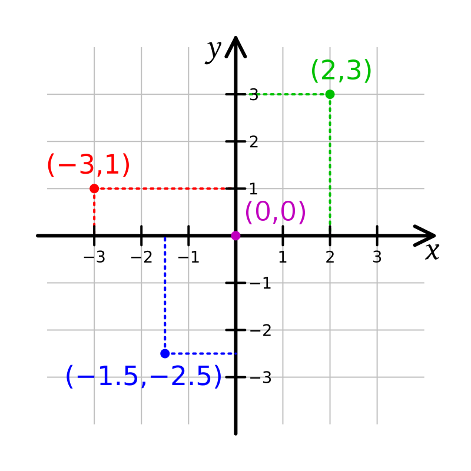

---
format:
  revealjs:
    slide-number: true
    # code-link: true
    highlight-style: a11y
    chalkboard: true
    theme:
      - ../../ucsb-media.scss
    include-in-header:
      text: |
        <script>
        (function loadCancelExtension(){
          if (window.MathJax && window.MathJax.Hub) {
            MathJax.Hub.Config({ TeX: { extensions: ["cancel.js"] } });
          } else {
            setTimeout(loadCancelExtension, 20);
          }
        })();
        </script>
editor_options:
  chunk_output_type: console
---

## {#title-slide data-menu-title="Title Slide" background="#053660"}

[Day 3 - Part 1: Bren Math Workshop]{.custom-title}

<hr class="hr-teal">

[Carmen Galaz García, Ph.D.]{.body-text-l .center-text .baby-blue-text}

[Bren School of Environmental Science & Management]{.center-text .body-text-m .baby-blue-text}

<br>

---

## {#graphs-title data-menu-title="Graphs title" background-color="#003660"}


<div class="page-center">
<div class="custom-subtitle">Graphs</div>
</div>

---

## {#graphs data-menu-title="Graphs"} 

[Why graphs?]{.slide-title}

<hr>

Graphs are a way for us to more easily process trends or patterns that may be more challenging to understand in a table or list.

:::{.center-text}
**Which could be easier to understand?**
:::

:::: {.columns}
::: {.column width="50%"}
```{r,out.width="70%"}
library(DT)
library(tidyverse)

car<-mtcars %>%
  select(mpg,cyl,disp,hp) %>%
  head(6)
DT::datatable(car,
              fillContainer = FALSE, options = list(pageLength = 10))
```

:::

:::{.column width="50%"}
```{r,echo=FALSE, fig.width=6, fig.height=6,out.width="70%",fig.align='right'}
ggplot(mtcars, aes(x=as.factor(cyl), y=mpg)) + 
    geom_boxplot(fill="slateblue", alpha=0.2) + 
    xlab("Number of Cylinders")+
  theme_classic()+
  theme(text = element_text(size = 28)) 
```
:::
::::

---

## {#xy-coordinates-1 data-menu-title="xy coordinates"}

[The $xy$ coordinate system]{.slide-title}

<hr>

::::{.columns}
:::{.column width="50%"}

Graphs generally move in a 2-dimensional plane with a coordinate system using two axes:

- $x$-axis (horizontal axis)

- $y$-axis (vertical axis)


Axes units must be defined depending on the application.

<br>

:::

:::{.column width="50%"}

```{r echo=FALSE}

```
:::
::::

---

## {#xy-coordinates-2 data-menu-title="xy coordinates"}

[The $xy$ coordinate system]{.slide-title}

<hr>

::::{.columns}
:::{.column width="50%"}

Graphs generally move in a 2-dimensional plane with a coordinate system using two axes:

- $x$-axis (horizontal axis)

- $y$-axis (vertical axis)


Axes units must be defined depending on the application.

<br>

We use pairs of numbers to place data:

- A point on the $xy$ plane with **coordinates** $(a,b)$ means the point is located at $a$ on the $x$-axis and at $b$ on the $y$-axis.

[Where would (2,-1) go on the graph?]{style="color:green"}
:::

:::{.column width="50%"}

```{r echo=FALSE}

```
:::
::::

---

## {#graph-series data-menu-title="Graphs series of points to make lines"}

[We can join series of points to make graphs]{.slide-title}

<hr>

::::{.columns}
:::{.column width="50%"}
```{r echo=FALSE}
set.seed(1)
x=seq(0,10)
y=x+1.5*rnorm(10)
pdf<-data.frame(x=x,y=y)

DT::datatable(round(pdf,2),
              fillContainer = FALSE, options = list(pageLength = 6))
```

:::
:::{.column width="50%"}

```{r, echo=FALSE,fig.height=5.5,fig.width=5,out.width="90%"}
ggplot(pdf,aes(x=x,y=y))+
  geom_point(size=4)+
  geom_path(linewidth=2)+
  theme_classic()+
  theme(text = element_text(size = 28)) 
```

:::
::::

--- 

## {#graph-fcn data-menu-title="Most functions can be shown on graphs"}

[Functions on a single variable and a single output can be graphed]{.slide-title}

<hr>

::::{.columns}
:::{.column width="50%"}

- $\color{green}{y=sin(3x)+2x}$

<br>

- $\color{red}{y=0.5x^3+x^2-5x}$

<br>

- $\color{blue}{y=0.85x+0.44}$

:::

:::{.column width="50%"}

:::

::::

---

## {#graph-ingredients-1 data-menu-title="Two key ingredients to graphs"}

[Two key ingredients to graphs]{.slide-title}

<hr>

::::{.columns}
:::{.column width="50%"}


Intercepts

- $x$-intercept

  - Where does the graph intersect the $x$-axis? 
  - In other words, for what values of $x$ do we have $(x,0)$ be part of the graph?
    
    

:::

:::{.column width="50%"}
:::{.center-text}
What are the $x$ and $y$ intercepts of the polynomial function in red?
:::
{width=60%}
:::
::::

---

## {#graph-ingredients-2 data-menu-title="Two key ingredients to graphs"}

[Two key ingredients to graphs]{.slide-title}

<hr>

::::{.columns}
:::{.column width="50%"}


Intercepts

- $x$-intercept

  - Where does the graph intersect the $x$-axis? 
  - In other words, for what values of $x$ do we have $(x,0)$ be part of the graph?
    
- $y$-intercept

    - Where does  the graph intersect the $y$-axis? 
    - In other words, for what value of $y$ do we have $(0,y)$ be part of the graph?
    

:::

:::{.column width="50%"}
:::{.center-text}
What are the $x$ and $y$ intercepts of the polynomial function in red?
:::

{width=60%}

:::
::::


---

## {#intercepts-practice-1 data-menu-title="Intercepts practice"}
<!-- Source: ESM 204 Exercise Bank, Exercise 52 -->

[Intercepts practice]{.slide-title}

<hr>

✏️ [Solve these individually.]{style="color:green;"}

:::: {.columns}

::: {.column width="40%"}

:::{style="color:green;"}
(1) A reservoir is being drained for irrigation. The graph shows its storage volume (in millions of cubic meters) as a function of time (in years).

- When will the reservoir be empty? Are you using the $x$ or $y$ intercept? 

- What is the initial volume of the reservoir? Are you using the $x$ or $y$ intercept?
:::
:::

::: {.column width="60%"}

```{r echo=FALSE,fig.align='center',out.width="100%"}
x_min <- 0
x_max <- 14
y_min <- -20
y_max <- 60

V0 <- 50
rate <- 5

x <- seq(x_min, x_max, length.out = 100)
y <- V0 - rate * x

plot(x, y, type = "l", lwd = 4, col = "steelblue",
     xlim = c(x_min, x_max), ylim = c(y_min, y_max),
     xlab = "Time (years)",
     ylab = "Storage (million cubic meters)",
     xaxt = "n", yaxt = "n",
     cex.lab=2)

abline(h = seq(y_min, y_max, by = 10), col = "lightgray", lty = "dotted")
abline(v = seq(x_min, x_max, by = 2), col = "lightgray", lty = "dotted")

abline(h = 0, v = 0, col = "gray50")

lines(x, y, lwd = 2)

axis(1, at = seq(x_min, x_max, by = 2), cex.axis=2)
axis(2, at = seq(y_min, y_max, by = 10), cex.axis=2)
```

:::

:::

:::{style="color:green;"}
(2) Population size is denoted by $N$, this is the total number of individuals.
Per-capita growth rate is a function of $N$.
What does the $y$-intercept of the per-capita growth rate represent? What does its $x$-intercept represent?
:::

---

## {#intercepts-practice-3-solve data-menu-title="Intercepts practice"}

[Intercepts practice (1)]{.slide-title}

<hr>

::::{.columns}
:::{.column width="50%" }

- When will the reservoir be empty? Are you using the $x$ or $y$ intercept? 

- What is the initial volume of the reservoir? Are you using the $x$ or $y$ intercept?


✏️ [Let's see a solution!]{style="color:green;"}

:::

:::{.column width="50%"}


```{r echo=FALSE,fig.align='center',out.width="100%"}
x_min <- 0
x_max <- 14
y_min <- -20
y_max <- 60

V0 <- 50
rate <- 5

x <- seq(x_min, x_max, length.out = 100)
y <- V0 - rate * x

plot(x, y, type = "l", lwd = 4, col = "steelblue",
     xlim = c(x_min, x_max), ylim = c(y_min, y_max),
     xlab = "Time (years)",
     ylab = "Storage (million cubic meters)",
     xaxt = "n", yaxt = "n",
     cex.lab=2)

abline(h = seq(y_min, y_max, by = 10), col = "lightgray", lty = "dotted")
abline(v = seq(x_min, x_max, by = 2), col = "lightgray", lty = "dotted")

abline(h = 0, v = 0, col = "gray50")

lines(x, y, lwd = 2)

axis(1, at = seq(x_min, x_max, by = 2), cex.axis=2)
axis(2, at = seq(y_min, y_max, by = 10), cex.axis=2)
```
:::
::::


---

## {#intercepts-practice-1-solutions data-menu-title="Intercepts practice"}

[Intercepts practice (1)]{.slide-title}

<hr>

::::{.columns}
:::{.column width="50%" }

- When will the reservoir be empty? Are you using the $x$ or $y$ intercept? 

- What is the initial volume of the reservoir? Are you using the $x$ or $y$ intercept?


✏️ [Let's see a solution!]{style="color:green;"}

:::

:::{.column width="50%"}


```{r echo=FALSE,fig.align='center',out.width="100%"}
x_min <- 0
x_max <- 14
y_min <- -20
y_max <- 60

V0 <- 50
rate <- 5

x <- seq(x_min, x_max, length.out = 100)
y <- V0 - rate * x

plot(x, y, type = "l", lwd = 4, col = "steelblue",
     xlim = c(x_min, x_max), ylim = c(y_min, y_max),
     xlab = "Time (years)",
     ylab = "Storage (million cubic meters)",
     xaxt = "n", yaxt = "n",
     cex.lab=2)

abline(h = seq(y_min, y_max, by = 10), col = "lightgray", lty = "dotted")
abline(v = seq(x_min, x_max, by = 2), col = "lightgray", lty = "dotted")

abline(h = 0, v = 0, col = "gray50")

lines(x, y, lwd = 2)

axis(1, at = seq(x_min, x_max, by = 2), cex.axis=2)
axis(2, at = seq(y_min, y_max, by = 10), cex.axis=2)
```
:::
::::


The reservoir will be empty after 10 years. To identify this we look at the $x$-intercept, which happens at $(10,0)$. 

The initial volume of water in the reservoir is 50 cubic meters. To identify this we look at the $y$-intercept, which happens at $(0, 50)$. 

---

## {#intercepts-practice-2-solve data-menu-title="Intercepts practice"}

[Intercepts practice (2)]{.slide-title}

<hr>

::::{.columns}
:::{.column width="50%"}

**Population size** is denoted by $N$, this is the total number of individuals.

**Per-capita growth rate** is a function of $N$.

- What does the $y$-intercept of per-capita growth rate represent? 
- What does its $x$-intercept represent?

:::

:::{.column width="50%"}

```{r echo=FALSE,fig.align='center',out.width="90%"}
x_min <- 0
x_max <- 120
y_min <- -0.1
y_max <- 0.5

r <- 0.4
K <- 100

x <- seq(x_min, x_max, length.out = 100)
y <- r - (r / K) * x

plot(x, y, type = "l", lwd = 4, col = "seagreen",
     xlim = c(x_min, x_max), ylim = c(y_min, y_max),
     xlab = "Population size, N",
     ylab = "(1/N)(dN/dt)",
     xaxt = "n", yaxt = "n", cex.lab=2)

abline(h = seq(y_min, y_max, by = 0.1), col = "lightgray", lty = "dotted")
abline(v = seq(x_min, x_max, by = 20), col = "lightgray", lty = "dotted")

abline(h = 0, v = 0, col = "gray50")

lines(x, y, lwd = 2)

axis(1, at = seq(x_min, x_max, by = 20), cex.axis=2)
axis(2, at = seq(y_min, y_max, by = 0.1), cex.axis=2)
```

:::
::::

✏️ [Let's see a solution!]{style="color:green;"}

---

## {#intercepts-practice-2-solution data-menu-title="Intercepts practice"}

[Intercepts practice (2)]{.slide-title}

<hr>

::::{.columns}
:::{.column width="50%"}

**Population size** is denoted by $N$, this is the total number of individuals.

**Per-capita growth rate** is a function of $N$.

- What does the $y$-intercept of per-capita growth rate represent? 
- What does its $x$-intercept represent?

:::

:::{.column width="50%"}

```{r echo=FALSE,fig.align='center',out.width="90%"}
x_min <- 0
x_max <- 120
y_min <- -0.1
y_max <- 0.5

r <- 0.4
K <- 100

x <- seq(x_min, x_max, length.out = 100)
y <- r - (r / K) * x

plot(x, y, type = "l", lwd = 4, col = "seagreen",
     xlim = c(x_min, x_max), ylim = c(y_min, y_max),
     xlab = "Population size, N",
     ylab = "(1/N)(dN/dt)",
     xaxt = "n", yaxt = "n", cex.lab=2)

abline(h = seq(y_min, y_max, by = 0.1), col = "lightgray", lty = "dotted")
abline(v = seq(x_min, x_max, by = 20), col = "lightgray", lty = "dotted")

abline(h = 0, v = 0, col = "gray50")

lines(x, y, lwd = 2)

axis(1, at = seq(x_min, x_max, by = 20), cex.axis=2)
axis(2, at = seq(y_min, y_max, by = 0.1), cex.axis=2)
```

:::
::::

✏️ [Let's see a solution!]{style="color:green;"}

- $y$-intercept = the population's maximum per-capita growth rate when it is small and not yet resource-limited. 

-  $x$-intercept = the population size at which per-capita growth stops. 

---

## {#understanding-graphs data-menu-title="Graphs explanation"} 

[Understanding graphs]{.slide-title}

<hr>

<br>

[When you look at graphs, the first things you should ask:]{.body-text-m}  

<br>

- What variables are being plotted (e.g. x- & y-axis, including units)?

<br>

- What values are plotted (e.g. raw values, transformed, means, etc.)?

<br>

- What are the overall takeaways (e.g. trends, maxima, minima, axes intercepts) and am I understanding them responsibly?

