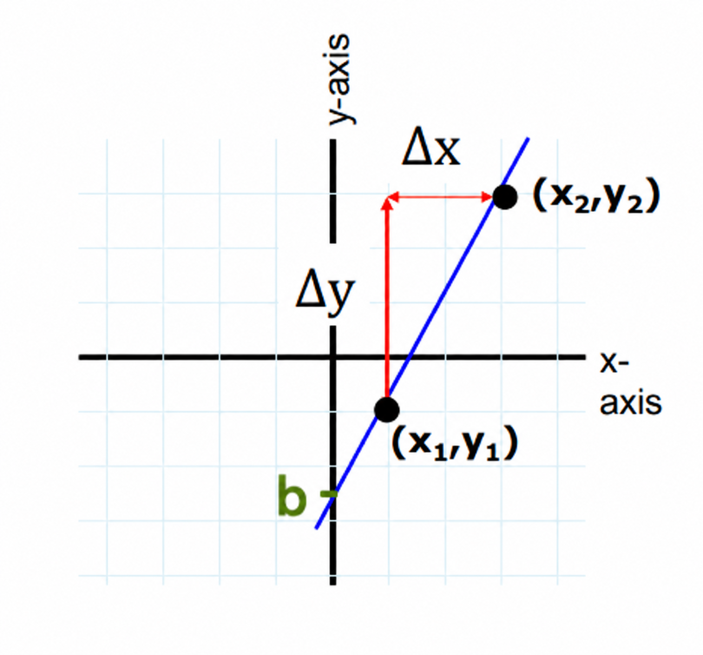
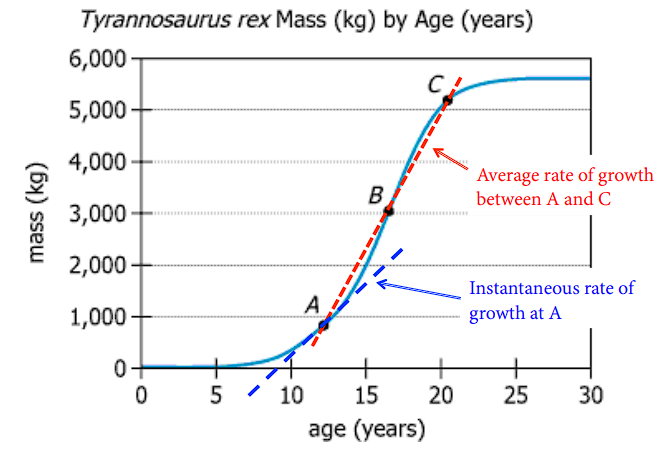

---
format:
  revealjs:
    slide-number: true
    # code-link: true
    highlight-style: a11y
    chalkboard: true
    theme:
      - ../../ucsb-media.scss
    include-in-header:
      text: |
        <script>
        (function loadCancelExtension(){
          if (window.MathJax && window.MathJax.Hub) {
            MathJax.Hub.Config({ TeX: { extensions: ["cancel.js"] } });
          } else {
            setTimeout(loadCancelExtension, 20);
          }
        })();
        </script>
editor_options:
  chunk_output_type: console
---

## {#title-slide data-menu-title="Title Slide" background="#053660"}

[Day 2: Bren Math Workshop]{.custom-title}

<hr class="hr-teal">

[Carmen Galaz García, Ph.D.]{.body-text-l .center-text .baby-blue-text}

[Bren School of Environmental Science & Management]{.center-text .body-text-m .baby-blue-text}

<br>

---

## {#exponential-function-title data-menu-title="The exponential function" background-color="#003660"}


<div class="page-center">
<div class="custom-subtitle">The exponential function</div>
</div>

--- 

## {#number-e-1 data-menu-title="The number $e$"}

<!-- 
A very nice slide deck Carmen made to explain what e is to my 34A summer 2020 students.
https://docs.google.com/presentation/d/1uztsfd9fwG49lxsDgxhyQZVsbFQDkmszsSkQdDivz2Q/edit?usp=sharing
-->

[The number $e$]{.slide-title}

<hr>

The **number $e$ is a constant** in mathematics, it is approximately $2.72$, but really its decimals continue infinitely without any pattern:

:::{.center-text .teal-text}
$e = 2.71828182845904523536...$
:::

---

## {#number-e-2 data-menu-title="The number $e$"}


[The number $e$]{.slide-title}

<hr>

The **number $e$ is a constant** in mathematics, it is approximately $2.72$, but really its decimals continue infinitely without any pattern:

:::{.center-text .teal-text}
$e = 2.71828182845904523536...$
:::

It's exact value can be described as 
$$
e = 1 + 1 + \frac{1}{1*2} + \frac{1}{1*2*3} + \frac{1}{1*2*3*4} + \frac{1}{1*2*3*4*5} + ... 
$$

--- 

## {#number-e-3 data-menu-title="The number $e$"}

[The number $e$]{.slide-title}

<hr>

The **number $e$ is a constant** in mathematics, it is approximately $2.72$, but really its decimals continue infinitely without any pattern:

:::{.center-text .teal-text}
$e = 2.71828182845904523536...$
:::

It's exact value can be described as 
$$
e = 1 + 1 + \frac{1}{1*2} + \frac{1}{1*2*3} + \frac{1}{1*2*3*4} + \frac{1}{1*2*3*4*5} + ... 
$$

Like any other number, $e$ follows normal power properties:

$$
\begin{align}
e^x\cdot e^y &=& ?\\
\frac{1}{e^x} &=& ?\\
\frac{e^x}{e^y} &=& ?\\
(e^x)^r &=& ?
\end{align}
$$

✏️ [Take a moment to write these with a single exponent.]{style="color:green;"}

--- 

## {#number-e-4 data-menu-title="The number $e$"}

[The number $e$]{.slide-title}

<hr>

The **number $e$ is a constant** in mathematics, it is approximately $2.72$, but really its decimals continue infinitely without any pattern:

:::{.center-text .teal-text}
$e = 2.71828182845904523536...$
:::

It's exact value can be described as 
$$
e = 1 + 1 + \frac{1}{1*2} + \frac{1}{1*2*3} + \frac{1}{1*2*3*4} + \frac{1}{1*2*3*4*5} + ... 
$$

Like any other number, $e$ follows normal power properties:

$$
\begin{align}
e^{x+y}&=&e^x\cdot e^y \\
e^{-x}&=&\frac{1}{e^x}\\
e^{x-y}&=&\frac{e^x}{e^y}\\
e^{rx}&=&(e^x)^r 
\end{align}
$$

---

## {#exponential-function data-menu-title="The exponential function $e^x$"}

[The exponential funciton]{.slide-title}

<hr>

The **exponential function $e^x$** is the number $e$ raised to the $x$ power. 

In function notation you may sometimes see it as

$$ f(x) = e^x \ \ \text{ or } \ \ \text{exp}(x).$$


```{r,fig.align='center',out.width="75%"}
library(tidyverse)
x=seq(-3,3,by=0.01)
y=exp(x)

ggplot()+
  geom_line(aes(x=x,y=y),color="black",linewidth=3)+
  theme_classic()+
  labs(x="x",y="y",title=bquote(e^x))+
  theme(text=element_text(size=28))
```

---

## {#e-common data-menu-title="e common"} 

[Why is the exponential function so common?]{.slide-title}

<hr>

<br>

::: {.body-text-l}
- **One reason:** Exponential trends show up a LOT in environmental science (the proportional change is the same over each time span)

- **Math reason:** Turns out it's a very useful value for calculus
:::

---

## {#aquaculture data-menu-title="Aquaculture example"} 

[A real-world example:]{.slide-title}

<hr>

```{r}
#| eval: true
#| echo: false
#| out-width: "100%"
#| fig-align: "center"
knitr::include_graphics("../day2_functions_graphs/images/fisheries-aquaculture.png")
```

::: {.footer}
Source: [Our World in Data](https://ourworldindata.org/grapher/capture-fisheries-vs-aquaculture)
:::

---

## {#logarithms-title data-menu-title="Logarithms" background-color="#003660"}


<div class="page-center">
<div class="custom-subtitle">Logarithms</div>
</div>

---

## {#logarithms data-menu-title="Logarithms"} 

[Logarithms]{.slide-title}

<hr>

<br>

[$\log_a(b)$ is the exponent you need to raise $a$ to get a value of $b$]{.body-text-m} 


<br>

[**For example:**]{.body-text-l} 

- $\log_2(8)=x$ asks "to what power do I have to raise 2, to get a value of 8?"
- $\log_{105}(1)=x$ asks "to what power do I have to raise 105, to get a value of 1?"

---

## {#ln-blank-1 data-menu-title="Natural Logs"}

[Natural logarithms]{.slide-title}

<hr>

<div style="position: absolute; bottom: 550px; right: 1000px; font-size: 1em;">                                                                               
  ✏️                    
</div>  


---

## {#ln-blank-2 data-menu-title="Natural Logs"}

[Natural logarithms]{.slide-title}

<hr>

If $y>0$, then **$\ln(x)$ is the exponent you need to raise $e$ to in order to get $y$.**

This means:

$$
\begin{align}
\ln(e^x) &= x \\
e^{\ln(y)} &= y
\end{align}
$$

In other words, $\ln(x)$ is the inverse of the exponential function $e^x$. 

<br>

**✏️ Examples**

- $\ln(e^3)$

- $\ln(\frac{1}{e})$

- $\ln(1)$

- $\ln(0)$ 

- $\ln(-7)$ 

---

## {#ln data-menu-title="Natural Logs"}

[Natural logarithms]{.slide-title}

<hr>

If $y>0$, then **$\ln(x)$ is the exponent you need to raise $e$ to in order to get $y$.**

This means:

$$
\begin{align}
\ln(e^x) &= x \\
e^{\ln(y)} &= y
\end{align}
$$

In other words, $\ln(x)$ is the inverse of the exponential function $e^x$. 

<br>

**Examples**

- $\ln(e^3) = 3$ because 3 is the power of $e$ needed to get $e^3$.

- $\ln(\frac{1}{e}) = \ln(e^{-1}) = -1$

- $\ln(1) = 0$ because 0 is the exponent we need to raise $e$ to to get 1

- $\ln(0)$ does not exist, because there's no number we can raise $e$ to to get 0

- $\ln(-7)$ does not exist, because $e$ to any number always be positive


---

## {#ln-blank data-menu-title="Properties of natural logarithm"}

[Natural log properties]{.slide-title}

<hr>

::::{.columns}
:::{.column width="50%"}

```{r,fig.dim=c(5,5.5), out.width="100%"}

# Define x values
x_exp <- seq(-2, 4, length.out = 500)          # for e^x
x_log <- seq(0.001, 4, length.out = 500)       # for ln(x) (x>0 only)

# Compute y values
y_exp <- exp(x_exp)
y_log <- log(x_log)

# Base plot: no axes, no box, no margin labels
plot(x_exp, y_exp, type = "l", col = "blue", lwd = 2,
     xlab = "", ylab = "",
     xlim = c(-2, 4), ylim = c(-2, 6),         
     main = "",
     axes = FALSE, frame.plot = FALSE)

# Draw custom axes at x=0 and y=0
axis(1, pos = 0)  # x-axis at y=0
axis(2, pos = 0)  # y-axis at x=0

# Add ln(x)
lines(x_log, y_log, col = "red", lwd = 2)

# Add the line y = x (dotted)
abline(0, 1, lty = 2, col = "darkgreen")

# Add legend (no box)
legend("topleft", legend = c("e^x", "ln(x)", "y=x"),
       col = c("blue", "red", "darkgreen"), lwd = c(2,2,1),
       lty = c(1,1,2), bty = "n")

# Add manual axis labels at the ends
text(x = 4, y = -0.2, labels = "x", cex = 1.2)
text(x = 0.2, y = 6, labels = "y", cex = 1.2) 
```

:::

:::{.column width="50%"}
✏️ 
:::

::::

---

## {#ln-properties data-menu-title="Properties of natural logarithm"}

[Natural log properties]{.slide-title}

<hr>

::::{.columns}
:::{.column width="50%"}

```{r,fig.dim=c(5,5.5), out.width="100%"}

# Define x values
x_exp <- seq(-2, 4, length.out = 500)          # for e^x
x_log <- seq(0.001, 4, length.out = 500)       # for ln(x) (x>0 only)

# Compute y values
y_exp <- exp(x_exp)
y_log <- log(x_log)

# Base plot: no axes, no box, no margin labels
plot(x_exp, y_exp, type = "l", col = "blue", lwd = 2,
     xlab = "", ylab = "",
     xlim = c(-2, 4), ylim = c(-2, 6),         
     main = "",
     axes = FALSE, frame.plot = FALSE)

# Draw custom axes at x=0 and y=0
axis(1, pos = 0)  # x-axis at y=0
axis(2, pos = 0)  # y-axis at x=0

# Add ln(x)
lines(x_log, y_log, col = "red", lwd = 2)

# Add the line y = x (dotted)
abline(0, 1, lty = 2, col = "darkgreen")

# Add legend (no box)
legend("topleft", legend = c("e^x", "ln(x)", "y=x"),
       col = c("blue", "red", "darkgreen"), lwd = c(2,2,1),
       lty = c(1,1,2), bty = "n")

# Add manual axis labels at the ends
text(x = 4, y = -0.2, labels = "x", cex = 1.2)
text(x = 0.2, y = 6, labels = "y", cex = 1.2) 
```

:::

:::{.column width="50%"}

:::{.center-text}
**Properties**
:::


$\ln (e^x)=x$

$\ln(xy)=\ln x+\ln y$

$\ln(\frac{x}{y})=\ln x-\ln y$

$\ln(x^y)=y \ln x$
:::

::::


---

## {#ln-ex-blank data-menu-title="Natural Logs"}

[Using logarithms to solve equations]{.slide-title}

<hr>
✏️ [Solve for $t$ in the equation $Pe^{rt} = A$. ]{style="color:green;"}

::::{.columns}
:::{.column width="70%"}
:::

:::{.column width="30%"}
:::{.center-text}
**Properties**
:::

$\ln (e^x)=x$

$\ln(xy)=\ln x+\ln y$

$\ln(\frac{x}{y})=\ln x-\ln y$

$\ln(x^y)=y \ln x$
:::

::::

---

## {#ln-ex data-menu-title="Natural Logs"}

[Using logarithms to solve equations]{.slide-title}

<hr>
✏️ [Solve for $t$ in the equation $Pe^{rt} = A$. ]{style="color:green;"}

$$
\begin{align}
Pe^{rt} &= A \\
e^{rt} & = \frac{A}{P} \\
rt &= \ln\left(\frac{A}{P}\right) \\
t &= \frac{\ln(A)-\ln(P)}{r}
\end{align}
$$

---

## {#applications data-menu-title="Applications" background-color="#003660"}


<div class="page-center">
<div class="custom-subtitle">Applications</div>
</div>

---

## {#exponential-growth-practice data-menu-title="Rules of exponents: practice"}

[Exponential growth]{.slide-title}

<hr>

When a population grows at a rate that is directly proportional to its size, we can model the population size at a time $t$ as

$$N(t) = N_0e^{rt}$$

where

- $r=$ per capita intrinsic growth rate
- $N_0=$ initial population size = population at $t= 0$


✏️ [Take a minute to solve these individually.]{style="color:green;"}

::: {.body-text-s style="color:green;"}
(1) What per capita intrinsic growth rate would make the population remain stable across time?

(2) Are the following statements true or false? Explain your reasoning.

  - If $r=\ln(\frac{1}{2})$, then the population will be half of its original size at $t=2$.

  - If $r=\ln(4)$, then the population will be four times its original size at $t=1$.

(3) Make a hypothesis about how $r$ being positive or negative is related to growth or decay of $N(t)$.

(4) Assuming $r>0$, when will the population double?
:::

---

## {#exp-growth-solutions-1 data-menu-title="Unit conversions practice"}

[Exponential growth practice]{.slide-title}

<hr>

::: {style="color:green;"}
(1) What per capita intrinsic growth rate would make the population remain stable across time?

(2) Are the following statements true or false? Explain your reasoning. 

  - If $r=\ln(\frac{1}{2})$, then the population will be half of its original size at $t=2$. 

  - If $r=\ln(4)$, then the population will be four times its original size at $t=1$. 
:::

✏️  [Let's see a solution!]{style="color:green;"}

---

## {#exp-growth-solutions-2 data-menu-title="Unit conversions practice"}

[Exponential growth practice]{.slide-title}

<hr>

::: {style="color:green;"}
(3) Make a hypothesis about how $r$ being positive or negative is related to growth or decay of $N(t)$.

(4) Assuming $r>0$, when will the population double?
:::

✏️  [Let's see a solution!]{style="color:green;"}

---

## {#exp-growth-solutions-answer data-menu-title="Exponential growth: Solutions"}

[Solutions]{.slide-title}

<hr>


**(1)** A stable population means $N(t)=N_0$ for every $t$, so we need $e^{rt}=1$ for all $t$, which requires $r=0$.

<br>

**(2)**

- *False.* $N(2)=N_0e^{2\ln(1/2)}=N_0\left(\frac{1}{2}\right)^2=\frac{N_0}{4}$, a **quarter** of $N_0$, not a half.

- *True.* $N(1)=N_0e^{\ln(4)}=N_0\cdot 4=4N_0$.


**(3)** The sign of $r$ determines whether $N(t)$ **grows** ($r>0$) or **decays** ($r<0$). See the plot on the next slide!

<br>

**(4)** Solve $N_0e^{rt}=2N_0$ for $t$:
$$
\small
e^{rt}=2 \ \Rightarrow \ rt=\ln(2) \ \Rightarrow \ t=\frac{\ln(2)}{r}
$$


---

## {#exponential-growth-plot data-menu-title="Rules of exponents: practice"}

[Exponential growth]{.slide-title}

<hr>

:::: {.columns}
::: {.column width="40%"}
:::{.body-text-s}
When a population grows at a rate that is directly proportional to its size, we can model the population size at a time $t$ as

$$N(t) = N_0e^{rt}$$

where

- $r=$ per capita intrinsic growth rate
- $N_0=$ initial population size = population at $t= 0$
:::

:::


::: {.column width="60%"}

```{r, echo=FALSE, fig.width=5, fig.height=3.6, out.width="80%", fig.align="center"}
t <- seq(0, 5, length.out = 200)
growth_df <- rbind(
  data.frame(t = t, N = exp(0.6 * t), r = "r > 0"),
  data.frame(t = t, N = exp(-0.6 * t), r = "r < 0")
)

ggplot(growth_df, aes(x = t, y = N, color = r)) +
  geom_line(linewidth = 2, show.legend = FALSE) +
  scale_color_manual(values = c("r > 0" = "seagreen", "r < 0" = "firebrick")) +
  annotate("text", x = 3.7, y = exp(0.6 * 3.7) * 1.35, label = "r > 0",
           color = "seagreen", hjust = 0.5, vjust = 0, size = 6, fontface = "bold") +
  annotate("text", x = 3.7, y = exp(-0.6 * 3.7) + 1.6, label = "r < 0",
           color = "firebrick", hjust = 0.5, vjust = 0, size = 6, fontface = "bold") +
  scale_y_continuous(expand = expansion(mult = c(0.02, 0.1))) +
  labs(x = "Time (t)", y = "N(t)") +
  theme_classic() +
  theme(text = element_text(size = 20), plot.title = element_text(hjust = 0.5))
```

:::

::::


[What environmental constraints could cause the population to not follow exponential growth?]{style="color:green;"}

---

## {#cant-grow-forever data-menu-title="Can't grow forever"}

[But populations can't grow exponentially forever]{.slide-title2}

<hr>

```{r}
#| eval: true
#| echo: false
#| out-width: "90%"
#| fig-align: "center"
knitr::include_graphics("../day2_functions_graphs/images/paramecium.jpg")
```

::: {.center-text .body-text-s .gray-text}
Gause, G. F. 1934. The Struggle for Existence. Baltimore: Williams and Wilkins.
:::

---

## {#logistic-growth data-menu-title="Logistic growth"} 

[Logistic growth]{.slide-title}

<hr>

[$$N_t=\frac{K}{1+[\frac{K-N_0}{N_0}]e^{-rt}}$$]{.body-text-l}

<br>

[Where $N_t$ is the population size at time $t$, $K$ is the carrying capacity, $N_0$ is the initial population size, and $r$ is a growth rate.]{.body-text-m}

<br>

✏️ [What should be the value of the formula when $t=0$? Confirm your answer by substituting.]{style="color:green;" }

::: {.center-text .body-text-m .teal-text}
We should always *understand the components of formulas and equations* - both conceptually and mathematically.
:::

---

## {#logistic-growth-example data-menu-title="Logistic growth: Example"}

[Logistic growth: Example]{.slide-title}

<hr>

What is [$$N_t=\frac{K}{1+[\frac{K-N_0}{N_0}]e^{-rt}}$$]{.body-text-m} when t = 0?


---

## {#logistic-growth-solution data-menu-title="Logistic growth: Solution"}

[Solution]{.slide-title}

<hr>

$$
\begin{aligned}
N_0 &= \frac{K}{1+[\frac{K-N_0}{N_0}]e^{-r(0)}} &\text{Substitute } t=0 \\
&= \frac{K}{1+[\frac{K-N_0}{N_0}](1)} &e^{0}=1 \\
&= \frac{K}{\frac{N_0 + (K-N_0)}{N_0}} &\text{Combine terms in the denominator} \\
&= \frac{K}{\frac{K}{N_0}} &N_0 + (K-N_0) = K \\
&= N_0
\end{aligned}
$$

---

## {#logistic-growth-Qs data-menu-title="Logistic growth (Qs)"}

[Logistic growth]{.slide-title}

<hr>

<br>

[$$N_t=\frac{K}{1+[\frac{K-N_0}{N_0}]e^{-rt}}$$]{.body-text-l}

<br>

::: {.body-text-m}
1. Why might we expect logistic growth for many populations? 

2. What variables *besides* time would influence the actual population?

<!-- 3. Why, mathematically, does the logistic growth expression take the shape it does? What happens as the population becomes very close to the carrying capacity? -->
:::

<!-- [A brief explanation of the math with derivatives.](https://sites.math.duke.edu/education/ccp/materials/diffeq/logistic/logi1.html) -->

::: {.notes}
1. Pops grow slowly at the start when there are few individuals. Grow more quickly (exponentially) when enough individuals are in a pop and resources are abundant. Plateau when resources become depleted.

2. The number of individuals and the amount of resources
:::

---

## {#break data-menu-title="10 minute break"}

[Let's take a 10 minute break]{.slide-title}

<hr>


---

## {#lines-title data-menu-title="Lines" background-color="#003660"}

<div class="page-center">
<div class="custom-subtitle">Linear functions</div>
</div>

---

## {#slope-int-blank data-menu-title="Slope-Intercept Form"}

[Linear functions: slope-intercept form]{.slide-title}

<hr>

<div style="position: absolute; bottom: 550px; right: 1000px; font-size: 1em;">                                                                               
  ✏️                    
</div>  


---

## {#slope-int data-menu-title="Slope-Intercept Form"}

[Linear functions: slope-intercept form]{.slide-title}

<hr>

<br>

Easiest model to describe linear relationship between two variables!

$$
\huge
\begin{align}
\underbrace{y}_{\text{output}}=\overbrace{m}^{\text{Slope}}\underbrace{x}_{\text{input}}+\overbrace{b}^{\text{$y$ intercept}}
\end{align}
$$

---

## {#find-line-eq-blank data-menu-title="Finding the equation of a line"}

[Finding the equation of a line]{.slide-title}

<hr>

<div style="position: absolute; bottom: 550px; right: 1000px; font-size: 1em;">                                                                               
  ✏️                    
</div>  


---

## {#find-line-eq-2 data-menu-title="Finding the equation of a line"}

[Finding the equation of a line]{.slide-title}

<hr>

Given two points $(x_1, y_1)$ and $(x_2, y_2)$ on the line:

::::{.columns}
:::{.column width="50%"}

(1) Find $m$, the **slope**, by using the two points:

$$
m=\frac{\Delta y}{\Delta x}=\frac{y_2-y_1}{x_2-x_1}.
$$

2. Find $b$, the **y-intercept**:

Since $(x_1, y_1)$ is on the line, it satisfies:

$$y_1 = mx_1+ b.$$
We can solve for $b$ to obtain:

$$b = y_1 - mx_1.$$

:::

:::{.column width="50%"}

```{r echo=FALSE,fig.align='center',out.width="80%"}

```

:::
::::

---

## {#line-equation-practice-1 data-menu-title="Equation of a line: practice"}

[Equation of a line: practice]{.slide-title}

<hr>

:::{style="color:green;"}
- Find the equation of the line that:

  (a) passes through $(3,5)$ and $(2,-1)$.

  (b) passes through $(2,-5)$ and has $x$-intercept equal to 4.

  (c) has the following graph:
:::

```{r echo=FALSE,fig.align='center',out.width="80%"}
# Set up plot area

x_min <- -3
x_max <- 3

y_min <- -4
y_max <- 4

x <- seq(x_min, x_max, length.out = 100)
y <- (3/2)*x + 1

plot(x, y, type = "l", lwd = 4, col="green",
     xlim = c(x_min, x_max), ylim = c(y_min, y_max),
     xlab = "x", ylab = "y",
     xaxt = "n", yaxt = "n")

# Add gridlines at integer spacing
abline(h = seq(x_min, x_max, by = 1), col = "lightgray", lty = "dotted")
abline(v = seq(y_min, y_max, by = 1), col = "lightgray", lty = "dotted")

# Add axis lines through origin
abline(h = 0, v = 0, col = "gray50")

# Redraw the line on top of gridlines
lines(x, y, lwd = 2)

# Add tick marks (integer spacing)
axis(1, at = seq(x_min, x_max, by = 1), cex.axis = 1.5)
axis(2, at = seq(y_min, y_max, by = 1), cex.axis = 1.5)
```

[- Make a graph showing the line that passes through (3,-1) and has slope equal to 2. 
]{style="color:green;"}

---

## {#line-equation-practice-sol-1 data-menu-title="Equation of a line: practice"}

[Equation of a line: practice]{.slide-title}

<hr>

A. Find the equation of the line that passes through $(3,5)$ and $(2,-1)$.

✏️ [Let's see a solution.]{style="color:green;"}

---

## {#line-equation-practice-sol-2 data-menu-title="Equation of a line: practice"}

[Equation of a line: practice]{.slide-title}

<hr>

B. Find the equation of the line that passes through $(2,-5)$ and has $x$-intercept equal to 4.

✏️ [Let's see a solution.]{style="color:green;"}

---

## {#line-equation-practice-3 data-menu-title="Equation of a line: practice" .smaller}

[Equation of a line: practice]{.slide-title}

<hr>

C. Find the equation of the line that has the following graph:

✏️ [Let's see a solution.]{style="color:green;"}

:::: {.columns}

::: {.column width="60%"}

```{r echo=FALSE,fig.align='center',out.width="100%"}
# Set up plot area

x_min <- -3
x_max <- 3

y_min <- -4
y_max <- 4

x <- seq(x_min, x_max, length.out = 100)
y <- (3/2)*x + 1

plot(x, y, type = "l", lwd = 4, col="green",
     xlim = c(x_min, x_max), ylim = c(y_min, y_max),
     xlab = "x", ylab = "y",
     xaxt = "n", yaxt = "n")

# Add gridlines at integer spacing
abline(h = seq(x_min, x_max, by = 1), col = "lightgray", lty = "dotted")
abline(v = seq(y_min, y_max, by = 1), col = "lightgray", lty = "dotted")

# Add axis lines through origin
abline(h = 0, v = 0, col = "gray50")

# Redraw the line on top of gridlines
lines(x, y, lwd = 2)

# Add tick marks (integer spacing)
axis(1, at = seq(x_min, x_max, by = 1))
axis(2, at = seq(y_min, y_max, by = 1))
```
:::


::: {.column width="40%"}

:::

:::

---

## {#line-equation-practice-solutions-summary data-menu-title="Equation of a line: solutions" .smaller}

[Solutions]{.slide-title}

<hr>

(a) Passes through $(3,5)$ and $(2,-1)$:

$$
\begin{aligned}
m &= \frac{5-(-1)}{3-2} = 6 &\text{Compute the slope} \\
y - 5 &= 6(x-3) &\text{Point-slope form using (3,5)} \\
y &= 6x - 13 &\text{Simplify}
\end{aligned}
$$

(b) Passes through $(2,-5)$ and has $x$-intercept equal to 4:

$$
\begin{aligned}
m &= \frac{0-(-5)}{4-2} = \frac{5}{2} &\text{Compute the slope using the } x\text{-intercept } (4,0) \\
y - 0 &= \frac{5}{2}(x-4) &\text{Point-slope form} \\
y &= \frac{5}{2}x - 10 &\text{Simplify}
\end{aligned}
$$

(c) Has the given graph: $y = \frac{3}{2}x+1$

$$
\begin{aligned}
\text{slope} &= \frac{\text{rise}}{\text{run}} = \frac{3}{2} &\text{Read from the graph} \\
y\text{-intercept} &= 1 &\text{Read from the graph} \\
y &= \frac{3}{2}x + 1 &\text{Equation of the line}
\end{aligned}
$$


---

## {#line-equation-practice-4 data-menu-title="Equation of a line: practice"}

[Solutions]{.slide-title}

<hr>

Make a graph showing the line that passes through (3,-1) and has slope equal to 2.

✏️ [Let's see a solution.]{style="color:green;"}

$$
\begin{aligned}
y - (-1) &= 2(x-3) &\text{Point-slope form} \\
y &= 2x - 7 &\text{Simplify}
\end{aligned}
$$

```{r echo=FALSE,fig.align='center',out.width="80%"}
# Set up plot area

x_min <- -1
x_max <- 6

y_min <- -9
y_max <- 6

x <- seq(x_min, x_max, length.out = 100)
y <- 2*x - 7

plot(x, y, type = "l", lwd = 4, col="green",
     xlim = c(x_min, x_max), ylim = c(y_min, y_max),
     xlab = "x", ylab = "y",
     xaxt = "n", yaxt = "n")

# Add gridlines at integer spacing
abline(h = seq(y_min, y_max, by = 1), col = "lightgray", lty = "dotted")
abline(v = seq(x_min, x_max, by = 1), col = "lightgray", lty = "dotted")

# Add axis lines through origin
abline(h = 0, v = 0, col = "gray50")

# Redraw the line on top of gridlines
lines(x, y, lwd = 2)

# Mark the given point (3,-1)
points(3, -1, pch = 19, cex = 1.5, col = "blue")

# Add tick marks (integer spacing)
axis(1, at = seq(x_min, x_max, by = 1))
axis(2, at = seq(y_min, y_max, by = 1))
```

---

## {#interpreting-slope data-menu-title="Interpreting the slope title" background-color="#003660"}


<div class="page-center">
<div class="custom-subtitle">Interpreting the slope</div>
</div>

---

## {#avg-rate-of-change data-menu-title="Slope (average)"} 

[Slope (average)]{.slide-title}

<hr>

::: {.body-text-m}
Sometimes, it can be useful to find the **average rate of change** of a function. 

Between any two points $(x_1,y_1)$ and $(x_2,y_2)$  on the graph of a function, the slope is found by:

<br>

$$m=\frac{\Delta y}{\Delta x}=\frac{y_2-y_1}{x_2-x_1}$$

Same idea as in a line!
:::

---

## {#slope-roc data-menu-title="Slope represents rate of change"}

[Slope represents rate of change]{.slide-title}

<hr>

Ice-core data before 1958. Mauna Loa data after 1958. 

](../_linear-functions/images/loa.PNG)

---

## {#practice-out-loud data-menu-title="Practice out loud"} 

[Get into the practice of saying the meaning out loud]{.slide-title3}

<hr>

- As if you're explaining it to someone unfamiliar with the data
- Including units
- Without overstating certainty 

[**For example:**]{.body-text-m} 

>"Between 1972 and 2020 the price of hobbit homes increased by an average of $2,450 per year" 

<br>

*differs from*

<br>

>"Between 1972 and 2020 the price of hobbit homes increased by $2,450 per year." 

---

## {#whole-story data-menu-title="Whole story"} 

[The *average* slope of a continuous function rarely tells the whole story]{.slide-title3}
  
<hr>

```{r}
#| eval: true
#| echo: false
#| out-width: "100%"
#| fig-align: "center"
knitr::include_graphics("../_linear-functions/images/cod_graph.jpg")
```


---

## {#slope-avg cdata-menu-title="can be average or instantaneous"}

[Slope can be *average* or *instantaneous*]{.slide-title}

<hr>

::::{.columns}
:::{.column width="50%"}


- Rise over run can always be used to find average rate of change between two parts of a graph


:::

:::{.column width="50%"}

- Instantaneous rate of change leads us to ✨calculus✨.

:::
::::

```{r echo=FALSE,fig.align='center',out.width="50%"}

```


---

## {#wrapping-up data-menu-title="Wrapping up" background-color="#003660"}

<div class="page-center">
<div class="custom-subtitle">Wrapping up...</div>
</div>

---

## {#problem-set data-menu-title="Problem set" }

[Get some extra practice!]{.slide-title}

<hr>

<br>


:::{.center-text}
[**Problem set**]()

{width=30%}

:::

---

## {#what-we-covered data-menu-title="What we covered today" }


[What we covered today]{.slide-title}

<hr>

- <span style="color:#336666"><b>🌱 The number e and exp()</b></span>
- <span style="color:#003399"><b>🐰 Exponential growth</b></span>
- <span style="color:#ED7014"><b>🦠 Logistic growth</b></span>
- <span style="color:#990099"><b>🪵 Natural logarithms</b></span>
- <span style="color:#003366"><b>📈 Linear functions</b></span>
- <span style="color:#FCAE1E"><b>↗️ Slope as a rate of change</b></span>
- <span style="color:#006699"><b> 🚜 Applications from MESM courses</b></span>
