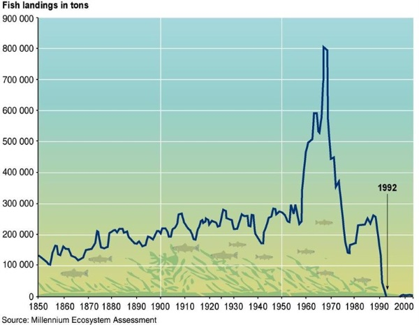
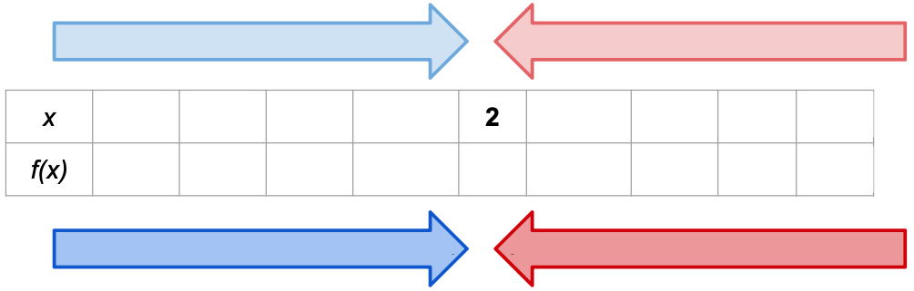
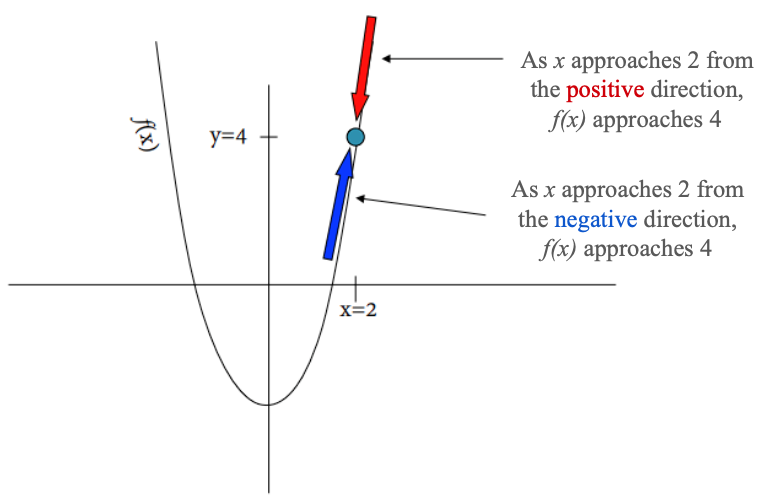
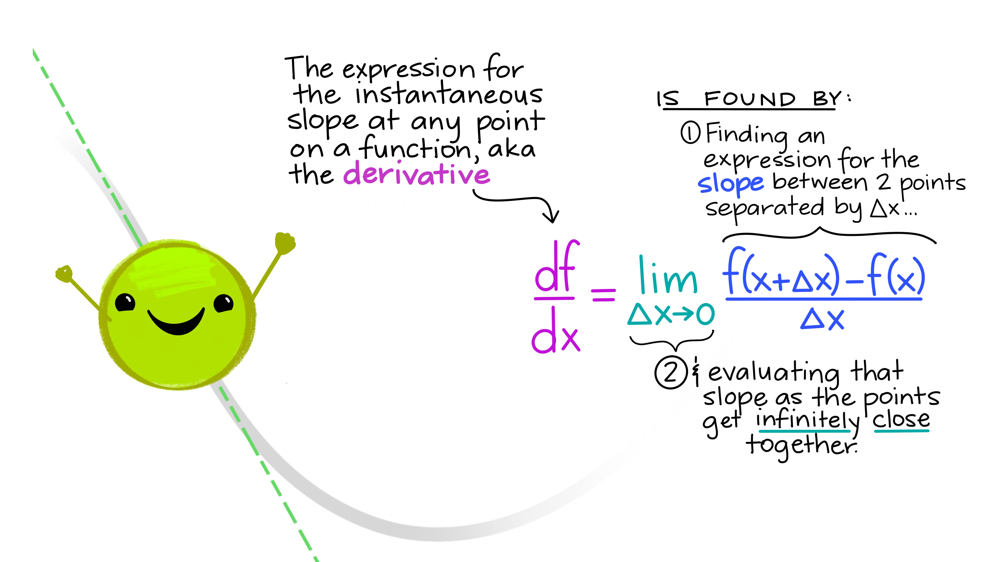
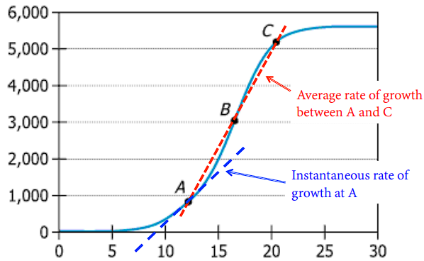

---
format:
  revealjs:
    slide-number: true
    # code-link: true
    highlight-style: a11y
    chalkboard: true
    theme:
      - ../../ucsb-media.scss
    include-in-header:
      text: |
        <script>
        (function loadCancelExtension(){
          if (window.MathJax && window.MathJax.Hub) {
            MathJax.Hub.Config({ TeX: { extensions: ["cancel.js"] } });
          } else {
            setTimeout(loadCancelExtension, 20);
          }
        })();
        </script>
editor_options:
  chunk_output_type: console
---

## {#title-slide data-menu-title="Title Slide" background="#053660"}

[Day 4: Bren Math Workshop]{.custom-title}

<hr class="hr-teal">

[Carmen Galaz García, Ph.D.]{.body-text-l .center-text .baby-blue-text}

[Bren School of Environmental Science & Management]{.center-text .body-text-m .baby-blue-text}

<br>

---

## {#interpreting-slope data-menu-title="Interpreting the slope title" background-color="#003660"}


<div class="page-center">
<div class="custom-subtitle">Interpreting the slope</div>
</div>

---

## {#avg-rate-of-change-blank data-menu-title="Slope (average)"}

[Slope (average)]{.slide-title}

<hr>

::::{.columns}
:::{.column width="50%"}

::: {.body-text-m}
Sometimes, it can be useful to find the **average rate of change** of a function.
:::

✏️

:::

:::{.column width="50%"}
```{r echo=FALSE, fig.align='center', out.width="90%"}
x <- seq(-1, 4, length.out = 200)
y <- x^2

plot(x, y, type = "l", lwd = 4, col = "black",
     xlab = "x", ylab = "y",
     xaxt = "n", yaxt = "n",
     bty = "n",
     cex.lab = 3)

abline(h = 0, v = 0, col = "gray50", lwd = 4)
```
:::
::::

---

## {#avg-rate-of-change data-menu-title="Slope (average)"}

[Slope (average)]{.slide-title}

<hr>

::::{.columns}
:::{.column width="50%"}

::: {.body-text-m}
Sometimes, it can be useful to find the **average rate of change** of a function.

Between any two points $(x_1,y_1)$ and $(x_2,y_2)$  on the graph of a function, the slope is found by:

<br>

$$m=\frac{\Delta y}{\Delta x}=\frac{y_2-y_1}{x_2-x_1}$$

Same idea as in a line!
:::

:::

:::{.column width="50%"}
```{r echo=FALSE, fig.align='center', out.width="90%"}
x <- seq(-1, 4, length.out = 200)
y <- x^2

x1 <- 0.5
y1 <- x1^2

x2 <- 3.2
y2 <- x2^2

plot(x, y, type = "l", lwd = 4, col = "black",
     xlab = "x", ylab = "y",
     xaxt = "n", yaxt = "n",
     bty = "n",
     cex.lab = 3)

abline(h = 0, v = 0, col = "gray50", lwd = 4)

segments(x1, y1, x2, y2, col = "red", lwd = 4, lty = 2)
points(c(x1, x2), c(y1, y2), pch = 19, cex = 3, col = "red")

text(x1, y1, expression(paste("(", x[1], ", ", y[1], ")")), pos = 3, cex = 3, offset = 1)
text(x2, y2, expression(paste("(", x[2], ", ", y[2], ")")), pos = 3, cex = 3, offset = 1)
```
:::
::::

---

## {#slope-roc data-menu-title="Slope represents rate of change"}

[Slope represents rate of change]{.slide-title}

<hr>

Ice-core data before 1958. Mauna Loa data after 1958. 

](../_linear-functions/images/loa.PNG)

---

## {#practice-out-loud data-menu-title="Practice out loud"} 

[Get into the practice of saying the meaning out loud]{.slide-title3}

<hr>

- As if you're explaining it to someone unfamiliar with the data
- Including units
- Without overstating certainty 

[**For example:**]{.body-text-m} 

>"Between 1972 and 2020 the price of hobbit homes increased by an average of $2,450 per year" 

<br>

*differs from*

<br>

>"Between 1972 and 2020 the price of hobbit homes increased by $2,450 per year." 

---

## {#slope-practice data-menu-title="Slope practice" .smaller} 

[Slope practice]{.slide-title3}

<hr>

:::{style="color:green;"}
✏️ A city has begun a 20-day, round-the-clock grading and paving phase for a highway-widening project that cuts directly through a neighborhood. In response, a community air-quality monitoring group tracked the additional fine particulate matter concentration, $P(t)$ (µg/m³ of PM2.5 above baseline), in the neighborhood's air over the 20 days of that construction phase.
:::

:::: {.columns}
::: {.column width="35%"}

:::{style="color:green;"}
| $t$ (days) | $P(t)$ (µg/m³) |
|:---:|:---:|
| 2  | 14.4 |
| 6  | 33.6 |
| 10 | 40.0 |
| 14 | 33.6 |
| 18 | 14.4 |
:::
:::

::: {.column width="65%"}
```{r}
#| echo: false
#| fig-align: center
#| out-width: "95%"
t <- seq(0, 20, length.out = 200)
P <- 8*t - 0.4*t^2

plot(t, P, type = "l", lwd = 4, col = "#003660",
     xlim = c(0, 20), ylim = c(0, 45),
     xlab = "Days since grading phase began", ylab = "Additional PM2.5 (µg/m³ above baseline)",
     xaxt = "n", yaxt = "n",  cex.lab=1.5)

# Add tick marks (integer spacing)
axis(1, at = seq(0, 20, by = 5), cex.axis = 2)
axis(2, cex.axis = 2)

```
:::
::::

:::{style="color:green;"}
a) Calculate the average rate of change in additional PM2.5 concentration between day 2 and day 6. Represent this graphically on the plot.
b) Write your answer as a full sentence, with units, without overstating certainty.
:::

---

## {#slope-practice-blank data-menu-title="Slope practice"} 

[Slope practice]{.slide-title3}

<hr>

:::: {.columns}

::: {.column width="50%"}


:::{style="color:green;" }
:::{.body-text-s}
$P(t)$ measures µg/m³ of PM2.5 above baseline in the neighborhood's air over the 20 days of that construction phase.
:::

| $t$ (days) | $P(t)$ (µg/m³) |
|:---:|:---:|
| 2  | 14.4 |
| 6  | 33.6 |
| 10 | 40.0 |
| 14 | 33.6 |
| 18 | 14.4 |


a) Calculate the average rate of change in additional PM2.5 concentration between day 2 and day 6. Represent this graphically on the plot.
b) Write your answer as a full sentence, with units, without overstating certainty.
:::
:::

::: {.column width="50%"}
```{r}
#| echo: false
#| fig-align: center
#| out-width: "95%"
t <- seq(0, 20, length.out = 200)
P <- 8*t - 0.4*t^2

plot(t, P, type = "l", lwd = 4, col = "#003660",
     xlim = c(0, 20), ylim = c(0, 45),
     xlab = "Days since grading phase began", ylab = "Additional PM2.5 (µg/m³ above baseline)",
     xaxt = "n", yaxt = "n",  cex.lab=1.5)

# Add tick marks (integer spacing)
axis(1, at = seq(0, 20, by = 5), cex.axis = 2)
axis(2, cex.axis = 2)

```
✏️ 

:::

:::

---

## {#slope-practice-solution data-menu-title="Slope practice"} 

[Slope practice]{.slide-title3}

<hr>

<br>
 
 a)
$$
\text{average rate of change} = \frac{P(6) - P(2)}{6-2} = \frac{33.6 - 14.4}{4} = \frac{19.2}{4} = 4.8 \ \frac{\mu\text{g/m}^3}{\text{day}}
$$

<br>

b) Between day 2 and day 6 of the grading phase, additional PM2.5 concentration in the  neighborhood increased by an average of 4.8 µg/m³ per day.


---

## {#whole-story data-menu-title="Whole story"} 

[The *average* slope of a continuous function rarely tells the whole story]{.slide-title3}
  
<hr>

```{r}
#| eval: true
#| echo: false
#| out-width: "100%"
#| fig-align: "center"

```


---

## {#slope-avg cdata-menu-title="can be average or instantaneous"}

[Slope can be *average* or *instantaneous*]{.slide-title}

<hr>

::::{.columns}
:::{.column width="50%"}


- Rise over run can always be used to find average rate of change between two parts of a graph


:::

:::{.column width="50%"}

- Instantaneous rate of change leads us to ✨calculus✨.

:::
::::

```{r echo=FALSE,fig.align='center',out.width="50%"}
knitr::include_graphics("images/trex.PNG")
```


---

## {#limits-title data-menu-title="Logarithms" background-color="#003660"}


<div class="page-center">
<div class="custom-subtitle">Limits</div>
</div>

---

## {#limits-blank data-menu-title="Limits"}

[Limits]{.slide-title}

<hr>

✏️


---

## {#limits data-menu-title="Limits"}

[Limits]{.slide-title}

<hr>

**Definition**

We say a number $L$ is the limit of a function $f(x)$ as its variable $x$ approaches a number $c$, if the function's output values $f(x)$ approach $L$ when $x$ get closer to $c$. 

<br>

We write this symbolically as:

$$
\large
\lim_{x\to c} f(x)=L
$$

<br>

We read this as: ["The limit of $f(x)$ as $x$ approaches $c$ is $L$."]{.teal-text}

---

## {#lim-ex-blank data-menu-title="Limit Example"}

[Limits example: numerical]{.slide-title}

<hr>

What is the limit of $f(x)=2x^2-4$ as $x$ approaches 2?

We need to examine the values of $f(x)$ as $x$ gets closer to 2 from both sides.

{fig-align="center" width="50%"}

✏️

<br>
<br>
<br>

---

## {#lim-ex-3 data-menu-title="Limit Example"}

[Limits example: numerical]{.slide-title}

<hr>

What is the limit of $f(x)=2x^2-4$ as $x$ approaches 2?

We need to examine the values of $f(x)$ as $x$ gets closer to 2 from both sides.


{fig-align="center" width="70%"}


From both directions it looks like $f(x)$ converges to 4.

So, we say that ["The limit of $2x^2-4$ as $x$ approaches 2 is 4"]{.teal-text}. We can write it like this:

$$
\lim_{x\to 2}(2x^2-4)=4
$$

---

## {#limit-graph-sol data-menu-title="Graphical Solution"}

[Limits example: graph]{.slide-title}

<hr>

What is the limit of $f(x)=2x^2-4$ as $x$ approaches 2?

```{r fig.align='center',out.width="200%"}

```

From both directions it looks like $f(x)$ converges to 4.

So, $\lim_{x\to 2}(2x^2-4)=4$.

---

## {#intro-derv data-menu-title="Introduction to Derivates" background-color="#003660"}

<div class="page-center">
<div class="custom-subtitle">Introduction to derivatives</div>
</div>

---

## {#average-slope data-menu-title="Average slope"}

[Average slope]{.slide-title}

<hr>

<div style="position: absolute; bottom: 550px; right: 1000px; font-size: 1em;">                                                                               
  ✏️                    
</div>  

```{r, fig.align='center'}

library(tidyverse)

x=seq(-1,3,by=0.01)
y=x^2

lim_df<-data.frame(x=x,y=y)

dx=2
y2=y[which(lim_df$x==dx)]

slope=y2/dx
line=x*slope


ggplot(data=lim_df,aes(x=x,y=y))+
  geom_line(color="black", linewidth=3)+
  theme_classic()+
  annotate("point",x=0,y=0,size=6,color="blue")+
  theme(text = element_text(size = 28),
        axis.title.x = element_blank(),
        axis.title.y = element_blank()) + 
  coord_fixed(ratio = 1) +
  coord_cartesian(xlim=c(-1,3), ylim=c(0,8))
```

Start with:


<br>

Nearby point:

<br>

Average slope:

---

## {#average-slope-filled data-menu-title="Average slope"}

[Average slope]{.slide-title}

<hr>

```{r, fig.align='center'}
x=seq(-1,3,by=0.01)
y=x^2

lim_df<-data.frame(x=x,y=y)

dx=2
y2=y[which(lim_df$x==dx)]

slope=y2/dx
line=x*slope


p0<-ggplot(data=lim_df,aes(x=x,y=y))+
  geom_line(color="black",linewidth=3)+
  theme_classic()+
  geom_line( data = data.frame(x = seq(-1, 3, by = 0.01),  
                               y = 1.5 * seq(-1, 3, by = 0.01)),
            aes(x = x, y = y),
            color="red",
            linewidth=2)+
  annotate("point",x=0,y=0,size=8,color="blue")+
  annotate("text", 
            x=0, y=1, 
            label="(x, f(x))",
            size=10,
            color="blue")+
  annotate("point",x=1.5, y=2.25, size=8, color="blue")+
  annotate("text", 
            x=2.25, y=2.25, 
            label="(x+Δx, f(x+Δx))",
            size=10,
            color="blue") +
  theme(text = element_text(size = 28),
        axis.title.x = element_blank(),
        axis.title.y = element_blank()) + 
  coord_fixed(ratio = 1) +
  coord_cartesian(xlim=c(-1,3), ylim=c(0,8))

p0
```

Start with a point $(x,f(x))$ on the graph. 

A nearby point can be $(x+\Delta x, f(x+\Delta x))$, where $\Delta x$ is a short distance from $x$. 


<br>

The average slope between $(x,f(x))$ and $(x+\Delta x, f(x+\Delta x))$ is given by

<span style="color:red">
$$\text{average slope} = \frac{f(x+\Delta x) - f(x)}{(x+\Delta x)-x} = \frac{f(x+\Delta x) - f(x)}{\Delta x}.$$
</span>

**What happens when $\Delta x$ becomes smaller and smaller?**

---

## {#walkthrough-1 data-menu-title="Walkthrough"}

[What happens when $\Delta x \to 0$?]{.slide-title}

<hr>

```{r, fig.align='center'}

library(tidyverse)

x=seq(-1,3,by=0.01)
y=x^2

lim_df<-data.frame(x=x,y=y)

dx=2
y2=y[which(lim_df$x==dx)]

slope=y2/dx
line=x*slope


p0<- ggplot(data=lim_df,aes(x=x,y=y))+
  geom_line(color="black", linewidth=3)+
  theme_classic()+
  annotate("point",x=0,y=0,size=6,color="blue")+
  theme(text = element_text(size = 28),
        axis.title.x = element_blank(),
        axis.title.y = element_blank()) + 
  coord_fixed(ratio = 1) +
  coord_cartesian(xlim=c(-1,3), ylim=c(0,8))

p1<-p0+
  geom_point(aes(x=dx,y=y2),color="blue",size=6)+
  geom_line(aes(x=x,y=line),color="red",linewidth=2)+
  annotate("text",x=1,y=7,label="Delta~x==2",parse=TRUE,size=14)+
  annotate("text",x=1,y=4.5,label="Slope=2",size=14)
p1

```

---

## {#walkthrough-2 data-menu-title="Walkthrough"}

[What happens when $\Delta x \to 0$?]{.slide-title}

<hr>

```{r, fig.align='center'}
dx=1
y2=y[which(lim_df$x==dx)]

slope=y2/dx
line=x*slope
p2<-p0+
  geom_line(aes(x=x,y=line),color="red",linewidth=2)+
  geom_point(aes(x=dx,y=y2),color="blue",size=6)+
  annotate("text",x=1,y=7,label="Delta~x==1",parse=TRUE,size=14)+
  annotate("text",x=1,y=4.5,label="Slope=1",size=14)

p2
```

---

## {#walkthrough-3 data-menu-title="Walkthrough"}

[What happens when $\Delta x \to 0$?]{.slide-title}

<hr>

```{r, fig.align='center'}
dx=0.5
y2=y[which(lim_df$x==dx)]

slope=y2/dx
line=x*slope
p3<-p0+
  geom_line(aes(x=x,y=line),color="red",linewidth=2)+
  geom_point(aes(x=dx,y=y2),color="blue",size=6)+
  annotate("text",x=1,y=7,label="Delta~x==0.5",parse=TRUE,size=14)+
  annotate("text",x=1,y=4.5,label="Slope=0.5",size=14)
p3
```

---

## {#walkthrough-4 data-menu-title="Walkthrough"}

[What happens when $\Delta x \to 0$?]{.slide-title}

<hr>

```{r, fig.align='center'}
dx=0.25
y2=y[which(lim_df$x==dx)]

slope=y2/dx
line=x*slope
p4<-p0+
  geom_line(aes(x=x,y=line),color="red",linewidth=2)+
  geom_point(aes(x=dx,y=y2),color="blue",size=6)+
  annotate("text",x=1,y=7,label="Delta~x==0.25",parse=TRUE,size=14)+
  annotate("text",x=1,y=4.5,label="Slope=0.25",size=14)
p4
```

---

## {#tangent data-menu-title="Tangent Lines"}

[Tangent lines]{.slide-title}

<hr>

**What if we let $\Delta x=0$?**

Then we would have the slope of a line that only touches the graph at exactly $(x, f(x))$.

```{r, fig.align='center'}

slope=0
line=x*slope
p5<-p0+
  geom_line(aes(x=x,y=line),color="red",linewidth=2)+
  annotate("text",x=1,y=7,label="Delta~x==0",parse=TRUE,size=14)+
  annotate("text",x=1,y=4.5,label="Slope=?",size=14)
p5
```

:::{.center-text .teal-text}
These very special types of lines are called **tangent lines**.
:::
---

## {#recap-1 data-menu-title="Recap in math notation"}

[Derivative definition]{.slide-title}

<hr>

Remember the slope of the line that passes between two points $(x_1, y_1)$ and $(x_2, y_2)$ is:

$$\text{slope}=\frac{y_2-y_1}{x_2-x_1}.$$

---

## {#recap-2 data-menu-title="Recap in math notation"}

[Derivative definition]{.slide-title}

<hr>

Remember the slope of the line that passes between two points $(x_1, y_1)$ and $(x_2, y_2)$ is:

$$\text{slope}=\frac{y_2-y_1}{x_2-x_1}.$$


If we have a function $f(x)$, then $(x,f(x))$ represents a point on its graph.


Choose a different point on the graph that is $\Delta x$ away: $(x+\Delta x,f(x+\Delta x))$.

---

## {#recap-3 data-menu-title="Recap in math notation"}

[Derivative definition]{.slide-title}

<hr>

Remember the slope of the line that passes between two points $(x_1, y_1)$ and $(x_2, y_2)$ is:

$$\text{slope}=\frac{y_2-y_1}{x_2-x_1}.$$


If we have a function $f(x)$, then $(x,f(x))$ represents a point on its graph.


Choose a different point on the graph that is $\Delta x$ away: $(x+\Delta x,f(x+\Delta x))$.


Plug these points on the graph of $f(x)$ into the slope equation:

$$
\text{slope}=\frac{f(x+\Delta x)-f(x)}{\Delta x}.
$$

---

## {#recap-4 data-menu-title="Recap in math notation"}

[Derivative definition]{.slide-title}

<hr>

Remember the slope of the line that passes between two points $(x_1, y_1)$ and $(x_2, y_2)$ is:

$$\text{slope}=\frac{y_2-y_1}{x_2-x_1}.$$


If we have a function $f(x)$, then $(x,f(x))$ represents a point on its graph.


Choose a different point on the graph that is $\Delta x$ away: $(x+\Delta x,f(x+\Delta x))$.


Plug these points on the graph of $f(x)$ into the slope equation:

$$
\text{slope}=\frac{f(x+\Delta x)-f(x)}{\Delta x}.
$$

When we let $\Delta x \to 0$ we get <span style="color:red">**the slope of the tangent line at $x$**</span>

<span style="color:red">
$$
\large
f'(x)=\lim_{\Delta x \to 0} \frac{f(x+\Delta x)-f(x)}{\Delta x}
$$
</span>

<span style="color:red">**This is the derivative of $f$ at $x$.**</span>
Also denoted $\frac{df}{dx}$. 


---

## {#deriv9 data-menu-title="Derivative"} 

```{r}
#| eval: true
#| echo: false
#| out-width: "100%"
#| fig-align: "center"

```

::: {.footer}
*Artwork by [Allison Horst](https://allisonhorst.com/)*
:::

---

## {#break data-menu-title="10 minute break"}

[Let's take a 10 minute break]{.slide-title}

<hr>


---

## {#interpretation-derv data-menu-title="Introduction to Derivates" background-color="#003660"}

<div class="page-center">
<div class="custom-subtitle">Interpreting the derivative</div>
</div>

---

## {#calc data-menu-title="Calculus and Derivatives are the study of change"}

[Calculus and derivatives are used to study change]{.slide-title}

<hr>

```{r, fig.align='center',out.width="75%"}

```

---

## {#envs-change3 data-menu-title="Enviromental Science is the Study of Change"}

[Environmental Science studies change]{.slide-title}

<hr>

{fig-align="center"}

<br>

[🤔 Talk with a partner, what are 2 fields of environmental science where studying the rate of change and derivatives would be important?]{style="color:green;"}


---

## {#diff-rules data-menu-title="Introduction to Derivates" background-color="#003660"}

<div class="page-center">
<div class="custom-subtitle">Rules for differentiation</div>
</div>


---

## {#diff-rules-1-blank data-menu-title="Rules for Differentiation (1)"}

[Rules for differentiation (1)]{.slide-title}

<hr>

**Constant Rule** ✏️


<br>
<br>
<br>
<br>
<br>
<br>


**Power Rule** ✏️

---

## {#diff-rules-1 data-menu-title="Rules for Differentiation (1)"}

[Rules for differentiation (1)]{.slide-title}

<hr>

**Constant Rule**

Let $c$ be a constant (so, a number). If $f(x) = c$, then $f'(x)=0$. Equivalently

$$\frac{d}{dx}c = 0$$


**Power Rule**

Let $n$ be a (real) number, if $f(x)= x^n$, then $f'(x) = nx^{n-1}$. Equivalently
$$
\frac{d}{dx}[x^n]
=nx^{n-1}.
$$

**Examples**   ✏️

$$
\begin{align}
&y=100 & &f(x)=x^5 & &f(x)=\frac{1}{x^2}
\end{align}
$$

---

## {#diff-rules-2-blank data-menu-title="Rules for Differentiation (2)"}

[Rules for differentiation (2)]{.slide-title}

<hr>

**Sum and Difference Rules**

✏️

---

## {#diff-rules-2 data-menu-title="Rules for Differentiation (2)" .smaller}

[Rules for differentiation (2)]{.slide-title}

<hr>

**Sum and Difference Rules**

Let $f(x)$ and $g(x)$ be differentiable functions. Then 

$$
\begin{align}
\frac{d}{dx}[f(x)+g(x)]=\frac{d}{dx}f(x)+\frac{d}{dx}g(x) \\
\frac{d}{dx}[f(x)-g(x)]=\frac{d}{dx}f(x)-\frac{d}{dx}g(x)
\end{align}
$$


😵*All this says is: if the function has pieces that are added or subtracted you can take the derivative of each individual piece and add those derivatives.*

The $\frac{d}{dx}$ notation can be a lot here, the prime notation is a bit better:

$$
\begin{align}
[f(x)+g(x)]'=f'(x)+g'(x) \\
[f(x)-g(x)]'=f'(x)-g'(x)
\end{align}
$$


✏️ **Example** 

$$
f(x)=x^3-x^2-15
$$

---

## {#diff-rules-3-blank data-menu-title="Rules for Differentiation (3)"}

[Rules for differentiation (3)]{.slide-title}

<hr>

**Constant Multiplier Rule**

✏️

---

## {#diff-rules-3-example data-menu-title="Rules for Differentiation (3)".smaller}

[Rules for differentiation (3)]{.slide-title}

<hr>

**Constant Multiplier Rule**

The derivative of a constant $c$ multiplied by a function $f(x)$ is the same as the constant multiplied by the derivative:

$$\frac{d}{dx}[kf(x)] = k\frac{d}{dx}f(x)$$

✏️ **Example** 


---

## {#diff-rules-3 data-menu-title="Rules for Differentiation (3)"}

[Rules for differentiation (3)]{.slide-title}

<hr>

**Constant Multiplier Rule**

The derivative of a constant $c$ multiplied by a function $f(x)$ is the same as the constant multiplied by the derivative:

$$\frac{d}{dx}[kf(x)] = k\frac{d}{dx}f(x)$$

 ✏️ **Example**

$$
y=x^2+\sqrt{2}x-\frac{8}{x}+4
$$

---

## {#logs-exp data-menu-title="Derivative of logs & exp"} 

[Derivative of logs & exponents]{.slide-title}

<hr>

<br>

[Two special derivatives:]{.body-text-l}

<br>

- [$\frac{d}{dx}(e^x) = e^x$]{.body-text-l}

<br>

- [$\frac{d}{dx}ln(x)=\frac{1}{x}$]{.body-text-l}

---

## {#diff-rules-summary data-menu-title="Summary of differentiation rules"}

[Summary of differentiation rules]{.slide-title}

<hr>

<br>

| Differentiation Rule | $f'(x)$ notation | $\frac{d}{dx}$ notation |
|----------------------|------------------|-------------------------|
| **Constant Rule** | $f(x)=c \Rightarrow f'(x)=0$ | $\frac{d}{dx}[c]=0$ |
| **Power Rule** | $f(x)=x^n \Rightarrow f'(x)=n x^{n-1}$ | $\frac{d}{dx}[x^n]=n x^{n-1}$ |
| **Sum Rule** | $(g(x)+h(x))'=g'(x)+h'(x)$ | $\frac{d}{dx}[g(x)+h(x)]=\frac{d}{dx}g(x)+\frac{d}{dx}h(x)$ |
| **Difference Rule** | $(g(x)-h(x))' = g'(x)-h'(x)$ | $\frac{d}{dx}[g(x)-h(x)]=\frac{d}{dx}g(x)-\frac{d}{dx}h(x)$ |
| **Constant Multiplier Rule**  | $(c\cdot g(x))'=c\,g'(x)$ | $\frac{d}{dx}[c\,g(x)]=c\,\frac{d}{dx}g(x)$ |

<br>

And two special derivatives: $\frac{d}{dx}(e^x) = e^x$ and $\frac{d}{dx}ln(x)=\frac{1}{x}$.

:::{.center-text .body-text-s}
There's more differentiation rules (product, quotient, chain rule). 

They're fun, but we won't be reviewing them.
:::

---

## {#higher-order-der data-menu-title="Higher Order Derivatives"}

[Higher order derivatives]{.slide-title}

<hr>

- We can continue to take derivatives of derivatives.

- The second derivative becomes the rate of change of the rate of change. 

- If we interpret the first derivative as velocity, then the second derivative is acceleration. 

. . .

- Notation: 

    - Function: $f(x) = y$
    - 1st derivative: $f'(x)$ or $\frac{dy}{dx}$
    - 2nd derivative: $f''(x)$ or $\frac{d^2y}{dx^2}$
    - nth derivative: $f^{(n)}(x)$ or $\frac{d^ny}{dx^n}$

---

## {#derivatives-practice data-menu-title="Derivatives practice"}

[Derivatives practice]{.slide-title}

<hr>

[Solve individually and then check with a partner.]{style="color:green;"}

1) Which rules should you use to take these derivatives?

$$
\begin{align}
\text{A)  }& f(x)=3x^4 &\text{B) }  y=4x^2+3x-16
\end{align}
$$

2) Find the derivatives of these functions

$$
\begin{align}
&\text{A) } y=3x^2 & &\text{B) }h(x)=2x(x^2 + 3x) & &\text{C) }g(y)=2\sqrt{y} - e^y + 20\ln(y)
\end{align}
$$

3) Find the 3rd derivative of:

$$G(z)=3z^4-8z^3+2z-19$$

---

## {#derivatives-practice-solve-1 data-menu-title="Derivatives practice"}

[Derivatives practice]{.slide-title}

<hr>

[ ✏️  Let's see a solution!]{style="color:green;"} 

2.B) Find the derivative $$h(x)=2x(x^2 + 3x)$$

---

## {#derivatives-practice-solve-2 data-menu-title="Derivatives practice"}

[Derivatives practice]{.slide-title}

<hr>

[ ✏️  Let's see a solution!]{style="color:green;"} 

2.C) Find the derivative $$g(y)=2\sqrt{y} - e^y + 20\ln(y)$$

---

## {#derivatives-practice-solve-3 data-menu-title="Derivatives practice"}

[Derivatives practice]{.slide-title}

<hr>

[ ✏️  Let's see a solution!]{style="color:green;"}

3) Find the 3rd derivative of $G(z)=3z^4-8z^3+2z-19$.

---

## {#derivatives-solution data-menu-title="Derivatives solution"}

[Derivatives solution]{.slide-title}

<hr>

1) Which rules should you use to take these derivatives?

$$
\begin{align}
\text{A)  }& f(x)=3x^4 &\text{B) }  y=4x^2+3x-16
\end{align}
$$

A) Power Rule (with the Constant Multiplier Rule)

B) Sum/Difference Rule, Power Rule, Constant Multiplier Rule, and Constant Rule (for $-16$)


2) Find the derivatives of these functions

$$
\begin{align}
&\text{A) } y=3x^2 & &\text{B) }h(x)=2x(x^2 + 3x)
\end{align}
$$

A) $y' = 3\cdot 2x^{(2-1)} = 6x$

B) First expand: $h(x) = 2x\cdot x^2 + 2x \cdot 3x = 2x^3+6x^2$

Then differentiate term by term: $h'(x) = 2\cdot 3x^{(3-1)} + 6\cdot 2x^{(2-1)} = 6x^2+12x$

---

## {#derivatives-solution-2 data-menu-title="Derivatives solution"}

[Derivatives solution]{.slide-title}

<hr>

2) Find the derivative of this function

$$
g(y)=2\sqrt{y} - e^y + 20\ln(y)
$$

Rewrite $\sqrt{y}$ as $y^{1/2}$:

$$
\begin{align}
g(y) &= 2y^{1/2}-e^y+20\ln(y)\\
g'(y) &= 2\cdot\frac{1}{2}y^{(1/2-1)} - e^y + 20\cdot\frac{1}{y}\\
&= \frac{1}{\sqrt{y}} - e^y + \frac{20}{y}
\end{align}
$$

---

## {#derivatives-solution-3 data-menu-title="Derivatives solution"}

[Derivatives solution]{.slide-title}

<hr>

3) Find the 3rd derivative of:

$$G(z)=3z^4-8z^3+2z-19$$

$$
\begin{align}
G'(z) &= 3\cdot 4z^{(4-1)} - 8\cdot 3z^{(3-1)} + 2\cdot 1z^{(1-1)} - 0 = 12z^3-24z^2+2\\
G''(z) &= 12\cdot 3z^{(3-1)} - 24\cdot 2z^{(2-1)} + 0 = 36z^2-48z\\
G'''(z) &= 36\cdot 2z^{(2-1)} - 48\cdot 1z^{(1-1)} = 72z-48
\end{align}
$$

---

## {#wrapping-up data-menu-title="Wrapping up" background-color="#003660"}

<div class="page-center">
<div class="custom-subtitle">Wrapping up...</div>
</div>

---

## {#problem-set data-menu-title="Problem set" }

[Get some extra practice!]{.slide-title}

<hr>

<br>


:::{.center-text}
[**Problem set**](day4-problem-set.qmd)

{width=30%}

:::

---

## {#what-we-covered data-menu-title="What we covered today" }


[What we covered today]{.slide-title}

<hr> 

- <span style="color:#660099"><b>↗️ Slope as a rate of change</b></span>  
- <span style="color:#660033"><b>🔎 Limits</b></span>  
- <span style="color:#993300"><b>🖊️ Derivatives and rate of change</b></span>  
- <span style="color:#330000"><b>🛤️ Tangent lines</b></span>  
- <span style="color:#333300"><b>📝 Rules for differentiation</b></span>  
- <span style="color:#996600"><b>🔹 Constant rule</b></span>  
- <span style="color:#660000"><b>💪 Power rule</b></span>  
- <span style="color:#003300"><b>➕ Sum and difference rule</b></span>  

