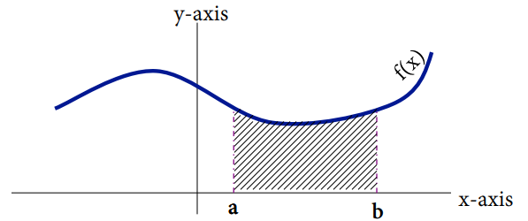
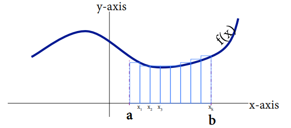
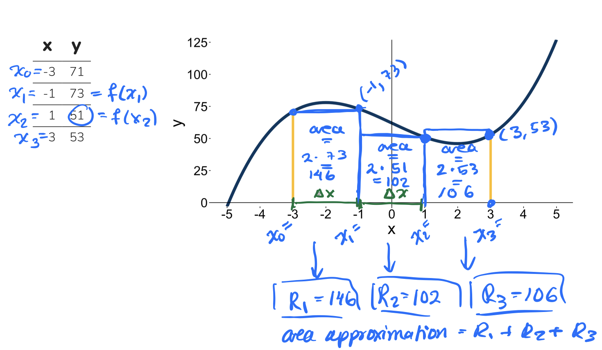
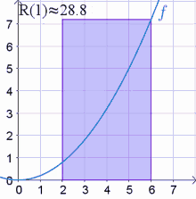
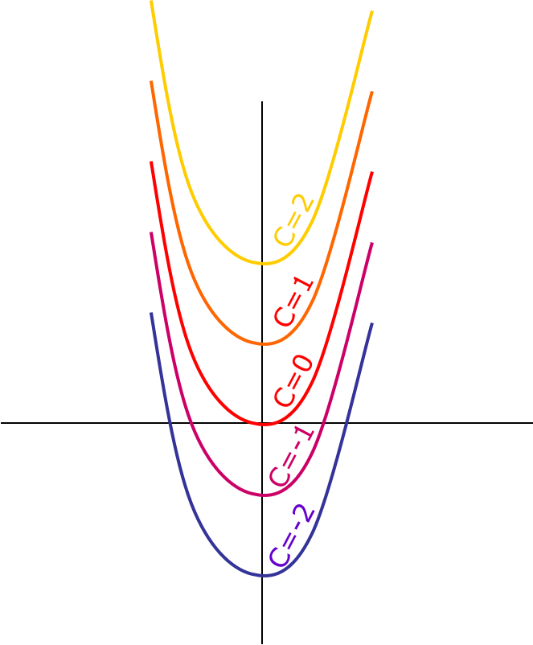
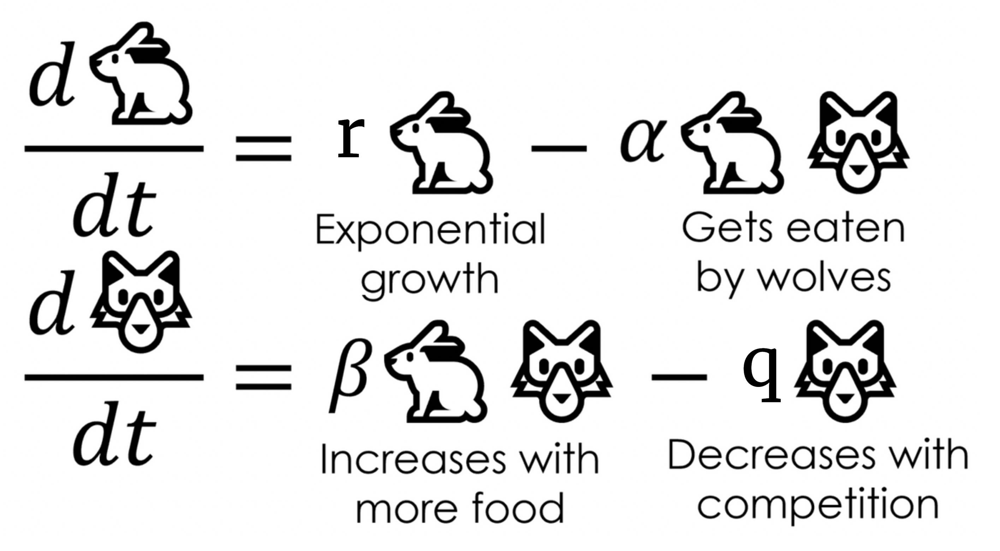
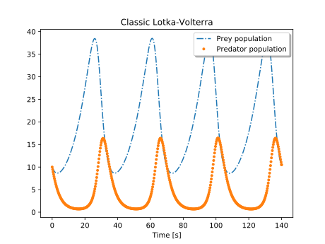

---
format:
  revealjs:
    slide-number: true
    # code-link: true
    highlight-style: a11y
    chalkboard: true
    theme:
      - ../../ucsb-media.scss
    include-in-header:
      text: |
        <script>
        (function loadCancelExtension(){
          if (window.MathJax && window.MathJax.Hub) {
            MathJax.Hub.Config({ TeX: { extensions: ["cancel.js"] } });
          } else {
            setTimeout(loadCancelExtension, 20);
          }
        })();
        </script>
editor_options:
  chunk_output_type: console
---

## {#title-slide data-menu-title="Title Slide" background="#053660"}

[Day 5: Bren Math Workshop]{.custom-title}

<hr class="hr-teal">

[Carmen Galaz García, Ph.D.]{.body-text-l .center-text .baby-blue-text}

[Bren School of Environmental Science & Management]{.center-text .body-text-m .baby-blue-text}

<br>

---

## {#interpreting-slope data-menu-title="Interpreting the slope title" background-color="#003660"}


<div class="page-center">
<div class="custom-subtitle">Derivatives practice</div>
</div>

---

## {#diff-rules-summary data-menu-title="Summary of differentiation rules"}

[Summary of differentiation rules]{.slide-title}

<hr>

<br>

| Differentiation Rule | $f'(x)$ notation | $\frac{d}{dx}$ notation |
|----------------------|------------------|-------------------------|
| **Constant Rule** | $f(x)=c \Rightarrow f'(x)=0$ | $\frac{d}{dx}[c]=0$ |
| **Power Rule** | $f(x)=x^n \Rightarrow f'(x)=n x^{n-1}$ | $\frac{d}{dx}[x^n]=n x^{n-1}$ |
| **Sum Rule** | $(g(x)+h(x))'=g'(x)+h'(x)$ | $\frac{d}{dx}[g(x)+h(x)]=\frac{d}{dx}g(x)+\frac{d}{dx}h(x)$ |
| **Difference Rule** | $(g(x)-h(x))' = g'(x)-h'(x)$ | $\frac{d}{dx}[g(x)-h(x)]=\frac{d}{dx}g(x)-\frac{d}{dx}h(x)$ |
| **Constant Multiplier Rule**  | $(c\cdot g(x))'=c\,g'(x)$ | $\frac{d}{dx}[c\,g(x)]=c\,\frac{d}{dx}g(x)$ |

<br>

And two special derivatives: $\frac{d}{dx}(e^x) = e^x$ and $\frac{d}{dx}ln(x)=\frac{1}{x}$.

:::{.center-text .body-text-s}
There's more differentiation rules (product, quotient, chain rule). 

They're fun, but we won't be reviewing them.
:::

---

## {#derivatives-practice data-menu-title="Derivatives practice"}

[Derivatives practice]{.slide-title}

<hr>

[**Solve individually and then check with a partner.**]{style="color:green;"}

:::{style="color:green;"}
1) Find the derivatives of these functions

$$
\begin{align}
&\text{A) } y=3x^2 & &\text{B) }h(x)=2x(x^2 + 3x) & &\text{C) }g(y)=2\sqrt{y} - e^y + 20\ln(y)
\end{align}
$$

2) A city's community solar program has installed cumulative solar capacity, $S(t)$ (in megawatts = MW), modeled as:

$$S(t) = 0.5t^2 + 4t, \text{ where $t$ is years since 2015.}$$


(a) Evaluate $S(6)$. What does this value mean in context? State it as a full sentence, with units.

(b) Find $S'(t)$.

(d) Evaluate $S'(6)$. What does this value mean in context? State it as a full sentence, with units.
:::

---

## {#derivatives-solution data-menu-title="Derivatives solution"}

[Derivatives solution]{.slide-title}

<hr>

1) Find the derivatives of these functions

$$
\begin{align}
&\text{A) } y=3x^2 & &\text{B) }h(x)=2x(x^2 + 3x)
\end{align}
$$

A) $y' = 3\cdot 2x^{(2-1)} = 6x$

B) First expand: $h(x) = 2x\cdot x^2 + 2x \cdot 3x = 2x^3+6x^2$

Then differentiate term by term: $h'(x) = 2\cdot 3x^{(3-1)} + 6\cdot 2x^{(2-1)} = 6x^2+12x$

---

## {#derivatives-solution-2 data-menu-title="Derivatives solution"}

[Derivatives solution]{.slide-title}

<hr>

1,C) Find the derivative of this function

$$
g(y)=2\sqrt{y} - e^y + 20\ln(y)
$$

Rewrite $\sqrt{y}$ as $y^{1/2}$:

$$
\begin{align}
g(y) &= 2y^{1/2}-e^y+20\ln(y)\\
g'(y) &= 2\cdot\frac{1}{2}y^{(1/2-1)} - e^y + 20\cdot\frac{1}{y}\\
&= \frac{1}{\sqrt{y}} - e^y + \frac{20}{y}
\end{align}
$$

---

## {#derivatives-solution-4 data-menu-title="Derivatives solution (rate & interpretation)" .smaller}

[Derivatives solution]{.slide-title}

<hr>

3) Since 2015, a city's community solar program has installed cumulative solar capacity, $S(t)$ (in MW), modeled as:

$$S(t) = 0.5t^2 + 4t$$

where $t$ is years since 2015.

(a) Evaluate $S(6)$. What does this value mean in context?

We have that $S(6) = 0.5(6)^2 + 4*6 = 42$. This means that in 2021 (6 years after the program began), the city's installed solar capacity was 42 MW. 

(b) Find $S'(t)$.

$$
S'(t) = t + 4
$$

(c) Evaluate $S'(6)$. What does this value mean in context?

$$
S'(6) = 6+4 = 10
$$

In 2021 (6 years after the program began), the city's installed solar capacity was increasing at a rate of 10 MW per year.


---

## {#integrate-concept data-menu-title="Integration" background-color="#003660"}

<div class="page-center">
<div class="custom-subtitle">Integration Conceputally</div>
</div>

---

## {#auc data-menu-title="Area under the curve"}

[How do we find the area under this curve?]{.slide-title}

<hr>

```{r}

```

---

## {#rect-approx data-menu-title="Area under the curve"}

[How do we find the area under this curve?]{.slide-title}

<hr>

Areas of rectangles are easy to find. We can approximate the area by adding the area of rectangles under the curve.

```{r}

```

---

## {#riemann-sum data-menu-title="Riemann Sum"}

[Example]{.slide-title}

<hr>

Approximate the area under the curve from $[-3,3]$ with $\Delta x=2$ and $k=3$.

✏️

:::{.columns}

:::{.column width="30%"}
```{r}
library(tidyverse)

x=seq(-5,5,by=.1)
y=x^3-12*x+62

x_tab=seq(-3,3,by=2)
y_tab=x_tab^3-12*x_tab+62

data.frame(x=x_tab,y=y_tab) %>% 
  knitr::kable()
```
:::

:::{.column width="70%"}

```{r,out.width="90%"}

ggplot()+
  geom_line(aes(x=x,y=y),size=2.5,color="#003660")+
  geom_hline(yintercept = 0, color = "black") +
  geom_vline(xintercept = 0, color = "black") +
  theme_classic()+
  annotate("segment",x=-3,xend=-3,y=71,yend=0,linetype=1,color="#FEBC11",size=2)+
  annotate("segment",x=3,xend=3,y=53,yend=0,color="#FEBC11",size=2)+
  theme(text = element_text(size = 28),
                axis.line = element_blank()) +   # remove default axis box
  scale_y_continuous(expand=c(0,0))+
  scale_x_continuous(breaks=seq(-5,5))
```
:::

::::

---

## {#riemann-sum-filled-in data-menu-title="Riemann Sum"}

[Example]{.slide-title}

<hr>

Approximate the area under the curve from $[-3,3]$ with $\Delta x=2$ and $k=3$.



---

## {#rect data-menu-title="Riemann Sum"}

[Riemann sums]{.slide-title}

<hr>

1. Divide the interval $[a,b]$ into $k$ subintervals of width $\Delta x$. 

2. The endpoints of those intervals will give you a series of $x$ values: $x_0, x_1, \ldots, x_k$. 


3. Multiply $f(x_1)\Delta x$ to get the the area of the first rectangle.

5. Repeat the same steps above, now starting with $x_2$ as the bottom right corner of the next rectangle. Repeat until you cover the area with rectangles of width $\Delta x$. 

6. Sum up the area of all $k$ rectangles.

<span style="color:red">
$$
R(f(x), \Delta x)= \underbrace{f(x_1)\Delta x+f(x_2)\Delta x+...f(x_k)\Delta x}_{\text{Sum of area of rectangles with width $\Delta(x)$} }
$$
</span>

This is called a **Riemann Sum**.

---

## {#exp-reimman-1 data-menu-title="Riemann Sum"}

[Finer and finer Riemann sums]{.slide-title}

<hr>

- What if we try to make $\Delta x$ (the width of the rectangles) really small? So we let $\Delta x \to 0$. This will make the number of rectangles under the curve go to infinity.

- Our estimation of the area will get better and better with more rectangles.

:::: {.columns}

::: {.column width="50%"}
{fig-align="center" width="70%"}
:::

::: {.column width="50%"}

:::

::::

---

## {#exp-reimman-2 data-menu-title="Riemann Sum"}

[Finer and finer Riemann sums]{.slide-title}

<hr>

- What if we try to make $\Delta x$ (the width of the rectangles) really small? So we let $\Delta x \to 0$. This will make the number of rectangles under the curve go to infinity.

- Our estimation of the area will get better and better with more rectangles.

:::: {.columns}

::: {.column width="50%"}
{fig-align="center" width="70%"}
:::

::: {.column width="50%"}
<br>

Take the area calculation we did before, but let $\Delta x \to 0$
<span style="color:red">
$$
\large
\begin{align}
\text{True Area} &= \lim_{\Delta x \to 0}R(f(x),\Delta x) \\
                  &= \int^b_af(x)dx
\end{align}
$$
</span>

We formally call this <span style="color:red">**the integral of $f(x)$ from $a$ to $b$ with respect to $x$**</span>.
:::

::::

---

## {#integral-calc-blank data-menu-title="Integrals"}

[How do we calculate integrals?]{.slide-title}

<hr>

- Taking infinite sums is impossible by hand

- Luckily, integrals and derivatives are related in a very useful way:

<br>

If we integrate a derivative, we should get the same function back as the original vice-versa:

<br>

$$
\begin{align}
 \text{Differentiation is the inverse of integration} &: \hspace{13cm}
\end{align}
$$

<br>

$$
\begin{align}
\text{Integration is the inverse of differentiation} &: \hspace{13cm}
\end{align}
$$


---

## {#integral-calc-2 data-menu-title="Integrals"}

[How do we calculate integrals?]{.slide-title}

<hr>

- Taking infinite sums is impossible by hand

- Luckily, integrals and derivatives are related in a very useful way:

<br>

If we integrate a derivative, we should get the same function back as the original vice-versa:

$$
\begin{align}
\frac{d}{dx}\left[\int f(x)dx\right]&=f(x) &\text{Differentiation is the inverse* of integration}
\end{align}
$$

$$
\begin{align}
\int f'(x)&=f(x)+C &\text{Integration is the inverse* of differentiation}
\end{align}
$$


<br>

<div class="page-center">
<span style="color:red">
*To find the integral of $\int f(t) dt$ we need to find a function $F(x)$ whose derivative is $f(x)$.*
</span>
</div>

:::{style="font-size: 0.5em;" style="color:gray;"}
*The conditions for these to hold are more nuanced (see [Fundamental theorem of calculus](https://en.wikipedia.org/wiki/Fundamental_theorem_of_calculus)). But for our practical purposes we can think about it this way.
:::

---

## {#c-blank data-menu-title="Constants of Integration"}

[Where did that $C$ come from?]{.slide-title}

<hr>

::::{.columns}
:::{.column width="50%"}

**Example** 

✏️

:::
:::{.column width="50%"}
```{r,out.width="75%"}

```
:::
::::

---

## {#c data-menu-title="Constants of Integration"}

[Where did that $C$ come from?]{.slide-title}

<hr>

::::{.columns}
:::{.column width="50%"}

**Example** 

Find $\int 2x-4$.

To find $\int 2x-4$ we need to find a function whose derivative is $2x-4$. What could it be?

- If we integrate, we'll have $\int 2x-4 = x^2-4x+C$. 

- There is no way of knowing what the $C$ should be without additional information

- $C$ is the $x$-intercept and we would have we have to solve for it with an initial value problem.


:::
:::{.column width="50%"}
```{r,out.width="75%"}

```
:::
::::

---

## {#integratal-use data-menu-title="Why is Integration useful"}

[What is integration useful for?]{.slide-title}

<hr>
- Convert from rate of change to total values!

<br>

- Solving differential equations

    - i.e $\frac{dy}{dx}=2x-4$
    
    <!-- - Logistic Growth is one example -->
    
<br>    

- Calculating the area under a curve

<br>    

- We'll see some applied exercises too

---

## {#tough data-menu-title="Integration is tough"}

[But also... integration can be tough]{.slide-title}

<hr>

:::: {.columns}

::: {.column width="40%"}
**Before integrating ask yourself:**

1. What am I trying to solve?

<br>

2. Does it make sense to take an integral?

:::

::: {.column width="60%"}
](images/xkcd.png){width="80%"}
:::

::::

---

## {#rules-cover data-menu-title="Rules of Integration" background-color="#003660"}

<div class="page-center">
<div class="custom-subtitle">Rules of Integration</div>
</div>


---

## {#notation data-menu-title="Notation"}

[Notation]{.slide-title}

<hr>

<br>

:::::: {.body-text-l}
When you take an integral, the function in it can be in terms of any variable. This is just notation and it does not affect the result of the integration:

<br>

$$\int f(x) dx = \int f(t) dt = \int f(u) du.$$
:::

---

## {#sum-diff-blank data-menu-title="Rules of Integration"}

[Integration rules (1)]{.slide-title}

<hr>

:::{.center-text .body-text-l}
**Sum and Difference Rules**
:::

✏️ 

---

## {#sum-diff data-menu-title="Rules of Integration"}

[Integration rules (1)]{.slide-title}

<hr>

:::{.center-text .body-text-l}
**Sum and Difference Rules**
:::

The integral of a sum is equal to the sum of the integrals:

$$
\int[f(x)+g(x)]dx=\int f(x)dx+\int g(x)dx
$$

The integral of the difference is equal to the difference of the integrals: 

$$\int[f(x)-g(x)]dx=\int f(x)dx-\int g(x)dx $$

---

## {#constant-blank data-menu-title="Rules of Integration"}

[Integration rules (2)]{.slide-title}

<hr>

:::{.center-text .body-text-l}
**Constant Rule**
:::

✏️ 

---

## {#constant data-menu-title="Rules of Integration"}

[Integration rules (2)]{.slide-title}

<hr>

:::{.center-text .body-text-l}
**Constant Rule**
:::

When a function is mulitplied by a constant, the constant can be taken out to multiply the integral:

$$
\int cf(x)dx=c\int f(x)dx
$$

---

## {#power-blank data-menu-title="Rules of Integration"}

[Integration rules (3)]{.slide-title}

<hr>

:::{.center-text .body-text-l}
**Power Rule**

:::

<br>

:::{style="color:green;" .center-text .body-text-m}
$\int x^n dx$ is a function whose derivative is $x^n$. 

What could $\int x^n dx$ be?
:::

✏️ 

---

## {#power data-menu-title="Rules of Integration"}

[Integration rules (3)]{.slide-title}

<hr>

<br>

:::{style="color:green;" .center-text .body-text-m}
$\int x^n dx$ is a function whose derivative is $x^n$. 

What could $\int x^n dx$ be?
:::


<br>

:::{.center-text .body-text-l}
**Power Rule**
:::

$$
\int x^ndx=\frac{x^{n+1}}{n+1}+C \text{, n}\ne -1
$$


---

## {#examples data-menu-title="Examples of Integration"}

[Examples]{.slide-title}

<hr>

✏️ [Evaluate the following integrals.]{style="color:green;"}

:::: {.columns}

::: {.column width="50%"}
A) $\int 4 dx$
:::

::: {.column width="50%"}
B) $\int 2x^2 + e^x dx$
:::

::::

---

## {#exercise-int-rules data-menu-title="Examples of Integration"}

[Exercise]{.slide-title}

<hr>

✏️ [Evaluate the following integral:]{style="color:green;"}


$$\int x^3-4x dx$$


---

## {#example-solutions data-menu-title="Example solutions"}

[Example & exercise solutions]{.slide-title}

<hr>


A) $\int 4 dx = 4x+C$


<br>
<br>

B) $\int 2x^ + e^x dx = \frac{2}{3}x^3+ e^x + C$

<br>
<br>

C) $\int x^3-4x dx = \frac{x^4}{4}-2x^2+C$


---

## {#initial-value-title data-menu-title="Initial value problems" background-color="#003660"}

<div class="page-center">
<div class="custom-subtitle">Initial value problems</div>
</div>

---

## {#ivp data-menu-title="Initial Value Problems"}

[Initial value problems]{.slide-title}

<hr>

:::: {.columns}

::: {.column width="50%"}

- To find the $C$ term in the integral, we need extra information

- Often times that comes from being given an *initial value*

- This means being given some value of the function, e.g. $y(0)=a$ or $y(12)=b$

- We use this information to solve for what $C$ should be
:::

::: {.column width="50%"}
```{r,out.width="75%"}

```
:::

::::

---

## {#ivp-ex-blank  data-menu-title="Initial Value Problem"}

[Example]{.slide-title}

<hr>

✏️ [The marginal cost of producing $x$ units of a product is:]{style="color:green;"}

[
$$
\frac{dC}{dx}=25-0.02x
$$
]{style="color:green;"}

[Where $C$ is the cost (in dollars), and $x$ is the number of units produced. Given that producing 2 units of product costs \$10, what is the complete cost equation?]{style="color:green;"}

---

## {#ivp-ex  data-menu-title="Initial Value Problem" .smaller}

[Example]{.slide-title}

<hr>

✏️ [The marginal cost of producing $x$ units of a product is:]{style="color:green;"}

[
$$
\frac{dC}{dx}=25-0.02x
$$
]{style="color:green;"}

[Where $C$ is the cost (in dollars), and $x$ is the number of units produced. Given that producing 2 units of product costs \$10, what is the complete cost equation?]{style="color:green;"}

We can integrate to find the original cost function $C$:

$$C(x) = \int \frac{dC}{dx} dx = \int 25-0.02x.$$

Then: 
$$
\begin{align}
\int 25-0.02x =&25x-\frac{.02x^2}{2}+D & \text{Solve with Power Rule}\\
10&=25(2)-\frac{0.02(2)^2}{2}+D  &\text{ Sub in $x=2$}\\
-39.96&=D\\
C(x)&=25x-\frac{0.2x^2}{2}-39.96
\end{align}
$$

---

## {#break data-menu-title="10 minute break"}

[Let's take a 10 minute break]{.slide-title}

<hr>


---

## {#exercise-initial-value data-menu-title="Definite vs Indefinite"}

[Exercise]{.slide-title}

<hr>

:::{style="color:green;"}
A model for the rate of change in ozone concentrations over time between 1962-1984 is given by $\frac{dC}{dt}=2t+20$, where $C$ is the ozone concentration (ppm) and $t$ is the elapsed time in years since 1962. Given that in 1964 the ozone concentration was 30 ppm, what was the ozone concentration in 1982? 
:::

✏️         


---

## {#exercise-initial-value-sol data-menu-title="Definite vs Indefinite" .smaller}

[Exercise]{.slide-title}

<hr>

:::{style="color:green;"}
A model for the rate of change in ozone concentrations over time between 1962-1984 is given by $\frac{dC}{dt}=2t+20$, where $C$ is the ozone concentration (ppm) and $t$ is the elapsed time in years since 1962. Given that in 1964 the ozone concentration was 30 ppm, what was the ozone concentration in 1982? 
:::


Given:  
$$\frac{dC}{dt} = 2t + 20$$

Integrate:  
$$\int dC = \int (2t + 20)\,dt$$  

$$C(t) = t^{2} + 20t + D$$  

Initial condition:  
$$C(2)=30 \ \  \text{(since 1964 is 2 years after 1962)}$$  

$$30 = 2^{2} + 20\cdot 2 + D$$  

$$D = 30 - 44 = -14$$  

Thus:  
$$C(t) = t^{2} + 20t - 14$$  

Evaluate at $t=20$ (1982):  

$$C(20) = 20^{2} + 20\cdot 20 - 14$$  

$$= 400 + 400 - 14$$  

$$= 786 \text{ ppm}$$


---

## {#definite-integrals data-menu-title="Definite integrals" background-color="#003660"}

<div class="page-center">
<div class="custom-subtitle">Definite integrals</div>
</div>

---

## {#definite-blank data-menu-title="Definite vs Indefinite" .smaller}

[Indefinite vs. definite integrals]{.slide-title}

<hr>

:::: {.columns}

::: {.column width="55%"}
- We have been working with **indefinite integrals**.

$$
\int f(x)dx
$$

This means there are no integration bounds and we need initial values to find integration constants.

✏️

:::

::: {.column width="45%"}

:::

::::


---

## {#definte-1 data-menu-title="Definite vs Indefinite" .smaller}

[Indefinite vs. definite integrals]{.slide-title}

<hr>

:::: {.columns}

::: {.column width="55%"}
- We have been working with **indefinite integrals**.

$$
\int f(x)dx
$$

This means there are no integration bounds and we need initial values to find integration constants.

- **Definite integrals** have start and end values $a$ and $b$:

$$\int_a^b f(x) dx.$$

<!-- - If $F(x) = \int f(x)dx$ then

$$\int_a^b f(x) dx = F(b) - F(a).$$ -->

To find the area under the curve along an interval $[a,b]$, evaluate the antiderivative at the endpoints and subtract them.

✏️ [**Example**]{style="color:green;"}

$$
\begin{align}
\int^b_axdx &= \frac{1}{2}x^2\Big|^b_a\\
            &= \frac{1}{2}(b)^2-\frac{1}{2}(a)^2
\end{align}
$$
:::

::: {.column width="45%"}
```{r}
#| echo: false
#| warning: false
#| out-width: "100%"
#| fig-align: "center"
library(tidyverse)
a_val <- 1; b_val <- 3
x <- seq(-1.5, 4, length.out = 400)
df <- data.frame(x = x, y = x)
shade <- df |> filter(x >= a_val, x <= b_val)

ggplot(df, aes(x = x, y = y)) +
  geom_ribbon(data = shade, aes(ymin = 0, ymax = y),
              fill = "#FEBC11", alpha = 0.7) +
  geom_hline(yintercept = 0, color = "black", linewidth = 0.7) +
  geom_vline(xintercept = 0, color = "black", linewidth = 0.7) +
  geom_line(linewidth = 2.5, color = "#1a5c2e") +
  geom_vline(xintercept = a_val, linetype = "dashed", color = "gray40") +
  geom_vline(xintercept = b_val, linetype = "dashed", color = "gray40") +
  annotate("text", x = a_val, y = -0.4, label = "a", size = 9, fontface = "italic") +
  annotate("text", x = b_val, y = -0.4, label = "b", size = 9, fontface = "italic") +
  scale_x_continuous(limits = c(-1.5, 4), breaks = NULL) +
  scale_y_continuous(limits = c(-1.5, 4), breaks = NULL) +
  labs(x = "x", y = "y") +
  theme_minimal() +
  theme(
    axis.title = element_text(size = 22),
    panel.grid = element_blank()
  )
```
:::

::::

<!----------------------------------------------------->

## {#def-solve-blank data-menu-title="Definite Integral"}

[Example]{.slide-title}

<hr>

✏️ [Evaluate the following integral.]{style="color:green;"}

<span style="color:green">
$$\int^2_{-1}3x^2dx$$
</span>

<!----------------------------------------------------->

## {#def-solve data-menu-title="Definite Integral"}

[Example]{.slide-title}

<hr>

✏️ [Evaluate the following integral.]{style="color:green;"}

<span style="color:green">
$$\int^2_{-1}3x^2dx$$
</span>

We have that:
$$
\begin{align}
\int^2_{-1}3x^2dx &= x^3\Big|^2_{-1}\\
&=(2)^3-(-1)^3 \\ 
&=9
\end{align}
$$


## {#exercises data-menu-title="Exercises"}


[Exercise]{.slide-title}

<hr>

:::{style="color:green;"}
Integrate $$\int^4_2\frac{1}{2}x.$$ Make a diagram to represent the area this integral represents.
:::
✏️ 

---

## {#ta2-C-solution data-menu-title="Team Assessment 2 Questions"}

[Solution]{.slide-title}

<hr>

We get that

$$\begin{aligned}
\int_{2}^{4} \frac{1}{2}x\,dx 
&= \frac{1}{2}\int_{2}^{4} x\,dx \\[6pt]
&= \frac{1}{2}\left[\frac{x^{2}}{2}\right]_{2}^{4} \\[6pt]
&= \frac{1}{4}\bigl(4^{2}-2^{2}\bigr) \\[6pt]
&= \frac{1}{4}(16-4) \\[6pt]
&= 3
\end{aligned}$$

---

## {#differential-equations-title data-menu-title="Differential equations" background-color="#003660"}

<div class="page-center">
<div class="custom-subtitle">Differential equations</div>
</div>

---

## {#diffeq-blank data-menu-title="Diff Eq"}

[What is a differential equation?]{.slide-title}

<hr>

A **differential equation** is any equation which contains derivatives. 

The goal of the differential equation is to find a function that satisfies the equation. 

<br>

**Example**

✏️

---

## {#diffeq data-menu-title="Diff Eq"}

[What is a differential equation?]{.slide-title}

<hr>

A **differential equation** is any equation which contains derivatives. 

The goal of the differential equation is to find a function that satisfies the equation. 

<br>

**Example**


$$
\text{Solve for $y(x)$ in} \hspace{0.5 cm} y'(x) = y(x) + x.
$$

Notation is often simplified as 

$$
\text{Solve for $y$ in} \hspace{0.5 cm} y' = y + x.
$$


- Is a differential equation because we are trying to find the function $y$ with information about its derivative $y'$.

- Translated as: find a function $y(x)$ whose derivative equals the function pluse $x$. 

---

## {#diffeq-solution data-menu-title="Diff Eq"}

[What is a solution to a differential equation?]{.slide-title}

<hr>

In a "normal" equation the solutions are a set of values of $x$. 

$$
\text{Solve for $x$ in} \hspace{0.5 cm} x^2 - 4 = 0.
$$

:::{style="color:green;" .center-text}
How would you check that $x=2$ is a solution for the equation?
:::

<br>
<br>

In a differential equation, the solutions are whole functions.

$$
\text{Solve for $y$ in} \hspace{0.5 cm} y' = y + x.
$$

:::{style="color:green;" .center-text}
How would you check that $y(x) = -x -1$ is a solution for this differential equation?
:::

---

## {#terms data-menu-title="Terms"} 

[Differential equations: vocab]{.slide-title}

<hr>

<span style="font-size: 0.8em;">
*Sometimes functions have more than one variable and we can take **partial derivatives** with respect to each variable.*
</span>

::: {.body-text-m}
- **Ordinary differential equation (ODE):** Does not contain partial derivatives

$$\frac{df}{dt}=3.2-f(t)$$


- **Partial differential equations (PDE):** Differential equations with partial derivatives

$$\frac{\partial B}{\partial t}= \alpha B+0.31x-21.6$$
:::

---

## {#order-ODE data-menu-title="Order of ODE"} 

[Order of an ODE]{.slide-title}

<hr>

[**Order:** The order of a differential equation is the highest order for any differential expression in the equation ]{.body-text-m}

<br>

[**Example:**]{.body-text-l .teal-text}

[$\frac{df}{dt}=3.2-f(t)$ is a **first order ordinary differential equation**]{.body-text-m}

---

## {#why-diff-equations data-menu-title="Why differential equations"} 

[Differential equations help us understand changing environments]{.slide-title}

<hr>

- For some natural phenomena it can be easier to describe them in terms of derivatives than give an explicit function.

- By specifying how something changes, we are describing a process or behavior over time. 

- Examples:

:::: {.columns}

::: {.column width="50%"}
{fig-align="center" width="70%"}
:::

::: {.column width="50%"}
{fig-align="center" width="65%"}
:::

:::

---

## {#lotka-volterra data-menu-title="tbd"}

[Example: Lotka-Volterra (predator-prey) equations]{.slide-title2}

<hr>

::: {.body-text-m}
<!-- $$\frac{dx}{dt}=\alpha x-\beta xy$$ -->
Prey: $\frac{dN}{dt}=r N- \alpha NP$

<br>

<!-- $$\frac{dy}{dt}=\delta xy - \gamma y$$ -->
Predator: $\frac{dP}{dt}=ab NP - mP$


**Where:**

- $N$ is number of prey (e.g. rabbits)
- $P$ is number of predators (e.g. wolves)
- $r, \alpha, a, b, m$ are positive parameters
:::

::: {.center-text}
**What do the different pieces of the equation *mean*?**
:::

::: {.notes}
- $r$: intrinsic rate of increase
- $a$: attack rate, or capture efficiency, of predators (i.e. effect of a predator on per capita growth rate of prey population)
  - the larger $a$ is, the more the per capita growht rate of a prey population is depressed by the addition of a single predator (e.g. baleen whales feeding on plankton vs. web-building spider capturing a mosquito)
- $b$: a measure of conversion efficiency (i.e. the ability of predators to convert each new prey item into additional per capita growth rate for the predator population)
  - $b$ is high when a single prey item is high value (e.g. a moose prey to wolf predator vs. a seed to a bird)
- $m$: predator mortality, i.e. per capita death rate (these predators are extreme specialists with no alternative prey sources; so if prey are absent, the predator population declines exponentially)
:::

---

## {#interpretation-prey data-menu-title="Interpretation (prey)"} 

[Interpretation of prey equation:]{.slide-title}

<hr>


::: {.body-text-l}
$$\frac{dN}{dt}=r N-a NP$$
:::
<!-- $$\frac{dx}{dt}=\alpha x-\beta xy$$ -->

::: {.body-text-m}
**The pieces:**

- $\frac{dN}{dt}$: Rate of growth / decline in prey abundance
- $r N$: Population growth ( $r$ is the intrinsic rate of increase)
- $-\alpha NP$: Population loss due to predation (where $a$ is the attack rate, or capture efficiency, of the predator)
:::

---

## {#interpretation-pred data-menu-title="Interpretation (predator)"} 

[Interpretation of predator equation:]{.slide-title}

<hr>

::: {.body-text-l}
$$\frac{dP}{dt}=ba NP - m P$$
:::

::: {.body-text-m}
**The pieces:**

- $\frac{dP}{dt}$: Rate of growth / decline in predator population
- $ba NP$: Predator population growth 
- $-m P$: Predator population loss (where $m$ is the predator mortality)
:::

---

## {#pred-prey-image data-menu-title="Pred/prey image"} 

[Or, in pictures:]{.slide-title}

<hr>

<br>

```{r}
#| eval: true
#| echo: false
#| out-width: "100%"
#| fig-align: "center"

```

<br>

::: {.footer}
Adapted frrom Christopher Rackauckas, [*Scientific machine learning: interpretable neural networks that accurately extrapolate from small data.*](https://www.stochasticlifestyle.com/how-to-train-interpretable-neural-networks-that-accurately-extrapolate-from-small-data/) from the Stochastic Lifestyle blog. 
:::

::: {.notes}
Now we know the rates of change for both populations, but what we still want to know is the actual numbers through time.
:::

---

## {#approx-sols data-menu-title="Find approximate solutions"} 

[Finding $N(t)$ and $P(t)$?]{.slide-title}
<!-- [Finding $x(t)$ and $y(t)$?]{.slide-title} -->

<hr>

```{r}
#| eval: true
#| echo: false
#| out-width: "100%"
#| fig-align: "center"

```

::: {.footer}
Integration to find approximate solutions. *Image: [Modelica by Example](https://mbe.modelica.university/behavior/equations/population/)*
:::

---

## {#solve-analytically-blank data-menu-title="Solve analytically"} 

[Some differential equations can be solved analytically:]{.slide-title3}

<hr>

✏️ 


---

## {#solve-analytically data-menu-title="Solve analytically"} 

[Some differential equations can be solved analytically:]{.slide-title3}

<hr>

::: {.body-text-m}
$$\frac{dy}{dx}=y$$

<br>

**Separate variables and integrate both sides:** 

$$\int\frac{1}{y}dy=\int1dx$$

<br>

**Yielding:** 

::: {.center-text}
$ln(y)=x$ or $y=e^x$
:::

:::

---

## {#solve-numerically data-menu-title="Solve numerically"} 

[Solving differential equations numerically]{.slide-title}

<hr>

<br>

::: {.body-text-m}
Find *approximate* solutions to differential equations when finding an analytical solution would be really challenging (...which is pretty often).

<br>

Instead, computers can numerically approximate solutions by predicting nearby values based on the *slope*. 

<br>

**There are many methods for solving differential equations numerically. You'll do it programatically later on.** 
:::
 
---

## {#wrapping-up data-menu-title="Integration" background-color="#003660"}

<div class="page-center">
<div class="custom-subtitle">Wrapping up...</div>
</div>

---

## {#acknowledgements data-menu-title="Null hypothesis"}

[These materials are an iterative effort]{.slide-title}

<hr>

:::: {.columns}
::: {.column width="25%"}
{height="150px" fig-align="center"}

::: {.center-text}
Allison Horst
:::
:::

::: {.column width="25%"}
{height="150px" fig-align="center"}

::: {.center-text}
Ruth Oliver
:::
:::

::: {.column width="25%"}
{height="150px" fig-align="center"}

::: {.center-text}
Nathan Grimes
:::
:::

::: {.column width="25%"}
{height="150px" fig-align="center"}

::: {.center-text}
Carmen Galaz García
:::
:::
::::

<br>

:::: {.columns}
::: {.column width="33%"}
{height="150px" fig-align="center"}

::: {.center-text}
Sam Shanny-Csik
:::
:::

::: {.column width="33%"}
{height="150px" fig-align="center"}

::: {.center-text}
Alessandra Vidal Meza
:::
:::

::: {.column width="33%"}
{height="150px" fig-align="center"}

::: {.center-text}
Cella Schnabel
:::
:::
::::

---

## {#everything-we-covered data-menu-title="Null hypothesis"}

[We covered a lot!]{.slide-title}

<hr>

:::: {.columns}

::: {.column style="width:33%;"}

- <span style="color:#E6001C"><b>🔢 Algebra review</b></span>
- <span style="color:#FF6600"><b>🗺️ Solving equations</b></span>
- <span style="color:#EDC001"><b>✖️ Exponents</b></span>
- <span style="color:#00994D"><b>📐 Polynomials</b></span>
- <span style="color:#0088CC"><b>🌡 Units</b></span>
- <span style="color:#3355CC"><b>📏 Metric prefixes</b></span>
- <span style="color:#9933CC"><b>🧊 Area & volume conversions</b></span>
- <span style="color:#E6007E"><b>⚖️ Dimensional analysis</b></span>
- <span style="color:#E6001C"><b>🧪 Parts per million</b></span>
- <span style="color:#FF6600"><b>🧩 Definition of functions</b></span>
- <span style="color:#EDC001"><b>📊 Graphing</b></span>
- <span style="color:#00994D"><b>📈 $x$ and $y$ intercepts</b></span>
- <span style="color:#0088CC"><b>🌱 The number e and $e^x$</b></span>
:::

::: {.column style="width:33%;"}
- <span style="color:#3355CC"><b>🐰 Logistic growth</b></span>
- <span style="color:#9933CC"><b>🪵 Natural logarithms</b></span>
- <span style="color:#E6007E"><b>📈 Linear functions</b></span>
- <span style="color:#E6001C"><b>↗️ Slope as a rate of change</b></span>
- <span style="color:#FF6600"><b>🔎 Limits</b></span>
- <span style="color:#EDC001"><b>🖊️ Derivatives and rate of change</b></span>
- <span style="color:#00994D"><b>🛤️ Tangent lines</b></span>
- <span style="color:#0088CC"><b>📝 Rules for differentiation</b></span>
- <span style="color:#3355CC"><b>🔹 Constant rule</b></span>
- <span style="color:#9933CC"><b>💪 Power rule</b></span>
:::

::: {.column style="width:33%;"}

- <span style="color:#E6007E"><b>➕ Sum and difference rule</b></span>
- <span style="color:#E6001C"><b>📈 Higher order derivatives</b></span>
- <span style="color:#FF6600"><b>🧮 Riemann sums</b></span>
- <span style="color:#EDC001"><b>∫ Integrals</b></span>
- <span style="color:#00994D"><b>📐 Rules of integration</b></span>
- <span style="color:#0088CC"><b>✏️ Initial value problems</b></span>
- <span style="color:#3355CC"><b>🧾 Definite and indefinite integrals</b></span>
- <span style="color:#E6007E"><b>🌊 What is an ODE</b></span>
- <span style="color:#FF6600"><b>🐟 Applications to MESM core courses</b></span>
:::

::::

---


---


## {#course-evals data-menu-title="Null hypothesis"}

[Pleaes fill out the exit survey!]{.slide-title}

<hr>

:::{.center-text}
{width="40%"}

[https://bit.ly/4yfEknE](https://bit.ly/4yfEknE)
:::

<div style="font-size:3rem; text-align:center; font-weight:bold;">
🎉 Have a great Fall Quarter! 🍂
</div>


